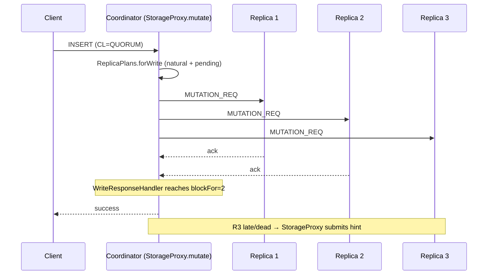
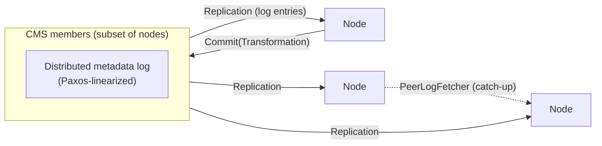

# Apache Cassandra — Architecture & Implementation Deep Dive

> **Source tree:** `C:\workspace\opensource\cassandra` (trunk, `base.version = 5.1`-dev)
> **Audience:** Principal/Staff-level engineers who need to understand, extend, or operate the codebase.
> **Scope:** Architecture, subsystem design, concurrency model, on-disk formats, distributed protocols, and the engineering rationale behind them. File references are relative to `src/java/org/apache/cassandra/` unless noted.

---

## Table of Contents

1. [System Overview](#1-system-overview)
2. [Codebase Map](#2-codebase-map)
3. [Process Lifecycle & Concurrency Model](#3-process-lifecycle--concurrency-model)
4. [Client Protocol Layer (Native Transport)](#4-client-protocol-layer-native-transport)
5. [CQL Layer](#5-cql-layer)
6. [Coordination Layer (StorageProxy)](#6-coordination-layer-storageproxy)
7. [Cluster Metadata: TCM, Gossip, and Topology](#7-cluster-metadata-tcm-gossip-and-topology)
8. [Partitioning, Tokens & Replication](#8-partitioning-tokens--replication)
9. [The Local Storage Engine (LSM Tree)](#9-the-local-storage-engine-lsm-tree)
10. [SSTable Formats: BIG and BTI](#10-sstable-formats-big-and-bti)
11. [Compaction](#11-compaction)
12. [Secondary Indexing & SAI](#12-secondary-indexing--sai)
13. [Consistency Machinery: LWT/Paxos, Read Repair, Anti-Entropy Repair](#13-consistency-machinery-lwtpaxos-read-repair-anti-entropy-repair)
14. [Internode Messaging](#14-internode-messaging)
15. [Streaming](#15-streaming)
16. [Hints & Batchlog](#16-hints--batchlog)
17. [Schema Management](#17-schema-management)
18. [Memory Management](#18-memory-management)
19. [Configuration, Guardrails, Security & Observability](#19-configuration-guardrails-security--observability)
20. [Testing Architecture](#20-testing-architecture)
21. [Key Invariants & Design Themes](#21-key-invariants--design-themes)

---

## 1. System Overview

Cassandra is a **masterless, peer-to-peer, partitioned, multi-master replicated database**. Every node runs the same code (`service/CassandraDaemon.java`) and can coordinate any request. The architecture decomposes into three planes:

| Plane | Responsibility | Core packages |
|---|---|---|
| **Coordination** | Route client requests to replicas, enforce consistency levels, resolve divergence | `service/` (`StorageProxy`), `locator/` |
| **Cluster metadata / control** | Membership, schema, token ownership, failure detection | `tcm/`, `gms/`, `schema/` |
| **Local storage** | Durable LSM-tree engine per node | `db/`, `io/sstable/`, `db/commitlog/`, `db/compaction/` |

The dominant design themes, worth internalizing before reading any code:

- **Log-structured everything.** Writes never modify data in place — commit log, memtables, immutable SSTables, sequential hint files, and even cluster metadata (TCM's replicated log) are all append-only structures reconciled by merge + timestamp.
- **Last-write-wins cell-level reconciliation.** Every cell carries a client-supplied timestamp; conflict resolution is commutative, associative, and idempotent, which is what makes multi-master replication tractable (no write coordination in the common path).
- **Tunable consistency, not global consensus.** Regular reads/writes use quorum-intersection arithmetic (`R + W > RF`), not consensus. Consensus (Paxos) is opt-in per-operation (LWTs) and, since 5.1, mandatory only in the control plane (TCM).
- **Everything is versioned and immutable at rest.** SSTables, `ClusterMetadata` snapshots (per-epoch), prepared statements, schema — mutation happens by producing new versions and atomically swapping references.

Trunk (5.1-dev) contains the modern stack: **Transactional Cluster Metadata (CEP-21)**, **Unified Compaction Strategy (CEP-26)**, **trie memtables & trie-indexed SSTables (BTI, CEP-25)**, **Storage-Attached Indexes with vector search (CEP-7/CEP-30)**, and **Paxos v2**. Accord general-purpose transactions (CEP-15) are developed on a feature branch and are *not* in this tree.

---

## 2. Codebase Map

```
src/java/org/apache/cassandra/
├── transport/        Native (CQL binary) protocol server — Netty pipeline, framing, dispatch
├── cql3/             CQL parsing, semantic analysis, statements, functions, restrictions
├── service/          Coordination: StorageProxy, StorageService, CassandraDaemon,
│   ├── paxos/        LWT consensus (Paxos v1 + v2)
│   ├── reads/        Read executors, digest resolution, read repair strategies
│   └── pager/        Query paging state machines
├── db/               Storage engine core: Keyspace/ColumnFamilyStore, ReadCommand/Mutation,
│   ├── commitlog/    Segmented WAL with pluggable sync modes
│   ├── memtable/     Pluggable memtables (SkipList, Trie) — see Memtable_API.md
│   ├── compaction/   Strategies (STCS/LCS/TWCS/UCS) + CompactionManager
│   ├── lifecycle/    SSTable set tracking, atomic transactions on the live set (Tracker, LifecycleTransaction)
│   ├── rows/, partitions/  In-memory row/partition abstractions (Unfiltered hierarchy)
│   ├── filter/       ClusteringIndexFilter, RowFilter, DataLimits — the read predicate model
│   ├── tries/        In-memory tries (memtable substrate); InMemoryTrie.md is excellent
│   ├── virtual/      Virtual tables (system_views.*)
│   └── guardrails/   Operator-defined usage limits
├── io/
│   ├── sstable/      SSTable readers/writers, format abstraction (format/big, format/bti)
│   ├── tries/        On-disk trie serialization (shared by BTI + SAI)
│   ├── compress/     Block compression (LZ4/Snappy/Zstd/Deflate) + CompressionMetadata
│   └── util/         File abstraction, mmap/buffered readers, Rebufferer stack, ChunkCache glue
├── tcm/              Transactional Cluster Metadata: CMS, replicated log, transformations,
│                     ownership/placements, membership, in-progress operation sequences
├── gms/              Gossip: failure detection (phi-accrual), liveness, legacy state propagation
├── locator/          Snitches, replication strategies, Replica/ReplicaPlan model
├── dht/              Partitioners, tokens, ranges, bootstrap/range streaming logic
├── net/              Internode messaging: Verb dispatch, framing, connection management
├── streaming/        Bulk SSTable transfer sessions (bootstrap, repair, decommission)
├── repair/           Anti-entropy: Merkle validation, sync, incremental repair coordination
├── hints/            Hinted handoff: per-endpoint append-only hint logs
├── batchlog/         Atomic batch durability
├── schema/           TableMetadata/KeyspaceMetadata, distributed schema (now TCM-backed)
├── index/            Secondary index API; sai/ (Storage-Attached Index), sasi/, internal/ (legacy 2i)
├── concurrent/       Stage model, SEPExecutor (shared executor pool), Interruptible loops
├── metrics/          Codahale-based metrics registry per subsystem
├── utils/            BTree, MerkleTree, OpOrder, Ref/RefCounted, memory primitives, bloom filters
├── audit/, fql/      Audit logging & full query log (Chronicle-queue BinLog)
└── tools/            nodetool implementation, sstable offline tools
```

In-tree design docs worth reading (they are authoritative and current):
- `tcm/TransactionalClusterMetadata.md`, `tcm/TCM_implementation.md`
- `db/compaction/UnifiedCompactionStrategy.md`
- `db/memtable/Memtable_API.md`, `db/tries/InMemoryTrie.md`
- `io/sstable/format/bti/BtiFormat.md`
- `service/paxos/Paxos.md`
- `index/sai/README.md`

---

## 3. Process Lifecycle & Concurrency Model

### 3.1 Startup sequence

`service/CassandraDaemon.setup()` orchestrates boot in a strict order:

1. **Config** — `config/DatabaseDescriptor` parses `cassandra.yaml` into `Config` (typed specs: `DataStorageSpec`, `DurationSpec` — units are explicit in the YAML since 4.1).
2. **StartupChecks** (`service/StartupChecks.java`) — fail-fast environment validation: kernel settings, data directory ownership (`FileSystemOwnershipCheck`), clock, JMX, dangling/legacy files, data resurrection risk (`DataResurrectionCheck`).
3. **System keyspace init & schema load** — local system tables opened, then `ClusterMetadataService` initialization (`tcm/Startup.java`): either join an existing CMS-managed cluster, bootstrap as first CMS node, or start in gossip-compatibility mode for upgrades.
4. **Commit log replay** — `CommitLog.recoverSegmentsOnDisk()` replays mutations into memtables (see §9.2).
5. **StorageService.initServer()** — token acquisition/bootstrap via TCM in-progress sequences, gossip start, messaging service listen.
6. **Native transport start** — Netty server binds; node announces itself as available for clients.

`StorageService` (`service/StorageService.java`) is the legacy god-object for node lifecycle operations (bootstrap, decommission, move, drain) — post-TCM it largely delegates state to `ClusterMetadata` but remains the JMX/nodetool entry point.

### 3.2 The Stage model and SEPExecutor

Cassandra uses a **staged execution architecture** (a SEDA descendant): work is partitioned by type into named stages (`concurrent/Stage.java`): `READ`, `MUTATION`, `COUNTER_MUTATION`, `VIEW_MUTATION`, `GOSSIP`, `REQUEST_RESPONSE`, `ANTI_ENTROPY`, `MIGRATION`, `MISC`, `TRACING`, etc. Each stage is an executor with its own queue and metrics, which gives:

- **Isolation**: a flood of reads cannot starve gossip or request-response handling.
- **Backpressure visibility**: per-stage pending/active/blocked metrics are the primary operator signal for overload.

The interesting implementation is `concurrent/SEPExecutor.java` + `SharedExecutorPool`: multiple stages **share one pool of workers** (`SEPWorker`) rather than owning dedicated threads. Workers are assigned to stages on demand with strict per-stage concurrency caps, and *spin briefly* before descheduling to avoid park/unpark latency on bursty workloads. This gets the isolation benefits of SEDA without the thread-count explosion of one-pool-per-stage.

Supporting primitives in `concurrent/` and `utils/concurrent/`:

- **`OpOrder`** — a low-overhead group-based barrier used to solve "safe memory reclamation" problems without locks: e.g., a memtable flush waits for all in-flight write operations that started before the flush barrier to complete, without blocking new writes (they land in the new memtable). This is the backbone of memtable lifecycle and reads-vs-compaction safety.
- **`Ref` / `RefCounted`** — debuggable reference counting for off-heap and file-backed resources (SSTable readers). Leaks are detected and logged with the allocation stack trace.
- **`Interruptible` / `InfiniteLoopExecutor`** — structured long-running loops (commit log sync, hint dispatch) with clean shutdown semantics.
- **`ExecutorLocals`** — propagates tracing/client-warning context across stage hops (Cassandra predates and does not use Loom; context is carried explicitly).

Netty event loops handle all network I/O (client and internode); stages handle CPU/disk work. The rule of thumb throughout the codebase: **never block a Netty event loop** — work is handed off to stages, and responses flow back through async callbacks/futures (`utils/concurrent/Future` hierarchy wraps Netty futures).

---

## 4. Client Protocol Layer (Native Transport)

Package: `transport/`. The native protocol is a binary, frame-based, multiplexed protocol over TCP (default 9042), versions v3–v5 supported here (`ProtocolVersion.java`).

### 4.1 Netty pipeline

`transport/Server.java` + `PipelineConfigurator.java` build the channel pipeline. Connection establishment goes through `InitialConnectionHandler` (STARTUP/OPTIONS negotiation), after which the pipeline is reconfigured for the negotiated version:

- **v4 and earlier**: classic per-message envelope decoding (`PreV5Handlers`).
- **v5** (`CQLMessageHandler.java`): the transport moved to **checksummed, optionally-compressed framing** shared conceptually with internode messaging — messages are packed into frames with CRC24/CRC32 protection (corruption detection at the transport layer, not just TCP checksums), and large messages span multiple frames reassembled by the handler.

Key components:

- **`Envelope`** — the protocol frame: header (version, flags, stream id, opcode, length) + body. Stream ids give per-connection multiplexing (async request pipelining).
- **`Message.Request` / `Message.Response`** hierarchy — QUERY, PREPARE, EXECUTE, BATCH, REGISTER, AUTH_*, etc., each with a codec (`CBCodec`).
- **`Dispatcher`** — takes decoded requests off the event loop and schedules execution on the `REQUEST` stage (native transport requests are processed on a dedicated pool, `NativeTransportService`); on completion, responses are queued to the **`Flusher`**, which coalesces multiple responses per syscall/flush across the event loop — a significant throughput optimization.
- **`ClientResourceLimits` / `ConnectionLimitHandler`** — global + per-endpoint byte-based inflight request limits; v5 adds protocol-level backpressure (server can throttle reads off the socket instead of buffering unboundedly).
- **`Event`** — server-push notifications (topology/status/schema changes) to drivers that REGISTERed.

Rationale: the native transport is deliberately thin — no query logic lives here. It converts bytes ⇄ `Message`, enforces resource limits, and delegates to `QueryProcessor`/`QueryHandler`.

---

## 5. CQL Layer

Package: `cql3/`. Grammar is ANTLR (`src/antlr/`), producing `Raw` statement ASTs that are then **prepared** (semantic analysis + binding) into executable `CQLStatement`s.

### 5.1 Compilation pipeline

```
CQL text ──ANTLR──▶ Raw statement ──prepare(ClientState)──▶ CQLStatement ──execute──▶ ResultMessage
                    (unresolved names)   (resolved against schema,          (via StorageProxy)
                                          bind-marker specs computed)
```

- **`QueryProcessor`** — the `QueryHandler` implementation: parse cache (recently parsed statements), **prepared statement cache** keyed by `MD5Digest` of the normalized query + keyspace. Prepared statements are invalidated on schema change (`QueryProcessor` listens to schema events) — the drivers then transparently re-prepare.
- **`cql3/statements/`** — `SelectStatement`, `ModificationStatement` (Insert/Update/Delete), `BatchStatement`, DDL statements (`schema/` alterations are TCM transformations, see §17), permission statements.
- **`cql3/restrictions/`** — the most intricate part of the layer: `StatementRestrictions` decomposes a WHERE clause into (a) partition key restrictions → token ranges / key lists, (b) clustering restrictions → `ClusteringIndexFilter` (slice or names filter), (c) everything else → `RowFilter` (post-filtering or index-eligible predicates). This decomposition **is** the boundary between "query" and "storage engine": the engine only understands `(partition keys | token range) × clustering filter × row filter × limits`.
- **`cql3/selection/`** — projection: selectors, aggregation (`db/aggregation/` holds group-by state), function evaluation (`cql3/functions/` — natives, UDFs sandboxed in a restricted UDF class loader / JS removed, UDAs).
- **`cql3/conditions/`** — IF conditions for LWTs (`CASRequest`).

### 5.2 Execution

`SelectStatement.execute` builds a `ReadQuery`:
- Single-partition: `SinglePartitionReadCommand` (one per key, grouped in `SinglePartitionReadQuery.Group`)
- Range scan: `PartitionRangeReadCommand`

`ModificationStatement` builds `Mutation`s (one per partition, containing per-table `PartitionUpdate`s). Multi-partition CQL batches become multiple mutations; **logged batches** go through the batchlog (§16).

Paging (`service/pager/`) wraps `ReadQuery` in a `QueryPager` that serializes progress into an opaque `PagingState` (partition key + clustering position + remaining counts) returned to the driver — the server is stateless across pages.

---

## 6. Coordination Layer (StorageProxy)

`service/StorageProxy.java` is the coordinator brain: every client request lands here after CQL processing, and it speaks to replicas (possibly including itself) via `MessagingService`.

### 6.1 Replica plans

`locator/ReplicaPlans` computes, per operation, from `ClusterMetadata`'s `DataPlacements`:
- the **natural replicas** for a token (+ **pending** replicas during range movements — writes go to both, so no window of under-replication exists),
- filtered/ordered by liveness (`FailureDetector`) and proximity (`DynamicEndpointSnitch`),
- validated against the consistency level (throws `UnavailableException` *before* doing any work if too few live replicas — fail fast).

The `Replica` model distinguishes **full** vs **transient** replicas (transient replication: some replicas only hold unrepaired data, dropping their copy once repair marks data repaired — an RF-cost optimization; still marked experimental).

### 6.2 Write path (coordinator)



- `AbstractWriteResponseHandler` variants implement CL semantics (`DatacenterSyncWriteResponseHandler` for EACH_QUORUM, etc.). The handler completes when `blockFor` acks arrive; remaining responses are still awaited in the background for hinting purposes.
- Dead/unresponsive replicas get **hints** (§16) if the coordinator deems the write "sufficiently live" (hinting only happens when the CL was achieved; otherwise the client gets a `WriteTimeout`/`Unavailable` and retries).
- Counters are special: a write is forwarded to a **counter leader replica** which performs a read-modify-write on its local shard (`db/CounterMutation`, `db/context/CounterContext` — a partitioned vector-clock-like structure of (node, logical clock, value) shards) and then replicates the result.
- Post-TCM, mutations carry the **epoch** of the coordinator's metadata; replicas detect divergence (out-of-range writes are rejected rather than silently accepted — `StorageProxy` re-checks placements after responses arrive, see `TransactionalClusterMetadata.md` §Read/Write Consistency).

### 6.3 Read path (coordinator)

`service/reads/` contains the executor machinery:

- **`AbstractReadExecutor`** picks strategy per table's `speculative_retry`: `NeverSpeculating`, `AlwaysSpeculating`, or percentile-based — if the fastest `blockFor` replicas don't respond within (e.g.) p99 latency, a **speculative** redundant request goes to the next-best replica. This bounds tail latency at the cost of extra load.
- **Digest reads**: for CL > ONE, one replica returns full data, others return a **digest** (hash of the result). `DigestResolver` compares; on mismatch, the read is retried as full-data reads and **`DataResolver`** merges the results (most-recent-cell-wins) — the merged result is returned to the client *and* the differences are written back to stale replicas (**blocking read repair**: the repair mutations must be acked before the client response, preserving monotonic read guarantees within the quorum). Strategies live in `service/reads/repair/` (`BLOCKING` default, `NONE` available).
- **`ReadCommandVerbHandler`** on the replica side executes locally (§9.4) and responds with `ReadResponse` (data or digest).

`db/ConsistencyLevel.java` encodes blockFor arithmetic including local-DC filtering for `LOCAL_*` levels.

---

## 7. Cluster Metadata: TCM, Gossip, and Topology

This is the biggest architectural shift in 5.1 (CEP-21). Package: `tcm/`.

### 7.1 The problem it solves

Pre-5.1, cluster state (tokens, membership, schema) propagated via **gossip** — eventually consistent, unordered, and racy. Divergent views during concurrent topology changes could cause ownership disagreement and data loss; schema changes could race and diverge. TCM replaces this with a **linearized, replicated log of metadata transformations**.

### 7.2 Architecture



- **`ClusterMetadata`** — a single immutable object composing: `DistributedSchema`, `Directory` (membership: `NodeId`, addresses, states, locations), `TokenMap`, `DataPlacements` (per-`ReplicationParams` token-range → replica maps, precomputed for reads *and* writes), `LockedRanges`, `InProgressSequences`. Each version is identified by a monotonic **`Epoch`**.
- **`Transformation`** (`tcm/transformations/`) — a pure function `ClusterMetadata → ClusterMetadata`, validated then committed. Examples: schema DDL, `PrepareJoin`/`MidJoin`/`FinishJoin`, CMS reconfiguration.
- **CMS (Cluster Metadata Service)** — a dynamically reconfigurable subset of nodes owning the log. Commits are linearized via **`PaxosBackedProcessor`** (Paxos LWTs on a distributed log table); non-CMS nodes submit via `RemoteProcessor`. The CMS placement uses `MetaStrategy` (`locator/MetaStrategy.java`) — replication of the log itself is metadata-driven too.
- **Dissemination**: committed entries are pushed to all peers; gaps are healed by pull (`PeerLogFetcher`, `FetchCMSLog`) — any peer can serve log suffixes since the log is immutable and totally ordered. **Snapshots** (`MetadataSnapshots`, `ForceSnapshot` synthetic transformation) let laggards skip ahead without replaying every epoch.
- **`MultiStepOperation` / `InProgressSequences`** — topology operations (bootstrap, decommission, move, replace) are pre-planned multi-phase sequences persisted *in* the metadata, so they survive coordinator failure and are resumable/cancelable. Writes are over-replicated during movements (the successor of `PendingRanges`), and concurrent operations are allowed only on disjoint ranges (`LockedRanges`).
- **Epoch-stamped data plane**: every read/write internode message carries relevant epochs; a replica with stale metadata fetches the missing entries before acting (`EpochAwareDebounce` prevents fetch storms). This closes the historical "coordinator and replica disagree about ownership" hole.

### 7.3 What remains of gossip

`gms/` is retained for **liveness**: heartbeat propagation and **phi-accrual failure detection** (`FailureDetector.java` — per-endpoint inter-arrival histograms produce a suspicion level φ rather than a binary timeout; `convictThreshold` maps φ to "down"). Gossip also carries a shrinking set of ephemeral, non-critical states and drives upgrade-compatibility mode (`tcm/compatibility/`). Authoritative state (tokens, membership, schema) is TCM's.

### 7.4 Locator / snitches

`locator/IEndpointSnitch` answers "which DC/rack is this endpoint in" and "sort these replicas by proximity". `GossipingPropertyFileSnitch` is the standard production choice; cloud snitches (EC2/GCE/Azure/Alibaba/Cloudstack) read instance metadata. **`DynamicEndpointSnitch`** wraps the configured snitch and re-ranks replicas by observed read latency (score-based, with badness threshold + periodic reset) — this is why coordinators automatically route around slow-but-alive replicas.

---

## 8. Partitioning, Tokens & Replication

Package: `dht/`.

- **`IPartitioner`** maps partition keys to **`Token`s** on a ring. `Murmur3Partitioner` (default): 64-bit tokens from MurmurHash3; `RandomPartitioner` (legacy, MD5/127-bit); `ByteOrderedPartitioner` (order-preserving — enables range scans by key but invites hotspots; effectively deprecated); **`LocalPartitioner`** — comparator-ordered tokens over the raw key bytes, used for *local-only* tables (system tables, index backing tables) where distribution is irrelevant but ordering matters.
- **`DecoratedKey`** = (Token, key bytes) — the sort key of the entire storage engine. `PartitionPosition` generalizes it with min/max ring bounds for range queries.
- **Vnodes**: each node owns `num_tokens` tokens (default 16); `dht/tokenallocator/` implements the replication-aware allocation algorithm that minimizes ownership imbalance when adding nodes (far better than random assignment at low token counts).
- **`AbstractReplicationStrategy`** (`locator/`): `SimpleStrategy` (ring walk), **`NetworkTopologyStrategy`** (per-DC RF; walks the ring per-DC skipping repeated racks — rack diversity is best-effort by construction), `LocalStrategy` (system tables), `MetaStrategy` (TCM log). Under TCM these are evaluated *once per placement change* to build `DataPlacements`, not on demand per query.
- **`Splitter`** — token-space arithmetic for splitting ranges evenly (drives UCS sharding, local range splitting for compaction/streaming parallelism).

---

## 9. The Local Storage Engine (LSM Tree)

The heart of the codebase. Entry point: `db/Keyspace.apply()` for writes, `db/ColumnFamilyStore` (CFS — one per table) for everything else. `ColumnFamilyStore` owns the memtable(s), the SSTable set (via `db/lifecycle/Tracker`), compaction strategy, and secondary indexes.

### 9.1 Data model internals

The engine's universal currency is the **`Unfiltered` iterator hierarchy** (`db/rows/`):

- A partition is a stream: `UnfilteredRowIterator` = partition key + partition-level deletion + static row + ordered sequence of `Unfiltered`s.
- `Unfiltered` is either a **`Row`** (clustering + cells) or a **`RangeTombstoneMarker`** (bound/boundary of a deletion range).
- A **`Row`** holds `LivenessInfo` (primary-key liveness: what makes an INSERT's row exist independently of its cells), row-level `Deletion`, and `Cell`s (value + timestamp + TTL/localDeletionTime). Complex columns (collections, UDTs) hold multiple cells keyed by `CellPath` plus a `complexDeletion` tombstone.
- **`ClusteringPrefix`/`Clustering`** — the multi-dimensional sort key within a partition, with array-backed, buffer-backed, and native (off-heap) implementations to control allocation.
- **Deletions are data.** Tombstones (cell, row, range, partition) are first-class writes that must outlive any data they shadow across all replicas until repair guarantees convergence — this is the origin of `gc_grace_seconds`: a tombstone may only be purged at compaction when it is older than gc_grace *and* no older unrepaired data could exist elsewhere. Understanding tombstone semantics (`DeletionInfo`, `RangeTombstoneList`, `DeletionPurger`) is prerequisite to touching compaction or reads.

Merging across sources is done by `UnfilteredRowIterators.merge` — an N-way merge on clustering order where cells reconcile by `(timestamp, then value)` — deterministic, commutative, idempotent. **The read path, compaction, repair, and streaming are all "just" this merge applied to different source sets.** `db/transform/` provides a stacked transformation framework (filtering, purging, limits enforcement) over these iterators.

### 9.2 Write path (replica-local)

```
Mutation → Keyspace.apply
  ├─ CommitLog.add(mutation)          — durability
  ├─ Memtable.put(update, opGroup)    — per affected table
  └─ (2i/SAI memory index update, MV lock + read-before-write if views exist)
```

**Commit log** (`db/commitlog/`): a global (per-node, not per-table) segmented WAL.
- `CommitLogSegmentManagerStandard` recycles fixed-size segments (32 MiB default); mutations are serialized into segment buffers with per-mutation CRCs.
- Sync modes: `periodic` (default — fsync every `commitlog_sync_period`; acks don't wait), `batch` (ack waits for fsync), `group` (batch with time-window coalescing). This is the classic durability/latency dial.
- Each segment tracks **per-table dirty intervals**; when all covered memtables flush, the segment is recycled. `Keyspace.apply` blocks if segment allocation stalls (backpressure from slow flushes).
- Replay on startup applies `CommitLogReplayer` with per-table replay positions from SSTable metadata (only mutations newer than what's already flushed are applied).
- Optional compression or encryption per segment; `CommitLogArchiver` supports PITR-style archiving.

**Memtables** (`db/memtable/` — pluggable API since 5.0, see `Memtable_API.md`; configured per-table):
- `SkipListMemtable` (default): `ConcurrentSkipListMap<PartitionPosition, BTreePartitionData>`; rows within a partition are BTrees (`utils/btree/`) updated via copy-on-write with per-partition contention management.
- **`TrieMemtable`**: partitions + clusterings encoded byte-comparably (`utils/bytecomparable/ByteComparable`) into a single **in-memory trie** (`db/tries/InMemoryTrie` — a garbage-free, chunked, mostly-off-heap structure documented in `InMemoryTrie.md`), **sharded** by token range to reduce contention. Significantly better memory density and read locality than the skip list.
- Allocation is tracked by `utils/memory/MemtableAllocator` (heap buffers / off-heap buffers / fully off-heap "native" objects per `memtable_allocation_type`), with global thresholds triggering flush of the largest memtable (`MemtableCleaner`).
- **Flush** (`db/memtable/Flushing.java`): an `OpOrder` barrier separates writes between the old and new memtable *without stopping writes*; contents are written per-disk-boundary (`DiskBoundaries` — JBOD support splits by token range) into new SSTables inside a `LifecycleTransaction`, then the commit log segments are released.

The **`db/lifecycle/`** package deserves emphasis: `Tracker` maintains the **live view** (`View`: current memtables + live SSTable set) with lock-free atomic swaps; `LifecycleTransaction` makes compound changes (flush results, compaction replacing N inputs with M outputs) **atomic and crash-safe**, journaled to a transaction log file (`LogTransaction`, the `.txn` files) so a crash mid-compaction never leaves both inputs and outputs live (orphans are cleaned at startup).

### 9.3 Read path (replica-local)

`ReadCommand.executeLocally` → `ColumnFamilyStore` query:

1. Establish `ReadExecutionController` (OpOrder groups over memtable + sstable sets; guards against concurrent flush/compaction reclaim).
2. **Source selection**: memtable(s) + candidate SSTables from the `View`'s interval tree over partition ranges, filtered by:
   - **Bloom filter** (`utils/BloomFilter`, off-heap bit set) — skips SSTables that definitely lack the key;
   - min/max clustering bounds and partition-deletion-only checks in SSTable metadata;
   - timestamp-based elimination for point reads (`SinglePartitionReadCommand` tracks "most recent tombstone seen so far" and skips SSTables whose max timestamp is older when the query is satisfied — the *sstables-per-read* optimization).
3. Each source yields an `UnfilteredRowIterator` for the partition (via the format-specific index, §10) honoring the `ClusteringIndexFilter` (slices or names) — reads seek directly to relevant rows, never materializing whole partitions.
4. N-way merge → `db/transform/` stack applies `RowFilter` (non-index predicates), purges droppable tombstones from the response, enforces `DataLimits`, counts tombstones (warn/fail thresholds — the tombstone-scan guardrail).
5. Result is consumed into a `ReadResponse` (serialized or digest).

**Caches** (`cache/`, `service/CacheService`):
- **Key cache**: key → index entry position (BIG format only; BTI deliberately drops it — its trie index is fast enough and mmapped, §10.2).
- **Row cache** (off by default): whole-head-of-partition cache; invalidated on write — only sensible for read-mostly hot partitions.
- **Chunk cache** (`ChunkCache`, Caffeine-based): caches decompressed/raw file chunks above the `Rebufferer` layer — the effective replacement for OS page cache dependence on compressed files.
- **Counter cache**: counter shard values to shortcut counter RMW reads.

### 9.4 Single-partition vs range reads

Range scans (`PartitionRangeReadCommand`) iterate the SSTable scanners + memtable across token order and merge; the coordinator side splits the requested range into per-replica-set subranges executed with concurrency estimated from expected result density (`StorageProxy.RangeCommandIterator`), growing concurrency adaptively when under-fetching.

---

## 10. SSTable Formats: BIG and BTI

`io/sstable/format/` abstracts the format (`SSTableFormat` factory + `SSTableReader`/`SSTableWriter` SPI; format chosen by `sstable.selected_format`). An SSTable is a set of **components** sharing a `Descriptor` (generation id, version):

Common components: `Data.db` (the partition/row payload, block-compressed via `CompressionInfo.db`+`io/compress/` unless disabled), `Filter.db` (bloom), `Statistics.db` (`StatsMetadata`: min/max timestamps, min/max clusterings, tombstone histograms, repair status, pending repair UUID, commit log intervals…), `TOC.txt`, `Digest.crc32`, `CRC.db`.

### 10.1 BIG (legacy, default `-Data.db` family since 1.x)

- `Index.db`: for every partition key — key + position in Data.db (+ embedded **row index**: for wide partitions, binary-searchable "column index" blocks every `column_index_size` (64 KiB) of row data, with clustering bounds per block).
- `Summary.db`: in-memory downsampled index-of-the-index (every N-th key), giving `key → Index.db neighborhood`, then a short sequential scan.
- Lookup: summary (memory) → index scan (1 seek) → data (1 seek). Key cache short-circuits to the index entry.

### 10.2 BTI — "Big Trie-Indexed" (CEP-25, `format/bti/`, docs in `BtiFormat.md`)

Replaces `Index/Summary` with two trie-based files:

- **`Partitions.db`** — a **trie of unique byte-comparable prefixes** of partition keys (built via `io/tries/` incremental builder; page-aware node layout so a lookup touches ~1 page per trie level; mmapped). Because it stores *minimal distinguishing prefixes*, it is dramatically smaller than BIG's index — small enough to serve lookups without a summary or key cache — while supporting exact and range lookup. False positives (prefix matched but wrong key) are resolved against the key stored in Data.db.
- **`Rows.db`** — per wide partition, a trie from clustering-prefix separators to row-index blocks, replacing the linear column index (BIG's binary search within a partition degrades on very wide partitions; the trie stays logarithmic with better constants).

The byte-comparable translation (`ByteComparable`: every type's values mapped to byte strings whose unsigned lexicographic order equals the type's comparator order) is the enabling primitive shared by BTI, `TrieMemtable`, and SAI's trie structures — one of the most consequential utilities in the modern codebase.

`SSTableReader` implementations use the `io/util/` stack: `FileHandle` → `Rebufferer` chain (mmap or buffered, compression-aware, chunk-cache-aware) → `RandomAccessReader`. Early-open (`PartitionIndexEarly`, `SSTableReaderWithFilter`) lets long compactions expose partially-written outputs for reads before completion, smoothing cache/latency transitions.

---

## 11. Compaction

Package: `db/compaction/`. `CompactionManager` (global executor, throughput-throttled by `compaction_throughput`) runs tasks produced by per-table strategy instances, coordinated by `CompactionStrategyManager` — which actually maintains **multiple strategy instances per table**: one for *repaired* SSTables, one for *unrepaired*, and one per *pending-repair* session (incremental repair, §13.3) — repaired and unrepaired data must never be compacted together, or repair state would be corrupted.

The strategies:

- **STCS** (`SizeTieredCompactionStrategy`, default): buckets SSTables by similar size, compacts buckets with ≥ `min_threshold` members. Write-amp friendly, space-amp and read-amp unfriendly (O(logN) sstables per read, 50% transient disk headroom worst case).
- **LCS** (`LeveledCompactionStrategy`): leveled runs of non-overlapping fixed-size (160 MiB) SSTables, each level 10× the previous. Read-amp ≈ 1 SSTable per level, great for read-heavy/update-heavy; write-amp ≈ 10× per level. `LeveledManifest`/`LeveledGenerations` track level state; L0 overflow falls back to STCS behavior.
- **TWCS** (`TimeWindowCompactionStrategy`): buckets by write-time windows; STCS within the current window, one SSTable per closed window. Purpose-built for TTL'd time series — expired SSTables are *dropped whole* (`fully expired` check) without rewrite.
- **UCS** (`UnifiedCompactionStrategy`, CEP-26 — read `UnifiedCompactionStrategy.md`): the generalization intended to subsume STCS/LCS. Key ideas:
  - SSTable runs organized by **density** (size ÷ token-range fraction), levels defined logarithmically;
  - per-level integer **scaling parameters `w`**: negative = leveled behavior (read-optimized), positive = tiered (write-optimized), 0 = middle ground — a *continuous* read/write-amp dial, settable per level;
  - **sharding** (`ShardManager`): output is split at token boundaries into shards whose count grows with density (`base_shard_count`, `target_sstable_size`), giving bounded SSTable sizes, parallel compaction across shards, and near-elimination of the 50% space overhead problem.

`CompactionIterator` performs the merge: reconciles rows, **purges tombstones** that are (a) older than gc_grace and (b) provably not shadowing data in non-participating SSTables (checked via `CompactionController.getPurgeEvaluator` overlap analysis), and feeds observers (SAI index writers, etc.). `CompactionTask` wraps everything in a `LifecycleTransaction` (crash-safe swap, §9.2). Related maintenance operations (scrub, verify, cleanup — dropping data no longer owned after range movements, garbage collect, index rebuild) run through the same machinery (`OperationType`).

---

## 12. Secondary Indexing & SAI

`index/Index.java` defines the SPI: an index observes writes (indexes `PartitionUpdate`s at memtable and flush/compaction time via observers), and participates in reads by supplying a `Searcher` when `RowFilter` predicates match its capabilities. `SecondaryIndexManager` per table handles registration, builds, and status propagation (`IndexStatusManager` — index queryability is gossiped/propagated so coordinators avoid replicas with unbuilt indexes).

Three generations coexist:

1. **Legacy 2i** (`index/internal/`): each index is a hidden local table whose partition key is the indexed value — reads collect matching keys locally then fetch rows. Kept for compatibility.
2. **SASI** (`index/sasi/`): experimental, effectively deprecated.
3. **SAI — Storage-Attached Index** (`index/sai/`, CEP-7; `README.md` in-package): the modern answer, GA in 5.0.
   - **Storage-attached**: index components are additional SSTable components sharing the SSTable lifecycle — flushed with the memtable, rewritten with compaction, streamed with the SSTable. No separate table, no independent consistency problem.
   - **Memory-resident segment** (`sai/memory/`): trie-based term index over memtable data, so queries see un-flushed writes.
   - **On-disk** (`sai/disk/`, versioned formats): per-SSTable, per-column indexes with a shared per-SSTable layer (token→offset structures) + per-index term structures: **trie term dictionaries + posting lists** for text/equality, **block KD-trees / balanced trees** for numeric ranges, and **graph indexes (JVector/HNSW-style)** for `vector<float, n>` ANN search (CEP-30) — `VectorQueryContext` threads ANN state through the read.
   - **Query planning** (`sai/plan/`): `QueryController` builds an expression tree over available column indexes, intersects/unions posting iterators (`sai/iterators/`), applies cost-based decisions (e.g., skip index for low-selectivity predicates), then materializes rows via the primary key map and post-filters (indexes may be lossy; the row data is the source of truth).
   - Coordinator-side, index queries are range reads fanned out per replica set; `ORDER BY ... ANN OF` adds distributed top-k re-ranking.

---

## 13. Consistency Machinery: LWT/Paxos, Read Repair, Anti-Entropy Repair

### 13.1 LWT / Paxos (`service/paxos/`, read `Paxos.md`)

CQL `IF` conditions require linearizable compare-and-swap. Cassandra implements **per-partition Paxos** with the partition's replica set as the acceptor group:

- **v1** (legacy): prepare → read → propose → commit; 4 round trips, serial reads require their own prepare round.
- **v2** (`paxos_variant: v2`, the modern default choice): reduces to ~2 round trips for a contended CAS (prepare piggybacks the read; `PaxosCommitAndPrepare` pipelines consecutive operations), skips commits for read-only operations, and adds **Paxos repair** (`PaxosRepair`, `service/paxos/cleanup/`): in-flight/uncommitted Paxos state (`uncommitted/` key tracking) is completed and reconciled during regular repair, which is what makes safely purging Paxos metadata possible (bounded `system.paxos` growth) and closes v1's edge cases around range movements. `ContentionStrategy` implements exponential backoff under CAS contention.
- Ballots (`Ballot.java`) are time-based UUIDs with node identity; clock skew bounds matter (large skew degrades liveness, not safety).

TCM reuses this machinery: the metadata log is Paxos-linearized (`PaxosBackedProcessor`) over the CMS replica group.

### 13.2 Read repair

Covered in §6.3 — quorum reads repair divergence they observe, synchronously (BLOCKING strategy) to preserve read monotonicity.

### 13.3 Anti-entropy repair (`repair/`, `service/ActiveRepairService`)

Full-dataset convergence: for each token range and replica set, replicas build **Merkle trees** (`utils/MerkleTree`, `Validator` — trees built by scanning data at a controlled depth to bound memory), the coordinator diffs them (`SyncTask`), and mismatched ranges are streamed between replicas (`SymmetricRemoteSyncTask`/local variants).

**Incremental repair** (the default): only *unrepaired* SSTables participate. Flow: coordinator starts a session (`PendingAntiCompaction` — participating SSTables are anti-compacted into a `pendingRepair` bucket, isolating them from other compaction), validation + sync run, then **finalization** marks the SSTables `repaired` with the session's `repairedAt` timestamp via a consensus-ish commit (`repair/consistent/` — `LocalSessions`/`CoordinatorSessions` two-phase protocol with failure recovery). The repaired/unrepaired/pending segregation in `CompactionStrategyManager` (§11) exists precisely to keep these sets disjoint. **Preview repair** (`PreviewKind`) validates consistency of *repaired* data without streaming — the operator's audit tool.

Trade-off worth knowing: incremental repair makes repair cheap and frequent, but anticompaction costs I/O and the repaired/unrepaired split doubles some compaction surfaces; TWCS tables typically opt out (`only_purge_repaired_tombstones` interactions).

---

## 14. Internode Messaging

Package: `net/`. Netty-based since 4.0, one subsystem for all internode traffic.

- **`Verb`** (`net/Verb.java`) — the RPC catalog: every message type with its serializer, handler, stage, and timeout. Request/response are matched by message id in `RequestCallbacks` with expiry.
- **`Message`** — header (id, verb, epoch-era params in `CustomParams`, creation time, expiry, flags) + typed payload via `IVersionedSerializer` keyed by `MessagingService.Version` (cross-version clusters during rolling upgrade serialize at the peer's version; `EndpointMessagingVersions` tracks per-peer versions negotiated in `HandshakeProtocol`).
- **Connection types** (`ConnectionType`): per peer there are distinct **URGENT** (gossip, failure-detection-relevant, TCM), **SMALL**, and **LARGE** message connections — so a 100 MiB streaming-adjacent payload can't head-of-line-block gossip acks (this separation is operationally critical: FD false positives were a real problem before it).
- **Framing** (`FrameEncoder/Decoder` CRC or LZ4): messages are packed into checksummed frames; large messages are chunked across frames and reassembled off the event loop (`AbstractMessageHandler` manages per-connection and global inbound byte limits — hard backpressure on inbound).
- **Outbound** (`OutboundConnection`): lock-free MPSC queueing with per-connection byte limits, expired-message pruning (a message that has outlived its verb timeout is dropped *before* hitting the wire), automatic reconnect/version renegotiation.
- **`InboundSink`/`OutboundSink`** — interception points (used heavily by in-JVM dtests and the simulator to inject partitions/delays).

Dropped-message accounting (`DroppedMessages`) per verb is the canonical overload signal ("MUTATION messages were dropped in last 5s").

---

## 15. Streaming

Package: `streaming/` (+ `db/streaming/` for the Cassandra-format specifics). Used by bootstrap, decommission/move, repair sync, rebuild, and `nodetool refresh`-adjacent flows — always as a **session** of outbound/inbound SSTable sections per range set.

- **`StreamPlan` → `StreamCoordinator` → per-peer `StreamSession`**: a state machine (PREPARE → STREAMING → COMPLETE) negotiated over dedicated streaming connections (`streaming/async/` — Netty, `AsyncStreamingOutputPlus`).
- **Two transfer modes**: *partial/legacy* — iterate the SSTable's relevant ranges and re-serialize (necessarily rewriting index/summary on the receiver via `CassandraStreamReceiver`); and **entire-SSTable / zero-copy streaming** — when a whole SSTable is owned by the destination (common with UCS sharding / LCS leveled layouts), all components are transferred as raw file copies (`CassandraEntireSSTableStreamWriter`, using kernel zero-copy where possible), an order of magnitude cheaper in CPU.
- Received data lands in new SSTables marked with the stream's repair status; `StreamReceivedOutOfTokenRangeException` guards against accepting data outside owned ranges (a TCM-era safety check).
- Throttled by `stream_throughput_outbound` / `entire_sstable_stream_throughput_outbound`; observable via `nodetool netstats` / `StreamManager`.

`dht/RangeStreamer` computes *who to fetch which ranges from* for bootstrap/rebuild (strict consistency source selection so bootstrap doesn't violate consistency: fetch from the replica being replaced, not an arbitrary one — `RangeStreamer.FetchReplica`).

---

## 16. Hints & Batchlog

**Hints** (`hints/`): when a replica is down/slow during a write that still met its CL, the coordinator persists the mutation as a *hint* for later delivery.
- Storage is **per-target-node append-only hint files** (`HintsBuffer` — off-heap accumulation with OpOrder-guarded concurrent writes → flushed to `HintsDescriptor`-described files; CRC-protected, optionally compressed/encrypted). This design (4.0+) replaced the old system-table-based hints, which suffered compaction amplification.
- `HintsDispatchExecutor` replays hints to targets when the FD reports them alive, rate-limited, with `hinted_handoff_window` capping how stale a hint may be (beyond it, only repair reconciles). Hints are *best effort* — they reduce entropy, they do not guarantee delivery.

**Batchlog** (`batchlog/BatchlogManager`): CQL `BEGIN BATCH` (logged) across multiple partitions guarantees **eventual atomicity** (all-or-nothing *eventually*, not isolation): the coordinator writes the batch to `system.batches` on two other nodes (preferably distinct racks), applies the mutations, then deletes the batchlog entries; if the coordinator dies mid-flight, the batchlog replicas replay the whole batch after a timeout. Cost: the extra write round — why unlogged batches/single-partition batches are preferred for performance.

---

## 17. Schema Management

Package: `schema/`. `TableMetadata`/`KeyspaceMetadata`/`ColumnMetadata` are immutable value objects; `TableId` (UUID) decouples identity from name (rename-safe, and data directories are `<name>-<id>`). `Schema` holds the node's current `DistributedSchema` and materializes runtime objects (`Keyspace`, `ColumnFamilyStore`) from it.

Since TCM, **DDL is a metadata transformation**: `AlterSchema` commits through the CMS log; every node applies the same schema delta in the same epoch order (`SchemaTransformation`). This eliminates the historic gossip-based schema propagation (`schema/MigrationCoordinator` era) and its divergence/reconciliation problems — schema disagreement is now structurally impossible among caught-up nodes, and "schema version" is just the epoch. DDL responses can await cluster-wide enactment visibility.

Views: materialized views (`db/view/`) hang off schema; MV writes acquire partition locks and do read-before-write on the base table to compute view deltas — the known write-amplification and consistency-complexity trade of MVs.

---

## 18. Memory Management

Cassandra is aggressive about keeping bulk data off the Java heap:

- **Memtable data**: `memtable_allocation_type` = `heap_buffers` | `offheap_buffers` | `offheap_objects` — `utils/memory/NativeAllocator`/`SlabAllocator` region-allocate to defeat fragmentation and GC pressure; `NativeDecoratedKey`/`NativeClustering`/native cells store data entirely off-heap. `MemtablePool` enforces global heap+offheap budgets with cleaner-triggered flushes.
- **Bloom filters, index summaries, compression offset maps**: off-heap (`utils/obs/OffHeapBitSet`, `Memory`), lifecycle-managed by `Ref` counting tied to `SSTableReader` tidiers.
- **Network buffers**: `utils/memory/BufferPool` — slab-based recycling pools for internode (and chunk-cache) `ByteBuffer`s; `BufferPoolAllocator` bridges it into Netty.
- **Chunk cache**: off-heap-ish caching of file chunks (Caffeine over pooled buffers).
- **Reads**: mmapped I/O by default on 64-bit (`disk_access_mode`), so cold data cost is page faults, not heap.

The GC-facing consequence: the heap holds indexes-to-data and short-lived request state, not the data itself; young-gen behavior dominates, and the codebase is full of allocation-avoidance idioms (array-backed clusterings, `ByteBuffer` reuse, `DataOutputBuffer` recycling) for the hot paths.

---

## 19. Configuration, Guardrails, Security & Observability

- **Config**: `config/Config.java` (raw YAML shape) + `DatabaseDescriptor` (validated accessors). Modern config uses typed quantities (`DurationSpec.LongMillisecondsBound`, `DataStorageSpec`) with explicit units, and most settings are exposed for live mutation via the **settings virtual table** and `nodetool`(JMX). `CassandraRelevantProperties` catalogs system properties.
- **Guardrails** (`db/guardrails/Guardrails.java`): operator-defined warn/fail thresholds enforced at the CQL/coordination layer — table count, tombstones per query, collection sizes, partition size, disallowed features (e.g., disabling ALLOW FILTERING), disk usage (with a failure mode that rejects writes cluster-wide when replicas exceed thresholds). They fire client warnings or reject with per-guardrail granularity, and are the sanctioned way to encode platform policy.
- **Auth** (`auth/`): pluggable `IAuthenticator` (default `PasswordAuthenticator` over `system_auth.roles` with salted bcrypt), `IAuthorizer` (role-based grants), `INetworkAuthorizer` (per-DC access), `IRoleManager`; permission/role/credential caches (`AuthCache`) since auth lookups are on the hot path. CIDR-based authorization (`cql3/CIDR`, CIDR filtering tables) is present in trunk.
- **Encryption** (`security/`): TLS internode (server) and client with hot-reloadable `SSLContext` (`SSLFactory`), pluggable `ISslContextFactory` (e.g., PEM-based), and transparent data-at-rest encryption hooks for commitlog/hints (table encryption remains vendor territory).
- **Observability**:
  - `metrics/` — exhaustive Codahale registry (latencies as decaying histograms, per-table/per-keyspace/per-stage/per-connection), exported via JMX (and easily scraped into Prometheus via agents).
  - **Virtual tables** (`db/virtual/`, keyspaces `system_views`/`system_virtual_schema`): queryable-over-CQL runtime state — clients, thread pools, internode in/outbound, sstable tasks, settings, TCM log (`ClusterMetadataLogTable`). Implemented as `AbstractVirtualTable` producing partitions on demand — no storage engine involvement.
  - **Full Query Log / Audit Log** (`fql/`, `audit/`): Chronicle-Queue-based binary logs (`utils/binlog/BinLog`) with bounded disk usage; FQL supports replay for workload capture (`tools/fqltool`).
  - **Diagnostic events** (`diag/`) and **tracing** (`tracing/` — per-request session/event tables, probabilistic or per-query `TRACING ON`).
  - `nodetool` (`tools/nodetool/`) — JMX client; one class per command.

---

## 20. Testing Architecture

The test tree is a major piece of engineering in itself:

- **Unit** (`test/unit`) — JUnit, with `CQLTester` as the workhorse harness (embedded node, real CQL round-trips).
- **In-JVM distributed tests** (`test/distributed`, `org.apache.cassandra.distributed.*`): multiple Cassandra "nodes" as isolated classloaders inside one JVM (`Instance`, `Cluster`), with an interception layer over `MessagingService` sinks enabling deterministic message drops/delays/partitions, version-upgrade tests (`upgrade/`), and white-box assertions across nodes. This is the primary tool for distributed-correctness work — vastly faster than container-based dtests (the Python dtest suite lives in a separate repo and still covers full-process behavior).
- **Simulator** (`test/simulator`): deterministic simulation testing — the JVM is instrumented (byte-weaving) so thread scheduling, time, and randomness are controlled by a seed; entire cluster runs (including Paxos) can be exhaustively perturbed and *reproduced from the seed*. Used to validate Paxos v2 and TCM linearizability properties.
- **Harry** (`test/harry`): model-based fuzz testing — generates a workload from a deterministic model, applies it, and can verify any read against the model's expected state without storing the full history; the standard tool for storage/TCM soak testing.
- **Microbench** (`test/microbench`): JMH benchmarks. **Burn** (`test/burn`): long-running concurrency stress for foundational primitives (messaging, OpOrder, BTree).

If you change distributed behavior, the expected accompanying evidence is an in-JVM dtest (functional), possibly a simulator or Harry run (correctness under adversarial scheduling), plus unit coverage.

---

## 21. Key Invariants & Design Themes

A distillation of the rules that code changes must not break:

1. **Timestamp reconciliation must remain commutative/associative/idempotent.** Any feature that makes merge order-dependent breaks replication, read repair, repair, and hints simultaneously.
2. **Tombstones must shadow data until convergence is provable.** Purging logic (compaction `PurgeEvaluator`, gc_grace, repaired-status tracking) errs on retention; resurrection is the cardinal sin.
3. **The live SSTable/memtable set changes only via atomic, crash-safe transitions** (`Tracker`/`LifecycleTransaction` + `LogTransaction`). Readers pin what they see via `OpOrder`/`Ref`; nothing is deleted while referenced.
4. **Repaired and unrepaired data never mix** in compaction or streaming without explicit status transitions.
5. **Coordinators must fail fast on unavailability** (CL check before work) and **never ack below the CL's durability** (hints only after CL met).
6. **Cluster metadata changes are linearized through the TCM log**; data-plane messages carry epochs, and out-of-range operations are rejected, not absorbed. Never derive ownership from anything but `ClusterMetadata` at a known epoch.
7. **Never block Netty event loops; never do unbounded work on a stage without accounting** (limits, timeouts, dropped-message handling). Every queue has a bound or a shedding policy.
8. **Rolling-upgrade compatibility**: all serializers are versioned (`MessagingService.Version`, SSTable `Version`, native `ProtocolVersion`); a cluster must function with mixed versions, so wire/disk format changes gate on the cluster's minimum version.
9. **Everything observable**: new subsystems are expected to expose metrics, virtual tables, and nodetool surface.

### Suggested code-reading paths

- **Write path, end to end**: `transport/Dispatcher` → `QueryProcessor` → `ModificationStatement.execute` → `StorageProxy.mutate` → `MutationVerbHandler` → `Keyspace.apply` → `CommitLog.add` + `Memtable.put` → `Flushing` → `BtiTableWriter`.
- **Read path**: `SelectStatement.execute` → `StorageProxy.read` → `AbstractReadExecutor` → `ReadCommandVerbHandler` → `SinglePartitionReadCommand.queryMemtableAndDisk` → `UnfilteredRowIterators.merge` → `DataResolver`.
- **Topology change**: `nodetool bootstrap`/join → `tcm/Startup` → `tcm/sequences/BootstrapAndJoin` → `PrepareJoin`/`MidJoin`/`FinishJoin` transformations → `dht/RangeStreamer` → `streaming/StreamSession`.
- **A compaction's life**: `CompactionManager` → strategy `getNextBackgroundTask` → `CompactionTask.runMayThrow` → `CompactionIterator` → `LifecycleTransaction` commit.

---

*Generated 2026-07-14 from source analysis of the trunk branch. In-tree design docs listed in §2 are the best companions to this overview; CEP documents on the Apache Cassandra wiki (CEP-7, 15, 21, 25, 26, 30) give the design-decision history.*
