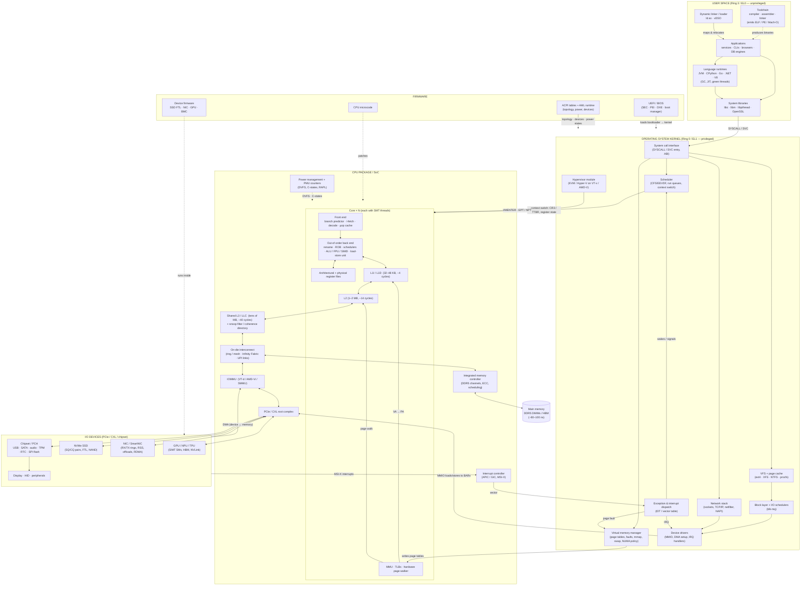

# Computer Architecture: Hardware and Software as One System

A staff/principal-level map of a modern general-purpose computer: every major hardware block, every major software layer, the contracts between them, and the paths a load, a system call, a page fault, a disk read, and a network packet actually take through the machine. The focus is on **mechanism** and **interaction**, not on any one vendor. Where numbers are given they are order-of-magnitude figures for a 2020s server-class x86-64 or ARMv9 system; treat them as anchors for reasoning, not specs.

Companion notes: [How Computers Work](../computer-science/01-how-computers-work.md) (gates → CPU, no prior knowledge assumed), [Operating Systems](../computer-science/operating-systems.md), [Virtualization](../computer-science/virtualization.md).

---

## Table of Contents

1. [The Whole Machine on One Page](#1--the-whole-machine-on-one-page)
2. [The Abstraction Stack and Its Contracts](#2--the-abstraction-stack-and-its-contracts)
3. [The CPU Core](#3--the-cpu-core)
4. [The Memory Hierarchy](#4--the-memory-hierarchy)
5. [Virtual Memory and the MMU](#5--virtual-memory-and-the-mmu)
6. [Multicore, Coherence, and Memory Ordering](#6--multicore-coherence-and-memory-ordering)
7. [Interconnects and I/O](#7--interconnects-and-io)
8. [Storage](#8--storage)
9. [Networking Hardware](#9--networking-hardware)
10. [Accelerators: GPUs, NPUs, and the Heterogeneous Machine](#10--accelerators-gpus-npus-and-the-heterogeneous-machine)
11. [Firmware and Boot](#11--firmware-and-boot)
12. [The Operating System Kernel](#12--the-operating-system-kernel)
13. [User Space: Toolchain, Loader, Runtimes](#13--user-space-toolchain-loader-runtimes)
14. [Virtualization and Containers](#14--virtualization-and-containers)
15. [End-to-End Walkthroughs](#15--end-to-end-walkthroughs)
16. [Quantitative Reasoning: The Numbers That Drive Design](#16--quantitative-reasoning-the-numbers-that-drive-design)
17. [Security as a Cross-Cutting Concern](#17--security-as-a-cross-cutting-concern)
18. [Design Principles a Staff Engineer Reasons With](#18--design-principles-a-staff-engineer-reasons-with)
19. [Further Reading](#19--further-reading)

---

# 1 — The Whole Machine on One Page

The diagram below is the master map. Everything else in this document is a zoom into one box or one edge of it. Read it top-down as *software → firmware → silicon → devices*, and read the edges as the four kinds of interaction that exist in a computer:

| Edge kind | Mechanism | Direction | Examples |
|---|---|---|---|
| **Instruction execution** | CPU fetches and executes code | software → core | every user and kernel instruction |
| **Trap / interrupt** | hardware forces a control transfer to a kernel handler | core/device → kernel | `SYSCALL`, page fault, NIC IRQ, timer tick |
| **Memory-mapped I/O (MMIO)** | CPU loads/stores to physical addresses routed to a device instead of DRAM | kernel driver → device | ringing an NVMe doorbell, programming a NIC register |
| **DMA** | device reads/writes DRAM directly without the CPU | device → memory | NIC writing a received packet into a kernel buffer |

Solid arrows are runtime data/control paths; dotted arrows are "produces" or "configures" relationships.



**How to read the interactions.** An application never touches hardware directly. It executes unprivileged instructions on a core; when it needs anything the core cannot do alone (I/O, more memory, another process), it executes a trap instruction and the kernel takes over on the same core. The kernel talks to devices by storing into MMIO addresses; devices talk back by writing into DRAM (DMA) and raising interrupts. The memory hierarchy, MMU, and coherence fabric sit silently under every one of those steps, and firmware set the whole thing up before the kernel existed. Section 15 walks four of these paths instruction-by-instruction.

---

# 2 — The Abstraction Stack and Its Contracts

A computer is a tower of layers, each of which hides the one below it behind a **contract**. The contracts are what make the system composable, and knowing exactly where each contract sits is what lets you reason about performance and correctness across layers.

```
┌──────────────────────────────────────────────────────────────────────────┐
│ Application code                                                          │
├────────────────────────────────── API (POSIX, Win32, language stdlib) ────┤
│ Language runtime / standard library / libc                               │
├────────────────────────────────── ABI (calling conv., ELF, syscall nums) ─┤
│ OS kernel                                                                 │
├────────────────────────────────── ISA (x86-64, ARMv9, RISC-V) + platform ─┤
│ Microarchitecture (Zen 5, Golden Cove, Neoverse V3, Apple Firestorm…)     │
├────────────────────────────────── RTL / netlist ──────────────────────────┤
│ Logic gates, SRAM cells, DRAM cells                                        │
├────────────────────────────────── Device physics ─────────────────────────┤
│ Transistors (FinFET, GAA), interconnect metal, packaging (chiplets, 3D)    │
└──────────────────────────────────────────────────────────────────────────┘
```

**The ISA is the most important contract in the machine.** It specifies:

- Architectural state: registers (x86-64: 16 GPRs, 32 vector regs, RIP, RFLAGS, control regs CR0–CR4, MSRs), memory, and their widths.
- Instruction encoding and semantics, including which are privileged.
- **Privilege levels** (x86 rings 0–3, ARM EL0–EL3) and what each may do.
- **Exception model**: which conditions trap, what state is saved, and where control goes (IDT on x86, VBAR on ARM).
- **Memory model**: what reorderings of loads and stores other cores may observe (x86-TSO vs ARM/RISC-V weakly ordered).
- Virtual memory format: page table layout, TLB semantics, ASIDs/PCIDs.
- Virtualization extensions (VT-x/AMD-V, ARM EL2).

Everything above the ISA is portable across microarchitectures; everything below is free to change every generation. This is why a binary from 2005 runs on a 2025 CPU, and why the same binary runs 10× faster on the newer CPU without being recompiled.

**The ABI** (System V AMD64, Microsoft x64, AAPCS64) sits between compiled code and everything else: which registers carry arguments (`rdi, rsi, rdx, rcx, r8, r9` on SysV; `x0–x7` on AArch64), which are caller/callee-saved, stack alignment (16 bytes), red zone, struct layout, name mangling, object file format, and the **system call convention** (`rax` = number, `syscall` instruction, result in `rax`). Break the ABI and libraries stop composing; this is why it almost never changes.

**The platform contract** is the part people forget: ACPI tables, PCIe enumeration, the interrupt controller, the timer (HPET/TSC/arch timer), and the boot protocol. The kernel is written to *this*, not just to the ISA. A kernel that boots on one ARM SoC does not boot on another unless the platform is described (device tree / ACPI).

---

# 3 — The CPU Core

A modern high-performance core is a **speculative, out-of-order, superscalar** machine that presents the *illusion* of executing one instruction at a time in program order. Nearly all of its transistor budget is spent maintaining that illusion while actually doing something very different.

## 3.1 The pipeline

```
   FRONT END (in order)                    BACK END (out of order)                RETIRE (in order)
┌────────────┬────────────┬──────────┐   ┌──────────┬───────────┬──────────────┐  ┌──────────┐
│ Branch     │ Fetch      │ Decode   │   │ Rename / │ Schedule  │ Execute       │  │ Reorder  │
│ predict    │ 32–64 B/cy │ x86→µops │──▶│ Allocate │ (RS, 100s │ ALU×4–6       │─▶│ buffer   │
│ (TAGE/     │ from L1I / │ 4–8 wide │   │ (PRF,    │ of µops   │ FPU/SIMD ×2–4 │  │ 300–600  │
│ perceptron)│ µop cache  │          │   │ ROB)     │ in flight)│ Load×2–3 St×2 │  │ entries  │
└────────────┴────────────┴──────────┘   └──────────┴───────────┴──────────────┘  └──────────┘
        ▲                                                   │                            │
        └───────────── mispredict: flush & restart ─────────┘      commit to arch state ─┘
```

**Front end.** The branch predictor is the most important single structure for integer code: with 300–600 instructions in flight and a branch every ~5 instructions, the core is speculating across 60+ branches at any moment. Modern predictors (TAGE-style, with loop and indirect-target predictors, plus a return-address stack) hit >99% on regular code; a mispredict costs the full pipeline depth (~15–20 cycles) *plus* the wasted work. x86 decode is variable-length and expensive, so decoded µops are cached (µop cache / DSB); hot loops run from it without touching decode. ARM's fixed-length encoding makes wide decode cheaper, which is one reason Apple's cores can be 8–10 wide.

**Back end.** Register **renaming** removes false (WAR/WAW) dependencies by mapping the 16 architectural GPRs onto 200–400 physical registers. The **reorder buffer (ROB)** tracks every in-flight µop in program order. **Reservation stations / schedulers** hold µops waiting for operands and issue them, oldest-ready-first, to execution ports the moment inputs arrive. Loads and stores go through the **load-store unit** with a **store buffer** (stores are committed to cache only at retirement, so they can be squashed on mispredict) and **memory disambiguation** prediction (may a load pass an older store with an unknown address?).

**Retirement** commits results to architectural state in program order. This is what makes exceptions **precise**: when an instruction faults, everything older has retired and nothing younger has, so the kernel sees a clean state. Speculation is invisible architecturally — but not microarchitecturally, which is the whole Spectre story (§17).

## 3.2 What a staff engineer takes from this

- **IPC, not clock, is the lever.** A 5 GHz core stalling on DRAM retires ~0 instructions for 400 cycles. Most server workloads run at IPC 0.5–1.5 against a theoretical 6–8.
- **Branchy, pointer-chasing code is the enemy.** Linked lists, virtual dispatch on unpredictable types, and hash tables that miss cache all defeat both the predictor and the memory-level parallelism the OoO engine relies on.
- **SIMD is where the FLOPs are.** AVX-512 / SVE2 execute 16 FP32 lanes per instruction, 2 per cycle: >100 GFLOPS per core. Scalar code leaves >90% of the ALU idle. Auto-vectorization is fragile; hot loops deserve intrinsics or a library.
- **SMT (Hyper-Threading)** gives a second architectural thread that shares the same back end. It helps when one thread stalls on memory (throughput +20–30%), hurts when both are compute-bound (they fight for ports and L1), and is a side-channel surface.
- **Frequency is a budget, not a constant.** Turbo, AVX-512 license levels, thermal and power limits (RAPL) mean the same code runs at different speeds depending on what the other cores are doing.

## 3.3 Privilege, exceptions, and interrupts

The core has a **current privilege level**. In ring 3 / EL0 an instruction like `mov cr3` or `hlt`, or a load from an address whose page table entry says "supervisor only", causes a fault. The core's exception logic then:

1. Finishes retiring older instructions; squashes younger ones (precise exception).
2. Switches to ring 0, loads the kernel stack pointer from the TSS (x86) or `SP_EL1` (ARM).
3. Pushes / saves `RIP`, `RFLAGS`, `RSP`, the error code (x86 pushes onto the kernel stack; ARM writes `ELR_EL1`, `SPSR_EL1`, `ESR_EL1`).
4. Jumps to the handler address from the **IDT** entry for that vector (x86: 256 vectors, 0–31 architectural, 32–255 for devices) or the **vector table** at `VBAR_EL1`.

Three sources funnel into that same mechanism:

| Source | Synchronous? | Examples |
|---|---|---|
| **Exception / fault / trap** | yes, caused by the executing instruction | #PF page fault, #GP, #UD, divide-by-zero, debug |
| **System call** | yes, deliberate | `SYSCALL` (x86-64 fast path via `IA32_LSTAR` MSR, no IDT), `SVC` (ARM) |
| **Interrupt** | no, from a device or another core | timer, NIC, NVMe completion, IPI for TLB shootdown |

Interrupts arrive at the **local APIC** (x86) or **GIC** redistributor (ARM). Modern devices deliver **MSI-X**: an interrupt is a PCIe memory write to a magic address, so each device queue can target a specific core and vector without shared wires. The kernel's handler runs with interrupts disabled for as short a time as possible (top half), then defers real work (bottom half: softirq / tasklet / threaded IRQ / NAPI poll).

---

# 4 — The Memory Hierarchy

The single most consequential fact in computer architecture: **a core can execute ~1,500 instructions in the time one DRAM access takes.** The hierarchy exists to make that mostly not matter.

```
              size        latency         bandwidth (per core)   who manages it
 Registers    ~1–2 KB     0 cycles        several TB/s           compiler (register allocation)
 L1D          32–48 KB    4–5 cycles      ~200 GB/s (2 loads/cy) hardware
 L2           1–2 MB      ~14 cycles      ~100 GB/s              hardware
 L3 / LLC     32–96 MB    ~40–70 cycles   ~50 GB/s  (shared)     hardware
 DRAM         64 GB–2 TB  80–120 ns       ~10 GB/s share of      hardware + OS (placement, NUMA)
                          (~400 cycles)    200–500 GB/s socket
 CXL memory   TBs         200–400 ns      ~64 GB/s per x16 link  OS (tiering)
 NVMe SSD     TBs         ~10–100 µs      ~7–14 GB/s             OS (page cache), device (FTL)
 Network      ∞           ~5 µs (RDMA)    100–800 Gb/s           everything
```

## 4.1 Caches

A cache is an SRAM array indexed by physical (or virtually-indexed, physically-tagged) address, organized in **64-byte lines** (128 B on Apple M-series), **N-way set associative** (L1: 8–12 way, L2: 8–16, L3: 12–20). Every load checks the tags of one set in parallel; hit → data in 4 cycles; miss → allocate a line, request from the next level, and keep going (non-blocking: L1D supports ~16–32 outstanding misses via **MSHRs**, which is exactly the **memory-level parallelism** the OoO engine exploits).

Key design points that show up in software behaviour:

- **Line granularity** means adjacent bytes are free. Struct layout, array-of-structs vs struct-of-arrays, and `alignas(64)` for hot fields are architecture decisions made in source code.
- **Associativity** means addresses that differ by a multiple of `(sets × line size)` (e.g. 4 KB for a 32 KB / 8-way L1) compete for the same set. Power-of-two strides, column walks through matrices, and 4 KB-aligned buffers cause **conflict misses** and **4K aliasing** stalls.
- **Inclusive vs non-inclusive vs exclusive** LLC policies change how much effective cache you have and how eviction from L3 back-invalidates L1/L2 (relevant to cross-core sharing and to cache side channels).
- **Hardware prefetchers** (next-line, stride, stream, and increasingly ML-guided) detect sequential and strided access and fetch ahead. They make sequential scans nearly free and do nothing for pointer chasing; software prefetch (`prefetcht0`) fills that gap when the address is computable ahead of time.
- **Write policy**: L1/L2 are write-back, write-allocate; stores that miss must first read the line (RFO — read-for-ownership). Non-temporal stores (`movntdq`) bypass this for streaming writes (memset/memcpy of large buffers).

## 4.2 DRAM and the memory controller

DRAM is not random-access at uniform cost. A DDR5 DIMM is organized as channels → ranks → bank groups → banks → rows (8 KB "pages") → columns. Reading requires **activating** a row into the bank's sense amplifiers (tRCD), reading columns (tCL), and eventually **precharging** (tRP). Consecutive reads from an open row are fast (row-buffer hit); switching rows costs ~30–50 ns. The **integrated memory controller (IMC)** reorders requests to maximize row hits and spread across channels/banks, and issues periodic **refresh** (every 64 ms per row, during which the bank is unavailable). Server DIMMs carry **ECC** (SECDED per 64-bit word, or chipkill), and the IMC reports corrected/uncorrected errors via machine-check.

Bandwidth scales with channels: an 8-channel DDR5-5600 socket gives ~360 GB/s. Latency does not scale: it has been ~80–100 ns for twenty years. This is the **memory wall**.

**HBM** (High Bandwidth Memory) stacks DRAM dies on the package with thousands of wires: 3–8 TB/s on GPUs and some CPUs (e.g. Xeon Max), at similar latency. **CXL** (Compute Express Link) puts DRAM behind a PCIe-physical link with coherent semantics, enabling memory expansion and pooling at a latency penalty.

---

# 5 — Virtual Memory and the MMU

Virtual memory gives every process the illusion of a private, contiguous, huge address space and gives the kernel the levers for isolation, lazy allocation, sharing, and overcommit. It is implemented jointly: the **MMU** (hardware) walks page tables that the **kernel** (software) writes.

## 5.1 Address translation

x86-64 uses a 4-level (or 5-level, 57-bit) radix page table. A 48-bit virtual address is split `9 | 9 | 9 | 9 | 12`: four indexes into 512-entry tables (each table is one 4 KB page) and a 12-bit page offset. `CR3` (x86) / `TTBR0/1` (ARM) holds the physical address of the root table for the current address space.

```
  VA:  [47:39] PML4 idx │ [38:30] PDPT idx │ [29:21] PD idx │ [20:12] PT idx │ [11:0] offset
          │                  │                  │                 │
   CR3 ──▶ PML4E ──────────▶ PDPTE ──────────▶ PDE ──────────▶ PTE ──▶ physical frame + offset
                              (1 GB page if PS)  (2 MB page if PS)
```

Each PTE carries the physical frame number plus **permission and status bits**: present, writable, user/supervisor, no-execute (NX/XD), accessed, dirty, global, cache type (PAT), and on modern parts a protection key (PKU). The kernel uses the accessed/dirty bits (set by hardware) to drive page reclaim and writeback.

A full walk costs up to 4 dependent memory accesses (~4 × L2/L3 hits at best, 4 DRAM misses at worst), so the result is cached in the **TLB**:

- L1 DTLB: 64–96 entries (4 KB pages), separate entries for 2 MB / 1 GB.
- L1 ITLB: ~64–128 entries.
- L2 STLB: 1,500–3,000 entries, shared I/D.
- **Page-walk caches** (PDE/PDPTE caches) cut walk latency by skipping upper levels.

TLB reach with 4 KB pages is ~6–12 MB. A process with a 100 GB heap and random access pattern takes a TLB miss on nearly every load. **Huge pages** (2 MB: reach ×512; 1 GB: reach ×262,144) are the fix — via `madvise(MADV_HUGEPAGE)`, transparent huge pages, or `hugetlbfs` — and are why databases and JVMs with large heaps care about them so much.

## 5.2 The kernel's side

The kernel owns the page tables and reacts to what the MMU reports:

- **Page fault (#PF)** delivers the faulting VA in `CR2` / `FAR_EL1` and an error code (present? write? user? instruction fetch?). The handler looks up the VMA (`mmap` region) covering the address and decides: allocate a zero page (anonymous memory, first touch), read from the page cache / disk (file-backed), copy-on-write (fork, private mappings), swap in, grow the stack, or send `SIGSEGV`. **Minor faults** (no I/O) cost ~1–2 µs; **major faults** cost an I/O.
- **Address space switch** on context switch: load `CR3`. Without help this flushes the whole TLB; **PCID** (x86) / **ASID** (ARM) tag TLB entries with an address-space ID so entries survive switches. The kernel's own mappings are marked **global** and never flushed (the pre-Meltdown design; KPTI now splits them).
- **TLB shootdown**: when the kernel unmaps or changes permissions on a page, any other core that may have the stale translation cached must be told. There is no hardware coherence for TLBs on x86, so the kernel sends **IPIs** to every core running that address space, and each one invalidates locally. On a 128-core box, `munmap` in a threaded process can cost tens of microseconds. ARMv8 has broadcast `TLBI` instructions that do this in hardware. This is why `MADV_DONTNEED` loops and mmap-heavy allocators hurt on big machines.
- **NUMA**: physical memory is attached to specific sockets/dies. The kernel's "first touch" policy allocates the frame on the node of the faulting core; `numactl`, `mbind`, and AutoNUMA balancing exist because a remote-node access costs 1.5–2× local.

## 5.3 Interaction with everything else

The VMM is the hub the rest of the kernel revolves around: the **page cache** *is* file-backed pages in the VM system; `mmap` of a file is a VMA with a page-cache backing; DMA buffers must be **pinned** (`get_user_pages`) so the frame cannot be reclaimed while a device is writing to it; the IOMMU has its own page tables for devices (§7); and the hypervisor adds a second level of translation (§14).

---

# 6 — Multicore, Coherence, and Memory Ordering

A socket today has 64–192 cores across multiple chiplets, and a 2-socket system doubles that. Each core has private L1/L2 caches. The hardware guarantees that they all agree on the contents of memory — **cache coherence** — but does *not* guarantee the order in which one core sees another's writes — that is the **memory consistency model**. Conflating these two is the source of most concurrency bugs at the systems level.

## 6.1 Coherence: MESI and friends

Every cache line is in a state from the **MESI** family (Intel MESIF, AMD MOESI):

| State | Meaning | Can read? | Can write? |
|---|---|---|---|
| **M**odified | this cache has the only, dirty copy | yes | yes |
| **E**xclusive | this cache has the only copy, clean | yes | yes (→M silently) |
| **S**hared | possibly other copies, clean | yes | no (must get ownership first) |
| **I**nvalid | not present | no | no |

To write a line in state S or I, a core sends an **RFO / invalidate** to all other holders; they drop to I and (if M) write back. The LLC keeps a **snoop filter / directory** so this becomes a targeted message, not a broadcast; across sockets it travels over **UPI / Infinity Fabric** at ~100+ ns per hop.

Consequences that software cannot ignore:

- **Line ping-pong**: two cores writing the same line alternately serialize on the coherence fabric at ~50–100 ns per transfer. A "lock-free" counter written by 64 cores is slower than a mutex.
- **False sharing**: two *unrelated* variables in the same 64-byte line behave as if they were one. Pad or align hot per-thread fields to a line.
- **Read-mostly data is cheap** to share: it sits in S in every L1.
- **Atomic RMW** (`lock cmpxchg`, `LDXR/STXR`, `LSE CAS`) requires the line in M and holds it for the duration; uncontended it is ~20 cycles, contended it is a coherence storm.

## 6.2 Memory ordering

Within one core, the OoO engine reorders loads and stores freely, but respects data dependencies and hides the reordering from that core. **Other** cores, however, can see it. Each ISA defines what they may see:

- **x86-TSO**: stores are buffered and become visible in program order; loads can pass *older stores to different addresses* (store→load reordering). That is the only reordering allowed; everything else looks sequentially consistent. `mfence` or a `lock`ed instruction drains the store buffer.
- **ARM / RISC-V (weak)**: loads and stores may be reordered with each other in almost any way absent a dependency or barrier. Ordering is restored with `DMB` / `fence`, or with **acquire/release** instructions (`LDAR/STLR`), which are what C++ `memory_order_acquire/release` compile to and are much cheaper than full barriers.

The programming-language memory model (C11/C++11, Java JMM, Go) is defined *above* the ISA so code is portable: a `std::atomic` store with `memory_order_release` costs nothing extra on x86 and a `STLR` on ARM. A staff engineer needs to know: the compiler is also a reorderer; `volatile` is not a fence; data races are undefined behaviour and the hardware will happily produce the "impossible" interleaving on ARM that x86 masked in testing.

---

# 7 — Interconnects and I/O

## 7.1 PCI Express

Every non-memory device in a server (GPU, NIC, NVMe, and via the chipset everything else) is a **PCIe** endpoint. PCIe is a packet-switched, point-to-point network: lanes (×1–×16), generations (Gen4: ~2 GB/s per lane per direction, Gen5: ~4 GB/s, Gen6: ~8 GB/s), a **root complex** in the CPU, optional **switches**, and **endpoints**. Traffic is **TLPs** (transaction layer packets): memory read/write, configuration, message.

The three ways software and a PCIe device interact map exactly to the three non-instruction edges in the master diagram:

1. **Configuration space** (enumeration): at boot, firmware and then the kernel walk bus/device/function IDs, read the vendor/device ID, and program **BARs** (base address registers) — assigning each device a window of physical address space. This is how the driver knows *where* the device lives.
2. **MMIO**: the driver `ioremap`s a BAR and does ordinary loads/stores to it. The core marks these pages **uncacheable** (or write-combining for framebuffers); each store becomes a PCIe write TLP posted to the device. MMIO reads are *synchronous round trips* (~1 µs) and are the reason drivers avoid reading device registers on hot paths — status goes in DRAM via DMA instead.
3. **DMA**: the driver allocates buffers in DRAM, writes their (I/O virtual) addresses into device descriptors (rings, queues), and the device reads/writes those buffers on its own. The device then signals completion via **MSI-X** (a PCIe memory write to the APIC's address) or by updating a completion-queue entry that the driver polls.

## 7.2 The IOMMU

Devices see addresses too. Historically they used raw physical addresses, so a buggy or malicious device (or a user-space driver) could scribble anywhere. The **IOMMU** (Intel VT-d, AMD-Vi, ARM SMMU) puts a page table in front of each device: DMA addresses are **IOVAs** translated and permission-checked before reaching the fabric. This enables:

- **Isolation**: a device can only touch the buffers mapped for it.
- **Device passthrough to VMs** (VFIO): the guest programs the device with guest-physical addresses, the IOMMU translates them to host-physical.
- **User-space drivers** (DPDK, SPDK) that are safe.
- **Scatter-gather** of physically fragmented buffers into one contiguous IOVA range.

The cost is an **IOTLB** miss path like the CPU's, and that mapping/unmapping on every I/O (strict mode) is expensive; "lazy" / batched unmapping is the usual production compromise.

## 7.3 The chipset and everything slow

USB, SATA, audio, SPI flash (where the firmware lives), the TPM, the RTC, GPIO, legacy serial: these hang off a **platform controller hub (PCH)** / south bridge that itself connects to the CPU over a PCIe-like link (DMI). On SoCs (phones, Apple silicon, embedded) these are on-die. A **BMC** (baseboard management controller) on servers is a separate ARM computer with its own firmware that can power the box on, read sensors, and present a remote console (IPMI/Redfish) regardless of the host's state.

## 7.4 CXL and coherent accelerators

**CXL** reuses PCIe's physical layer to add cache-coherent protocols: `.cache` (a device can cache host memory), `.mem` (host can use device memory as ordinary memory). Type-3 devices are memory expanders; Type-2 are accelerators with coherent local memory. The OS sees CXL memory as a distinct NUMA node with higher latency, and tiering (promote hot pages to DRAM, demote cold ones) becomes a kernel policy problem.

---

# 8 — Storage

## 8.1 The device

A modern **NVMe SSD** is a computer of its own: a multi-core ARM controller running an **FTL** (flash translation layer), DRAM for the logical-to-physical map, and NAND flash dies organized in channels → dies → planes → blocks → pages. Flash is written in pages (16 KB) and erased in blocks (MBs), cannot be overwritten in place, and wears out — so the FTL does log-structured writes, **garbage collection**, **wear levelling**, and **over-provisioning**. Consequences: write amplification, latency spikes under GC, and the importance of `TRIM/discard` so the FTL knows what is free.

The **NVMe protocol** is designed for the PCIe/DMA model: the driver allocates **submission and completion queues** in DRAM (up to 64 K queues × 64 K entries; in practice one pair per core), writes commands into the SQ, rings a **doorbell** (one MMIO write), the device DMAs the command, executes it, DMAs data to/from the buffers named in the command (PRPs/SGLs), writes a completion into the CQ, and raises an MSI-X on that queue's vector. No locks across cores, no shared registers on the hot path. Latency: ~10–20 µs for reads on TLC, ~1–2 µs on Optane-class media (now discontinued); ~1–2 M IOPS per device.

## 8.2 The software stack

```
 application  ──read()/write()/mmap()/io_uring──▶  VFS  ──▶  filesystem (ext4/XFS/btrfs/ZFS)
                                                      │              │
                                                 page cache      journal / CoW / extents
                                                      │              │
                                                      └──▶ block layer (bio, blk-mq, I/O scheduler)
                                                                     │
                                                          NVMe driver (per-core SQ/CQ) ──MMIO/DMA──▶ SSD
```

- **VFS** is the kernel's polymorphic file interface: inode, dentry, file, superblock objects with function tables that each filesystem implements. `/proc`, `/sys`, FUSE, NFS, and overlayfs are all "just" VFS implementations.
- **Page cache**: file data lives in DRAM pages indexed by (inode, offset). Reads hit the cache; writes dirty pages that are written back later (by writeback workers, `fsync`, or memory pressure). Most "disk reads" in a warm system never reach the device. `O_DIRECT` bypasses it for databases that manage their own buffer pool.
- **Filesystem** maps files to block extents, maintains directories, and guarantees crash consistency via **journaling** (ext4, XFS: metadata journal, write-ahead) or **copy-on-write** (btrfs, ZFS, APFS: never overwrite, atomic root pointer swap, built-in checksums and snapshots).
- **Block layer (blk-mq)**: multi-queue design mirroring NVMe — per-core software queues, hardware dispatch queues, merging and (optional) scheduling (`none`, `mq-deadline`, `bfq`, `kyber`).
- **io_uring**: shared-memory submission/completion rings between user space and kernel, so an application can issue thousands of I/Os without a syscall each; it is the same design as the NVMe queue pair, one level up. **SPDK** goes further and maps the NVMe queues directly into user space via VFIO.

Durability is a cross-layer contract: `write()` returning means "in page cache"; `fsync()` means "the filesystem asked the device to flush and the device acknowledged"; and the device's acknowledgement is only as good as its write cache and power-loss protection. Database engineers live in this gap.

---

# 9 — Networking Hardware

A **NIC** at 100–400 Gb/s receives a 64-byte packet every ~5 ns, far faster than any single core can handle. The NIC/driver/stack design is built entirely around this:

- **Descriptor rings**: per-queue circular buffers in DRAM. RX: the driver pre-posts empty buffers; the NIC DMAs packets into them and writes descriptors with length/checksum/hash. TX: the driver writes descriptors pointing to packet buffers and rings a doorbell.
- **RSS** (receive-side scaling): the NIC hashes the 5-tuple and steers each flow to one of N queues, each with its own MSI-X vector and pinned core, so connections are processed in parallel with no cross-core contention. **aRFS / flow steering** puts a flow on the core running its application.
- **Interrupt coalescing + NAPI**: an interrupt per packet would melt the CPU. The driver takes one IRQ, disables further IRQs on that queue, and **polls** the ring until empty, then re-enables. Under load the system is effectively polling.
- **Offloads**: checksum, **TSO/GSO/GRO** (the stack handles 64 KB super-packets; the NIC segments them into MTU-sized frames), VLAN, encryption (**kTLS**, IPsec), tunnelling (VXLAN), and on **SmartNICs / DPUs** whole vSwitches, firewalls, and storage initiators run on the card's own ARM cores.
- **RDMA** (InfiniBand, RoCE): the NIC does transport in hardware and reads/writes application memory on the *remote* host directly, bypassing both kernels: ~2–5 µs round trip, no CPU involvement in the data path. This is the substrate for HPC, GPU clusters (NCCL), and disaggregated storage.

The kernel stack (§12) processes packets in softirq context: driver → `netif_receive_skb` → XDP hook → netfilter → IP → TCP → socket receive queue → wake the thread blocked in `recv()`. An **sk_buff** with its metadata travels the whole way. Kernel bypass (**DPDK**, **AF_XDP**) hands the rings straight to a user-space poll loop for 10× the packets-per-second at the cost of dedicating cores.

---

# 10 — Accelerators: GPUs, NPUs, and the Heterogeneous Machine

The CPU optimizes for *latency* of one thread; a **GPU** optimizes for *throughput* of thousands. An H100/MI300-class GPU has ~130–300 "streaming multiprocessors", each a wide SIMD engine executing **warps/wavefronts** of 32–64 threads in lockstep (**SIMT**), with tens of thousands of threads resident to hide memory latency by switching rather than by OoO. Registers per SM are huge (256 KB), caches are small, and **HBM** delivers 3–5 TB/s. Tensor cores execute matrix-multiply-accumulate on small tiles at 1–4 PFLOPS (FP8/FP16).

How it fits the rest of the machine:

- It is a **PCIe endpoint** (or on NVLink/Infinity Fabric for GPU↔GPU at 900 GB/s+). Host↔device traffic goes over PCIe at 32–64 GB/s — orders of magnitude below HBM — so the entire CUDA/ROCm programming model is about *keeping data on the device*.
- The **driver** (kernel module) manages device memory, builds the GPU's own page tables (GPUs have MMUs and can fault), and submits **command buffers** via DMA rings; the user-space runtime (CUDA runtime, Vulkan, Metal) builds those buffers. **Unified memory** lets a pointer be valid on both sides, with page migration on fault over PCIe.
- **GPUDirect / peer DMA**: NIC → GPU memory and NVMe → GPU memory without staging through host DRAM.
- **NPUs** (Apple ANE, Qualcomm Hexagon, Intel/AMD NPUs) and **TPUs** are systolic-array or dataflow engines with a narrower operator set (convolution, matmul, attention) at much better perf/W. Integrated into SoCs they share the CPU's memory and coherent fabric (Apple's unified memory is LPDDR shared by CPU, GPU, and ANE).

Architecturally the interesting shift is that the "computer" is now a **cluster of heterogeneous processors sharing a coherent-ish memory fabric**, and the OS is only in charge of one of them. Scheduling, memory placement, and isolation across accelerators are open problems that today live in vendor runtimes.

---

# 11 — Firmware and Boot

Firmware is the software that runs when there is no OS: it initializes hardware to a state the kernel can take over from and then gets out of the way — mostly.

```
 Power on ──▶ Reset vector ──▶ SEC ──▶ PEI ──▶ DXE ──▶ BDS ──▶ bootloader ──▶ kernel ──▶ init (PID 1)
              (0xFFFFFFF0)     (cache  (DRAM   (drivers, (boot   (GRUB /      (early    (systemd:
              microcode        as RAM, init,   PCIe enum, manager) systemd-   arch init, services,
              from SPI flash   verify  CPU     ACPI tables,         boot,      mm, sched, mounts,
              via PCH)         next    topol.) handoff to           Windows    drivers,   network)
                               stage)          bootloader)          Boot Mgr)  mount /)
```

1. **Reset**: every core starts in 16-bit real mode at the reset vector; the **BSP** (bootstrap processor) runs, the **APs** wait for an INIT/SIPI IPI. The first thing loaded is a **microcode update**. On modern platforms a security co-processor (Intel CSME / AMD PSP / Apple SEP / Google Titan) runs *before* the x86 cores and verifies the firmware (hardware root of trust).
2. **UEFI phases**: SEC (cache-as-RAM, since DRAM is not trained yet), PEI (train DRAM — the memory controller has to calibrate timings per DIMM; this is why cold boots are slow), DXE (load drivers: PCIe enumeration and BAR assignment, USB, graphics, NVMe, network; build **ACPI** tables describing CPUs, NUMA topology, interrupt routing, power states, and devices not discoverable by enumeration), BDS (boot device selection).
3. **Secure Boot**: each stage verifies the signature of the next against keys in flash / TPM; the TPM records measurements (PCRs) so the OS can later attest what booted.
4. **Bootloader** (or the kernel's own EFI stub) loads the kernel image and initramfs into memory, sets up an initial page table, calls `ExitBootServices()`, and jumps to the kernel entry in 64-bit mode.
5. **Kernel early init**: parse ACPI / device tree, set up the real page tables, IDT, per-CPU areas, bring up the APs, start the scheduler, initialize the memory allocator, probe drivers, mount the root filesystem, and exec `/sbin/init`.
6. **Runtime firmware** never fully goes away: **SMM** (System Management Mode, ring −2) handles power/thermal events invisibly to the OS; ACPI **AML** bytecode runs in the kernel's interpreter for power management; the ME/PSP stays alive; and every device (SSD, NIC, GPU, BMC) runs its own firmware forever.

Firmware bugs are OS bugs you cannot fix; firmware is the layer where supply-chain and persistence attacks live; and firmware defines the platform contract the kernel is written against.

---

# 12 — The Operating System Kernel

The kernel is the one program that runs in ring 0. Its job is to **multiplex** the hardware among untrusting programs and to **abstract** it behind portable interfaces. Every subsystem below is a policy layered over a hardware mechanism from earlier sections.

| Subsystem | Hardware mechanism it manages | Abstraction it exports |
|---|---|---|
| Process / thread management | privilege levels, per-core register state, address spaces (CR3) | `fork`, `exec`, `clone`, threads, PIDs, signals |
| Scheduler | timer interrupt, IPIs, context switch, SMT/NUMA topology | fairness, priorities, cgroups CPU shares, real-time classes |
| Virtual memory manager | MMU, page tables, TLB shootdown, page faults, NUMA | `mmap`, `brk`, copy-on-write, overcommit, swap, huge pages |
| VFS + page cache | DRAM as cache for storage | files, directories, mounts, `read/write/mmap` |
| Block layer + FS | NVMe/SATA queues, DMA | durable, crash-consistent storage |
| Network stack | NIC rings, DMA, IRQs | sockets, TCP/UDP, routing, netfilter |
| Device drivers | MMIO, DMA, IRQ, IOMMU | uniform device classes (`/dev`, netdev, blockdev) |
| Interrupt / exception handling | IDT, APIC, precise exceptions | syscalls, signals, fault handling |
| Security | rings, NX, SMEP/SMAP, PKU, IOMMU | users, capabilities, namespaces, LSMs, seccomp |
| Time | TSC, HPET, APIC timer, RTC | `clock_gettime`, timers, vDSO fast path |
| Power | ACPI, P/C-states, RAPL | governors, suspend/resume |

## 12.1 The system call path

`read(fd, buf, n)` in user code becomes: libc places the syscall number in `rax` and args in registers, executes `syscall`. The core saves `RIP`/`RFLAGS` into `RCX`/`R11`, loads `RIP` from the `LSTAR` MSR and switches to ring 0 (~100 ns). The entry stub swaps to the kernel stack (`swapgs` to find per-CPU data), saves user registers into a `pt_regs` frame, and (with KPTI) switches to the kernel page table. It indexes the syscall table, calls `sys_read`, which goes VFS → file's `read_iter` → page cache → maybe block I/O (sleeping and letting the scheduler run something else). On return: check for pending signals or a needed reschedule, restore registers, `sysretq`. Round-trip cost for a trivial syscall: ~100–300 ns bare, ~500+ ns with mitigations. That number is why batching (`io_uring`, `sendmmsg`, `epoll`) and the vDSO (`clock_gettime` without a syscall, reading the TSC directly) exist.

## 12.2 Scheduling and context switching

The **timer interrupt** (or a device interrupt, or a blocking syscall) gives the kernel a chance to run `schedule()`. A context switch between threads in the same process: save callee-saved registers and stack pointer, switch kernel stacks, restore — ~1 µs, plus the *indirect* cost of a cold L1/L2/TLB and branch predictor for the incoming thread, which is usually larger. Between processes add the `CR3` load (TLB flush unless PCID). The scheduler is topology-aware: it prefers to keep a thread on the core (or at least the L3 / NUMA node) where its cache state is warm, balances across SMT siblings and cores, and runs per-core run queues to avoid a global lock. Linux's **EEVDF** (replacing CFS) tracks virtual runtime with lag and deadlines; **cgroups** scale a group's weight; `SCHED_FIFO/RR/DEADLINE` classes pre-empt everything else.

## 12.3 Interrupt handling discipline

Hardware IRQ → APIC → vector → `do_IRQ` → driver's **hard-IRQ handler** (must be tiny, interrupts disabled) → raise **softirq** (net RX, block completion, timers, RCU) → processed on IRQ exit or by `ksoftirqd`. Threaded IRQs move most driver work into a kernel thread that the scheduler can manage. The design goal is bounded latency for the top half and throughput for the bottom half; observability of where time goes lives in `/proc/interrupts`, `perf`, and `ftrace`.

## 12.4 Kernel-internal synchronization

The kernel is a massively concurrent program running on every core simultaneously. Its toolbox maps directly to the hardware of §6: spinlocks (`lock cmpxchg` / `LDXR` loops, with interrupts disabled if the lock is taken in IRQ context), mutexes (sleeping), **RCU** (read-copy-update: readers take no lock at all, writers publish a new version and wait a grace period — the reason `/proc`, routing tables, and dentry lookups scale), **per-CPU variables** (no sharing at all), and **seqlocks**. Lock ordering, IRQ-safety, and the memory-ordering rules of `smp_wmb()`/`smp_load_acquire()` are the kernel's equivalent of the C++ memory model.

---

# 13 — User Space: Toolchain, Loader, Runtimes

## 13.1 From source to instructions

```
 source ──compiler front end──▶ IR ──optimizer──▶ IR ──back end──▶ asm ──assembler──▶ .o ──linker──▶ ELF executable / .so
          (parse, types)      (SSA)  (inlining,      (instr. sel.,           (relocatable       (symbol resolution,
                                      vectorization,   reg alloc,             object: code,       relocation, layout,
                                      loop opts, LTO)  scheduling)            relocs, symbols)    PLT/GOT, TLS)
```

The compiler is where most "architecture-aware" decisions are made on the software side: register allocation against the ISA's register file, instruction scheduling against the microarchitecture's ports and latencies, vectorization width, alignment of loops and data, `-march=` targeting specific ISA extensions, **PGO** (profile-guided optimization: lay out hot paths contiguously for the I-cache and predictor), and **LTO**. Understanding what the optimizer can and cannot prove (aliasing, overflow, loop trip counts) is how you write C++/Rust that compiles to what you meant.

## 13.2 Executable format and the loader

An **ELF** binary has segments (`PT_LOAD` for text/rodata/data, `PT_INTERP` naming the dynamic linker, `PT_TLS`, `PT_GNU_STACK` for NX) and sections (`.text`, `.data`, `.bss`, `.dynamic`, `.plt`, `.got`, `.symtab`, `.eh_frame`). `execve()`: the kernel reads the header, `mmap`s the segments (file-backed, lazily faulted in — so a 200 MB binary starts instantly and only pages that execute are read), sets up the stack with `argv`/`envp`/**auxv** (hardware capabilities, page size, vDSO address, random bytes), and jumps to the **dynamic linker** (`ld.so`), not the program. `ld.so` maps each shared library (`DT_NEEDED`), resolves symbols (with lazy binding through the **PLT/GOT** or eager `BIND_NOW`), applies relocations (which is why **PIE/ASLR** costs some start-up time and dirties pages), runs constructors, sets up **TLS** (thread-local storage, via `fs:` on x86-64 / `TPIDR_EL0` on ARM), then calls `_start` → `__libc_start_main` → `main`.

**libc** is the userspace half of the OS: it wraps syscalls, implements `malloc` (arenas, `brk` + `mmap`, per-thread caches — the allocator is a first-order performance component: tcmalloc, jemalloc, mimalloc exist because glibc's lock contention and fragmentation matter), `pthreads` (which are kernel threads via `clone`, with **futexes** — user-space fast path, kernel only on contention), stdio buffering, locale, and the dynamic loader itself.

## 13.3 Language runtimes

A **managed runtime** (JVM, .NET CLR, V8, CPython, Go, BEAM) is an operating system's worth of machinery layered on top of libc, each piece mirroring a hardware/OS concept:

| Runtime component | What it mirrors | Architecture interaction |
|---|---|---|
| Bytecode interpreter | a CPU executing an ISA | indirect-branch heavy; threaded dispatch to help the predictor |
| **JIT** compiler (tiered: C1/C2, TurboFan, RyuJIT) | the toolchain, at runtime | writes to executable pages (W^X), needs I-cache flush on ARM, inline caches for dynamic dispatch, deoptimization |
| **Garbage collector** (generational, concurrent: G1, ZGC, Shenandoah) | the VMM's page reclaim | cache/TLB-sensitive scans, write barriers on every store, huge pages, `madvise` interplay, memory bandwidth as the bottleneck |
| Thread model (Go goroutines, Java virtual threads, async runtimes) | the OS scheduler | M:N scheduling on top of kernel threads, work-stealing, `epoll`/`io_uring` netpoller |
| Memory model (JMM, Go) | the ISA memory model | volatile/atomic mapping to fences and acquire/release |
| Safepoints | interrupts | polling a page that the runtime unmaps to stop all threads (a #PF as a broadcast) |

The performance envelope of a runtime is set by how well its GC and JIT respect the cache hierarchy, and by how it maps its concurrency model onto kernel threads and cores.

## 13.4 Above the runtime

Application frameworks, databases, browsers, and servers each re-implement pieces of this stack for their own reasons: a database has its own buffer pool (a page cache), WAL (a journal), and scheduler (worker pools); a browser has its own process model and JIT; a game engine has its own allocator and job scheduler. The recurring lesson of this document is that the same handful of mechanisms — caching, queueing, translation, multiplexing, speculation — recur at every layer, and the staff-level skill is recognizing which layer's instance of the mechanism is the bottleneck.

---

# 14 — Virtualization and Containers

**Hardware virtualization** (VT-x/AMD-V, ARM EL2) adds a mode in which the guest kernel runs in ring 0 *of the guest* but any sensitive action (`cpuid`, MSR access, I/O, certain page-table changes) causes a **VM exit** to the hypervisor. **Second-level address translation** (EPT/NPT, ARM Stage-2) lets the MMU translate guest-virtual → guest-physical → host-physical in one walk (2-D page walk: up to 24 memory references on a TLB miss — huge pages in both levels matter twice as much). I/O is either emulated (slow), **paravirtualized** (virtio: shared-memory rings between guest driver and host, just like NVMe/NIC queues), or **passed through** with the IOMMU (near-native). Interrupts are posted directly into the guest via APICv / posted interrupts. Type-1 (ESXi, Xen, Hyper-V) vs type-2 (KVM inside Linux, which uses the Linux scheduler and drivers) is mostly a packaging distinction now.

**Containers** are not virtualization: they are one kernel with **namespaces** (PID, mount, net, user, …) for isolation of *names* and **cgroups** for isolation of *resources* (CPU shares, memory limits enforced by the VMM's reclaim, block and network I/O throttling), plus seccomp/LSM for syscall filtering and overlayfs for images. The hardware sees ordinary processes. Firecracker / gVisor / Kata exist because a shared kernel is a shared attack surface.

Full treatment: [Virtualization](../computer-science/virtualization.md).

---

# 15 — End-to-End Walkthroughs

These trace real operations across every layer of the master diagram. Times are typical, not guaranteed.

## 15.1 A single load instruction: `mov rax, [rbx]`

1. **Front end** fetched and decoded it into a µop; renamer mapped `rax` to a physical register; the µop waits in the scheduler until `rbx` is ready.
2. **AGU** computes the virtual address; the µop enters the load queue.
3. **L1 DTLB** lookup (parallel with L1D tag lookup, since L1 is VIPT). Hit → physical address. Miss → STLB (~7 cycles). Miss → **hardware page walker** reads PML4E → PDPTE → PDE → PTE through the cache hierarchy (~30 cycles if cached, hundreds if not). Not-present or permission failure → **#PF** is flagged on the µop; it will fault only if it reaches retirement (a mispredicted-path fault is silently dropped).
4. **L1D** hit (4–5 cycles): data forwards to dependents. Miss → MSHR allocated, request to L2 (~14) → L3 (~40–70; snoop filter checked: is the line dirty in another core? If so, a cross-core transfer) → **memory controller** → DRAM row activate/read (~80–100 ns) → line fills L3, L2, L1 → data delivered. Meanwhile the OoO engine has kept executing independent instructions and possibly issued more loads (MLP).
5. **Retirement**: when the load is oldest in the ROB, `rax` is architecturally updated. If the address was ever in the store buffer of *this* core, the value came from there (store-to-load forwarding). If another core wrote the line between steps 3 and 5, the coherence protocol may have invalidated it and the load is replayed (this is how x86 preserves TSO under speculation).

## 15.2 Reading a file: `read(fd, buf, 4096)`

1. **libc** `read()` → `syscall` → ring 0 (§12.1).
2. `sys_read` → `fdget` (the file table, RCU-protected) → `vfs_read` → the filesystem's `read_iter`.
3. **Page cache lookup** in the inode's xarray. Hit: `copy_to_user` into `buf` (this copy is a memory bandwidth cost — hence `mmap`/`sendfile`/`splice`/`io_uring` fixed buffers exist). Return. ~1–2 µs total.
4. Miss: the filesystem maps offset → extent → LBA. **Readahead** heuristics decide how much more to fetch. The block layer builds a `bio`, `blk-mq` puts it on this core's software queue, the **NVMe driver** writes a command into this core's **submission queue** (in DRAM), and does one **MMIO write to the doorbell** BAR.
5. The task **sleeps** (`io_schedule`); the scheduler runs something else on this core.
6. The **SSD** DMAs the command, the FTL maps LBA → NAND page, reads the flash (~50–80 µs TLC), ECC-corrects, **DMAs the 4 KB into the page-cache page** through the **IOMMU**, writes a completion entry to the CQ, and sends an **MSI-X** write.
7. **APIC** delivers the vector; the core traps into the NVMe IRQ handler, which walks the CQ, completes the `bio`, marks the page up-to-date, and wakes the task.
8. The scheduler eventually runs the task; it copies to `buf`, returns to user space. Total: ~100 µs, of which the CPU was busy for a few.

## 15.3 A packet arrives

1. The **NIC** receives the frame, validates the CRC, computes the RSS hash → queue 7, pulls the next RX descriptor from queue 7's ring (in DRAM), **DMAs** the packet into the pre-posted buffer, writes back the descriptor (length, checksum-OK, hash), and, if coalescing timers allow, sends an **MSI-X** for queue 7's vector, which is affined to core 7.
2. Core 7 takes the IRQ; the driver's handler disables that queue's IRQ, schedules **NAPI** poll, and returns (~1 µs).
3. In **softirq**, NAPI polls the ring: builds an `sk_buff` around the buffer, **XDP** program runs if attached (can drop/redirect at ~20 M pps), then `netif_receive_skb` → GRO merges consecutive segments → netfilter/ebpf hooks → `ip_rcv` → routing → `tcp_v4_rcv` → socket lookup → TCP state machine (ACK generation, window, reorder queue) → data queued on the socket receive buffer → the thread blocked in `recv()`/`epoll_wait()` is **woken**.
4. The scheduler runs that thread (ideally on core 7 too, for cache locality: aRFS / `SO_INCOMING_CPU`); `recv` copies from the skb into user memory; the buffer is recycled to the ring.
5. **Transmit** is the mirror: `send()` → TCP segments (or a 64 KB TSO super-segment) → qdisc → driver writes TX descriptors → doorbell → NIC DMAs the data, segments, checksums, and sends → completion IRQ frees the buffers.

Kernel path latency: ~10–30 µs per hop under load; DPDK/RDMA: ~2–5 µs. The difference is syscalls, copies, IRQs, and cache misses on `sk_buff` metadata.

## 15.4 A page fault on first touch

1. A thread executes `mov [rdi], 0` on a freshly `mmap`ed anonymous page. TLB miss → page walk → PTE is 0 (not present) → **#PF** raised at retirement.
2. Core switches to ring 0, pushes the error code, vectors to the page-fault handler; `CR2` holds the address.
3. The handler finds the **VMA**, checks that write is permitted, calls the anonymous-memory fault path: allocate a physical frame from the **buddy allocator** on the local **NUMA** node (per-CPU page lists first), **zero it** (a 4 KB `rep stosb`; for a 2 MB THP, 512× that), install the PTE with write permission, and return.
4. `iretq` restores user state; the store re-executes and now hits. Cost: ~1–3 µs. For a 64 GB heap touched at 4 KB granularity that is 16 M faults ≈ 30+ s of pure fault overhead: exactly why `MAP_POPULATE`, huge pages, and pre-faulting exist.
5. Later, under memory pressure, the reclaim scanner sees the hardware-set **accessed** bit cleared for a while, unmaps the page (**TLB shootdown IPIs** to every core in the process), writes it to **swap** (block I/O as in 15.2), and frees the frame. The next access faults again — a **major fault**.

---

# 16 — Quantitative Reasoning: The Numbers That Drive Design

Every architecture decision is a ratio between two of these numbers. Memorize the orders of magnitude.

| Operation | Latency | ≈ cycles @ 4 GHz |
|---|---|---|
| L1 cache hit | ~1 ns | 4 |
| Branch mispredict | ~4 ns | 15–20 |
| L2 hit | ~3.5 ns | 14 |
| L3 hit (local die) | ~10–18 ns | 40–70 |
| Cross-core line transfer (same socket) | ~40–80 ns | 200–300 |
| DRAM access | ~80–100 ns | 400 |
| Remote NUMA DRAM | ~130–180 ns | 600 |
| TLB miss + full page walk (cached tables) | ~30–100 ns | 100–400 |
| System call round-trip (trivial) | ~100–500 ns | 500–2000 |
| Mutex lock/unlock, uncontended | ~20 ns | 80 |
| Context switch (direct cost) | ~1–2 µs | 5,000 |
| Page fault, minor | ~1–3 µs | 8,000 |
| RDMA round trip | ~2–5 µs | 15,000 |
| Kernel TCP round trip, same rack | ~20–50 µs | 150,000 |
| NVMe read, 4 KB | ~10–100 µs | 300,000 |
| Datacenter round trip | ~200–500 µs | 1,500,000 |
| HDD seek | ~5–10 ms | 30,000,000 |

**Bandwidths** (per socket / device): L1 ~2 TB/s aggregate; DRAM 200–500 GB/s; HBM 3–5 TB/s; PCIe 5.0 ×16 ~64 GB/s per direction; NVLink ~900 GB/s; NVMe 7–14 GB/s; 400 GbE 50 GB/s.

The laws that connect them:

- **Amdahl's law**: speedup ≤ 1 / (s + (1−s)/N). The serial fraction — a global lock, a single-threaded reducer, a coherence-serialized counter — caps scaling no matter how many cores. **Gustafson** is the optimistic reframing when the problem grows with N.
- **Little's law**: concurrency = throughput × latency. To saturate a DRAM system at 100 ns latency and 400 GB/s you need ~625 outstanding 64-byte requests in flight; a single core's ~16–32 MSHRs cannot do it — this is why one thread cannot saturate memory bandwidth, and why NVMe needs deep queues (100 µs × 1 M IOPS = 100 outstanding).
- **The roofline model**: attainable FLOP/s = min(peak compute, arithmetic intensity × memory bandwidth). Below the ridge point (~10–50 FLOP/byte on CPUs, ~100+ on GPUs) you are memory-bound and no amount of SIMD helps; cache blocking raises intensity.
- **Memory wall / bandwidth wall**: compute has grown ~50%/yr, DRAM bandwidth ~15%/yr, DRAM latency ~0. Everything since the 1990s — caches, OoO, SMT, prefetchers, HBM, on-package memory, near-data compute — is a response.
- **Dennard scaling ended (~2006)**: power per transistor stopped falling with size, so clocks froze at 3–5 GHz and gains moved to core count, specialization (accelerators), and **dark silicon** (not all of a chip can be powered at once). Perf/W is now the primary design metric.

---

# 17 — Security as a Cross-Cutting Concern

Every isolation boundary in the machine is enforced by some hardware mechanism, and every mechanism has been the subject of an attack:

| Boundary | Enforced by | Notable attacks / mitigations |
|---|---|---|
| User ↔ kernel | privilege rings, U/S bit in PTEs, **SMEP/SMAP** (kernel cannot exec/access user pages), NX | Meltdown (speculative read across U/S) → **KPTI** splits page tables; syscall-time mitigations cost 5–30% |
| Process ↔ process | separate page tables, ASLR | Spectre v1/v2 (mistrain branch predictor, leak via cache timing) → `lfence`, retpolines, IBRS/eIBRS, predictor flushing on switch; **MDS/L1TF/Zenbleed** (microarchitectural buffers leak across SMT siblings) → buffer flushes, disabling SMT in hostile multi-tenant settings |
| Guest ↔ host | VT-x/AMD-V, EPT/NPT, IOMMU | L1TF, VM-exit side channels; **confidential computing** (AMD SEV-SNP, Intel TDX, ARM CCA) encrypts guest memory with keys the hypervisor cannot read and attests via the platform root of trust |
| Device ↔ memory | IOMMU | DMA attacks over Thunderbolt/PCIe (pre-IOMMU-by-default era) |
| Firmware ↔ everything | measured/secure boot, TPM, SPI write protection, Boot Guard / PSP | UEFI implants, SMM exploits (ring −2) |
| Within a process | **CET / shadow stacks** (return address integrity), **IBT/BTI** (indirect-branch landing pads), **PAC** (pointer authentication, ARM), **MTE** (memory tagging), PKU | ROP/JOP; use-after-free detection at ~5% cost with MTE |
| Enclaves | SGX / TrustZone | side channels (cache, page-fault, frequency) |

The architectural lesson from Spectre: **speculation is a shared resource with observable side effects**, and the ISA's promise that mis-speculated work is "invisible" was never true microarchitecturally. Modern designs partition predictors, tag them by privilege/VM, and add explicit speculation barriers, trading a few percent of IPC for the isolation the OS always assumed it had.

---

# 18 — Design Principles a Staff Engineer Reasons With

1. **Locality is the whole game.** Temporal (reuse soon) and spatial (reuse nearby) locality are what caches, TLBs, prefetchers, branch predictors, and page caches all exploit. Data layout (SoA, packed structs, arena allocation, cache-line alignment) is an architecture decision made in application code.
2. **Every layer has a queue, and queues are where latency hides.** Schedulers, MSHRs, store buffers, NVMe SQs, NIC rings, socket buffers, run queues. Little's law tells you how deep each must be; tail latency lives in whichever is saturated.
3. **Sharing is expensive; partitioning is free.** Per-core, per-thread, per-queue state (RSS queues, per-CPU allocators, blk-mq, sharded counters, RCU) avoids the coherence fabric entirely. Design for **no shared writes** first, then locks.
4. **Batching amortizes fixed costs.** Syscalls, interrupts, TLB shootdowns, PCIe doorbells, and DRAM row activations all have a per-operation overhead; io_uring, NAPI, GRO, huge pages, and vectorized instructions are the same idea at different layers.
5. **Speculate, but bound the cost of being wrong.** Branch prediction, prefetching, readahead, optimistic concurrency, transactional memory: all are bets whose payoff is (hit-rate × gain) − (miss-rate × penalty).
6. **Make the common case fast and the rare case correct.** TLB hit vs page walk; store buffer vs fence; futex fast path vs kernel; page-cache hit vs disk. Measure which case *is* common on *your* workload before optimizing.
7. **The abstraction leaks exactly where the numbers change by 10× or more.** DRAM vs cache, local vs remote NUMA, page cache vs disk, kernel vs bypass, PCIe vs HBM. Those are the boundaries to design across deliberately.
8. **Mechanism in hardware, policy in software** — and policy migrates down when it stabilizes (RSS, TSO, coherence, page walks were all software once) and up when flexibility wins (SDN, user-space networking, software-defined storage).
9. **Observe before you theorize.** `perf stat` for IPC and cache-miss ratios, `perf c2c` for false sharing, `numastat`, `/proc/interrupts`, `bpftrace` for kernel paths, `perf mem` for load latencies, hardware PMU counters for everything. The architecture is measurable; treat it as such.

---

# 19 — Further Reading

- Hennessy & Patterson, *Computer Architecture: A Quantitative Approach* (6th ed.) — the canonical text; chapters 2 (memory hierarchy) and 3 (ILP) are the core.
- Patterson & Hennessy, *Computer Organization and Design* (RISC-V ed.) — the gentler companion.
- Bryant & O'Hallaron, *Computer Systems: A Programmer's Perspective* — the software-facing view of this document.
- Ulrich Drepper, *What Every Programmer Should Know About Memory* (2007; numbers dated, mechanisms not).
- Intel® 64 and IA-32 Architectures Software Developer's Manuals; Arm Architecture Reference Manual for A-profile — the ISA contracts themselves.
- Agner Fog, *The microarchitecture of Intel, AMD and VIA CPUs* and instruction tables — the microarchitecture ground truth.
- Paul McKenney, *Is Parallel Programming Hard, And, If So, What Can You Do About It?* — coherence, memory models, RCU.
- Linux kernel documentation: `Documentation/memory-barriers.txt`, `Documentation/core-api/`, and the `blk-mq`, `io_uring`, `NAPI`, and `vfio` docs.
- Brendan Gregg, *Systems Performance* (2nd ed.) — the observability half of this document.
- NVMe Base Specification; PCI Express Base Specification (overview chapters); UEFI Specification §2 (boot phases).
- Kocher et al., *Spectre Attacks*; Lipp et al., *Meltdown* — required reading for the security section.
