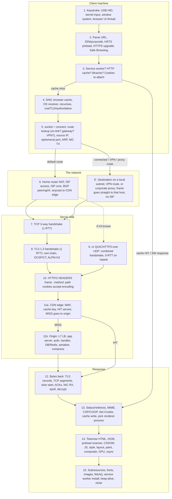
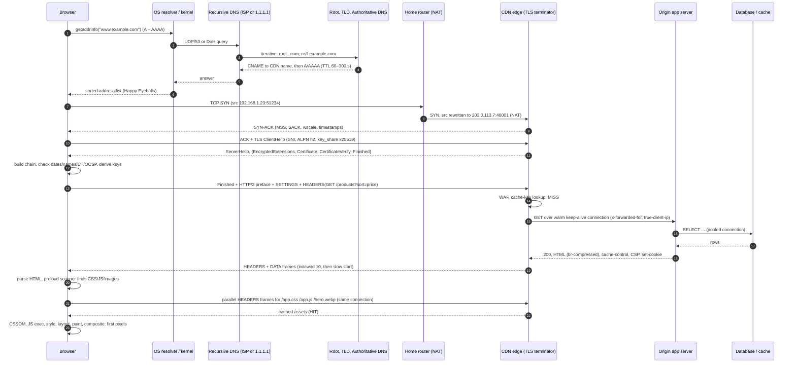

# What Happens When You Type a URL: Every Step From Keystroke to Pixels

The classic interview question, answered the way a staff engineer would answer it if given a whiteboard, an afternoon, and a packet capture. The point is not to recite "DNS, TCP, TLS, HTTP, render". The point is to know **every hand-off**: which process, which kernel subsystem, which box on the internet, which cache, which queue, which thread — and, for each one, what it costs in milliseconds, how it fails, and what you would change if it were slow.

The trace follows a single, ordinary action: a person on a laptop on home Wi-Fi types `https://www.example.com/products?sort=price` into Chrome and presses Enter. The site is served through a CDN in front of a cloud-hosted application with a database. Where other browsers, operating systems, or hosting shapes differ materially, the differences are called out.

Every section keeps the same shape as the other notes in this repo: **what has to happen** → **the mechanism** → **the numbers** → **how it fails** → **what a senior engineer does about it**.

Companion notes in this repo:

- [Computer Networking](computer-networking.md) — the deep reference for every protocol touched here (TCP congestion control, QUIC, DNS, TLS, load balancers, CDNs). This note is the *narrative* through that material; when a step says "see §6.7 of the networking note", that is where the full mechanism lives.
- [OSI and TCP/IP Models](osi-and-tcp-ip-models.md) — the layering vocabulary (encapsulation, what each layer owns) that this trace assumes.
- [What Happens When You Run a Program](../fundamentals/what-happens-when-you-run-a-program.md) — the sibling trace for the CPU/OS side: interrupts, syscalls, scheduling, page faults. Sections 1, 5, and 12 of this note lean on it.
- [Computer Architecture](../computer-architecture/computer-architecture.md) — NICs, DMA rings, interrupts, and the memory hierarchy from the hardware side.
- [REST API Best Practices](../software-engineering/rest-api-best-practices.md) — what the application server at the far end should be doing with the request once it has it.

---

## Table of Contents

0. [The Whole Journey on One Page](#0--the-whole-journey-on-one-page)
1. [Keystrokes: From Key Switch to Omnibox](#1--keystrokes-from-key-switch-to-omnibox)
2. [Parsing the URL and Deciding What It Means](#2--parsing-the-url-and-deciding-what-it-means)
3. [Pre-Network Checks Inside the Browser](#3--pre-network-checks-inside-the-browser)
4. [DNS: Turning a Name Into Addresses](#4--dns-turning-a-name-into-addresses)
5. [Opening a Socket: Route, Source Address, ARP, and the First Frame](#5--opening-a-socket-route-source-address-arp-and-the-first-frame)
6. [Across the Internet: NAT, the ISP, BGP, and Anycast](#6--across-the-internet-nat-the-isp-bgp-and-anycast)
7. [The TCP Handshake](#7--the-tcp-handshake)
8. [The TLS Handshake and Certificate Verification](#8--the-tls-handshake-and-certificate-verification)
9. [The QUIC and HTTP/3 Alternative Path](#9--the-quic-and-http3-alternative-path)
10. [Building and Sending the HTTP Request](#10--building-and-sending-the-http-request)
11. [The Server Side: Edge, Load Balancers, Application, Database](#11--the-server-side-edge-load-balancers-application-database)
12. [The Response Travels Back: Congestion Control and the Receive Path](#12--the-response-travels-back-congestion-control-and-the-receive-path)
13. [The Browser Processes the Response](#13--the-browser-processes-the-response)
14. [Rendering: Bytes to DOM to Pixels](#14--rendering-bytes-to-dom-to-pixels)
15. [After First Paint: JavaScript, Subresources, and the Long Tail](#15--after-first-paint-javascript-subresources-and-the-long-tail)
16. [A Worked Timeline With Real Numbers](#16--a-worked-timeline-with-real-numbers)
17. [Same Path, Different Client: ping, telnet, curl, and a Service Call](#17--same-path-different-client-ping-telnet-curl-and-a-service-call)
18. [Where Each Step Fails and How You Can Tell](#18--where-each-step-fails-and-how-you-can-tell)
19. [The Staff Engineer's Optimisation Checklist](#19--the-staff-engineers-optimisation-checklist)
20. [Observing Every Step Yourself: A Lab Path](#20--observing-every-step-yourself-a-lab-path)
21. [Further Reading](#21--further-reading)

---

# 0 — The Whole Journey on One Page

## 0.1 The flow

The diagram below is the spine of the note. Each numbered box is a section. Read it top to bottom once, then use it as a map when a step is slow or broken: the question "where in this diagram is the time going?" is the entire debugging method.



## 0.2 The same journey as a sequence of messages



## 0.3 The steps as a checklist

If you need the answer in ninety seconds, it is this list. Everything below is the expansion.

1. Key switch closes → keyboard MCU → USB HID report → host controller interrupt → kernel input subsystem → window system → browser UI thread → omnibox.
2. Omnibox autocompletes, and may pre-resolve DNS, preconnect, or prerender the predicted destination while you are still typing.
3. Enter: parse the string per the WHATWG URL Standard; decide "search" vs "navigate"; IDN → punycode; default port; strip fragment.
4. Apply HSTS (preload list + learned), HTTPS-first upgrade, Safe Browsing check, enterprise policy, extension rules.
5. Browser process creates a navigation request and hands it to the network service. Check for a controlling service worker, the HTTP disk cache (partitioned by top-level site), and back/forward cache. Decide direct versus proxy (policy, system settings, WPAD, PAC script); a proxy means the browser sends `CONNECT` to the proxy and the proxy does steps 7–12 on its behalf.
6. Collect cookies for the request (domain/path/Secure/SameSite/expiry/partition rules).
7. DNS: browser host cache → OS resolver (hosts file, OS cache, resolv.conf or DNS Client service) → recursive resolver (UDP 53 or DoH/DoT) → root → TLD → authoritative → CNAME chase → A and AAAA answers with TTLs.
8. Choose addresses (RFC 6724 sorting, Happy Eyeballs v2 racing v6 against v4).
9. `socket()` + non-blocking `connect()`: FIB longest-prefix route lookup decides internal versus external (destination AND netmask equals a connected network → deliver on-link; a VPN-pushed prefix → into the tunnel; otherwise the default route → the gateway), then source address and interface selection, ephemeral port allocation, ISN generation, SYN built with options.
10. Neighbour lookup for the default gateway MAC → ARP (or IPv6 ND) if missing → Ethernet or Wi-Fi frame → driver TX ring → DMA → NIC → PHY (or 802.11 CSMA/CA + WPA encryption + per-frame ACK).
11. Home router: de-encapsulate, forward, NAT/PAT rewrite + conntrack entry, firewall, TTL−1, out the WAN port (DOCSIS/PON/DSL/LTE scheduling).
12. ISP access → aggregation → core (MPLS) → BGP-selected exit (peering at an IX, private interconnect, or transit) → anycast lands at the nearest CDN PoP. Each hop: FIB lookup, TTL−1, checksum, ECMP hash, queue.
13. CDN PoP: edge router ECMP → L4 load balancer (consistent hashing, DSR or encapsulation) → L7 proxy host. NIC RSS → IRQ → NAPI → GRO → IP → TCP listener → SYN queue (or SYN cookie) → SYN-ACK.
14. Client ACK → server accept queue → `accept()` → connection handed to a worker or event loop. One RTT spent.
15. TLS 1.3: ClientHello (SNI/ECH, ALPN, key_share, PSK if resuming) → ServerHello + encrypted Certificate/CertificateVerify/Finished → client builds and verifies the chain (trust store, dates, SAN match, EKU, CT SCTs, OCSP staple/CRLSet) → client Finished → traffic keys. One more RTT (0-RTT with a resumption ticket).
16. Or QUIC over UDP 443 if an `Alt-Svc` header or HTTPS DNS record said so: transport + TLS in one RTT, no head-of-line blocking, connection migration.
17. HTTP/2 connection preface + SETTINGS; the request as an HPACK-compressed HEADERS frame on stream 1 with pseudo-headers and request headers (UA, accept, accept-encoding, cookies, sec-fetch-*, cache validators, priority).
18. `write()` → TLS record → TCP segments (Nagle off) → cwnd and pacing → qdisc → TSO → NIC.
19. CDN edge: WAF and bot rules, rate limits, cache-key computation (host + path + query + Vary), cache lookup. HIT → serve from edge RAM/SSD. MISS → origin fetch over pre-warmed connections, possibly through a shield tier.
20. Origin: cloud L7 load balancer → ingress or reverse proxy → application server accepts, parses, routes, runs middleware (request ID, auth, session, CSRF, rate limit), executes the handler, checks out a pooled DB connection, runs the query (parse/plan/execute/index scan), hits Redis, serialises, compresses, sets headers (cache-control, etag, CSP, HSTS, set-cookie, server-timing), writes, logs, emits metrics and traces.
21. Response bytes: HEADERS + DATA frames → TLS → TCP; first flight limited by initcwnd (10 segments ≈ 14 KB); slow start doubles per RTT; loss recovered by SACK and RACK; receive window auto-tunes; ACKs flow back.
22. Client RX: NIC → RSS queue → IRQ → NAPI → GRO → IP → TCP reassembly → socket receive buffer → `epoll` wakes the network service → read → TLS decrypt → HTTP/2 deframe → headers to the browser process, body streamed through a data pipe.
23. Browser: status code handling (3xx redirect chain with a limit, 401, 304 → cache), HSTS/Alt-Svc/Set-Cookie header side effects, MIME type and sniffing, `Content-Disposition`, CSP/COOP/COEP/CORP parsing, cache write, choose or spawn a renderer process (site isolation), unload the old document (or freeze it into bfcache), commit the navigation.
24. Renderer: decode bytes → tokenise → build DOM (with the preload scanner racing ahead to fetch CSS/JS/images) → parse CSS into CSSOM → run parser-blocking, defer, async, and module scripts by their rules → style resolution → layout → pre-paint (property trees) → paint (display lists) → layerise → commit to compositor thread → raster tiles (GPU) → draw quads → GPU process → OS compositor → vsync → photons.
25. Milestones fire: first paint, first contentful paint, `DOMContentLoaded`, largest contentful paint, `load`. Then the long tail: lazy images, fonts swapping in, fetch()/XHR, WebSockets, service worker install, analytics beacons, prefetch of the next page.
26. Connections linger on keep-alive, then time out and close with FIN/ACK; TLS session tickets and DNS entries are cached for next time.

---

# 1 — Keystrokes: From Key Switch to Omnibox

## 1.1 What has to happen

A physical event (a key switch closing) must become a character in a text field owned by one specific process, in the right window, with the right keyboard layout applied, roughly 200 times per second for a fast typist and without ever dropping or reordering a key.

## 1.2 The mechanism

**Inside the keyboard.** Keys sit on a scan matrix. The keyboard's microcontroller strobes rows and reads columns a few hundred to a few thousand times a second, debounces each switch (mechanical contacts bounce for 1–5 ms), and, when the state changes, builds a **USB HID report**: an 8-byte packet containing a modifier bitmap and up to six pressed keycodes. This is why cheap keyboards drop keys past six simultaneous presses ("6-key rollover").

**USB.** USB is host-polled, not interrupt-driven from the device. The host controller polls the keyboard's interrupt endpoint at the interval the device asked for: 8 ms (125 Hz) for a typical keyboard, 1 ms for gaming keyboards. A Bluetooth keyboard uses a 7.5 ms connection interval and adds radio retransmission jitter. A laptop's built-in keyboard usually rides an internal USB, I²C, or PS/2 controller with the same structure.

**Host controller → kernel.** The xHCI controller writes the report into a DMA'd transfer ring and raises an MSI-X interrupt. The kernel's USB core delivers it to the HID class driver, which parses the report using the descriptor it read at enumeration, and emits input events (`EV_KEY`, keycode, value) to the input subsystem. On Linux those events appear on `/dev/input/eventN`; on Windows the HID minidriver hands them to `kbdclass.sys` and the Raw Input Thread; on macOS, IOHIDFamily. The interrupt handling path (top half, bottom half, wakeup of the consumer) is the same one described in the run-a-program note.

**Kernel → window system.** The display server (Windows `win32k` and DWM, a Wayland compositor, an X server, macOS WindowServer) owns keyboard focus. It maps the scan code through the active layout (US, Dvorak, an IME for CJK input), applies modifiers, generates key-down and character events, and delivers them to the focused window's message queue: `WM_KEYDOWN`/`WM_CHAR` on Windows, `wl_keyboard::key` on Wayland, `NSEvent` on macOS.

**Browser UI thread.** Chrome's **browser process** (there is exactly one) runs the UI thread that pumps that message queue. The event is dispatched to the focused view: the omnibox text field, which inserts the character and repaints. Focus is *not* in a renderer process at this point, so no web content sees these keystrokes.

## 1.3 The omnibox is already working

Every keystroke runs the **autocomplete controller**, which fans out to providers in parallel: history (URL and title matching), bookmarks, open tabs, the shortcuts database (what you picked last time you typed this prefix), and the **search suggest** provider, which sends what you have typed so far to the default search engine over an already-open HTTPS connection. This is why a corporate proxy sees search traffic while you type; it can be disabled in settings. Results are scored and ranked; the top match is inline-completed.

The omnibox also feeds the **navigation predictor**. If it is confident enough about where you are going it will, before you press Enter:

| Speculation | What it does | Cost if wrong |
|---|---|---|
| **DNS pre-resolve** | Resolves the predicted hostname now | One DNS query |
| **Preconnect** | Opens TCP + TLS to the predicted origin | One idle connection the server has to hold |
| **Prefetch** | Fetches the predicted page's main resource into cache | Bandwidth and origin load |
| **Prerender** | Loads the whole page in a hidden renderer, then swaps it in on Enter | CPU, memory, and side effects if the page is not idempotent |

When prerender guesses right, the "what happens when you press Enter" answer is "a hidden tab becomes visible", and the rest of this note already happened.

## 1.4 Numbers

| Stage | Typical latency |
|---|---|
| Switch bounce + matrix scan | 1–5 ms |
| USB poll interval | 1–8 ms (average half the interval) |
| Interrupt → input event → window system | 50–200 µs |
| Window system → browser UI thread | 0.1–1 ms (more if the UI thread is busy) |
| Omnibox suggest round trip | 30–100 ms, asynchronous, does not block typing |
| Key press to glyph on screen | 20–60 ms end to end, dominated by the display's vsync (§14.9) |

## 1.5 How it fails

- A **busy UI thread** (an extension, a modal dialog, a huge history database query) makes typing lag; the keys are queued, not lost.
- **IME composition** means the omnibox receives a *composition* event stream, not characters; Enter may commit the composition rather than navigate.
- **Prerender side effects**: a prerendered page that fires an analytics beacon or a "mark as read" request has done so before the user chose it. The spec'd mitigations (`document.prerendering`, the `prerenderingchange` event, deferring non-idempotent work) exist and are widely ignored.

---

# 2 — Parsing the URL and Deciding What It Means

## 2.1 Search or navigate?

The first decision on Enter is whether the text is a URL at all. Heuristics: contains a scheme → URL; contains a dot in something that looks like a host → URL; matches a known intranet hostname from history → URL; contains spaces → search; a single word → search, with a "did you mean http://word/" infobar backed by an asynchronous DNS probe of the word. Our input has a scheme, so it is a navigation.

## 2.2 The WHATWG URL parser

Browsers do not use RFC 3986 directly; they implement the **WHATWG URL Standard**, a state-machine parser with defined error recovery so that all browsers mangle malformed URLs identically. The parse of `https://www.example.com/products?sort=price`:

| Component | Value | Notes |
|---|---|---|
| scheme | `https` | lower-cased; determines the default port and whether the host is "special" |
| username / password | empty | `user:pass@` would be parsed and then stripped from what is displayed |
| host | `www.example.com` | lower-cased, trailing dot stripped, IDNA-processed |
| port | none → 443 | an explicit `:443` is normalised away |
| path | `/products` | `.` and `..` segments resolved; backslashes become slashes in special schemes |
| query | `sort=price` | percent-encoded per the query set; not decoded |
| fragment | none | a `#section` would be kept by the browser and **never sent** to the server |

**Internationalised domain names.** A host like `bücher.example` is run through IDNA/UTS-46 processing (NFC normalisation, case folding, mapping of deprecated characters) and encoded as punycode for DNS: `xn--bcher-kva.example`. The browser then decides how to *display* it: mixed-script hostnames that could spoof Latin ones (`аррlе.com` with Cyrillic letters) are shown in punycode form as an anti-phishing measure.

**Percent-encoding.** Characters outside the allowed set for each component are encoded as UTF-8 then `%XX`. A space in the path becomes `%20`. Form submission would encode a space in the query as `+`, but that is a separate algorithm (`application/x-www-form-urlencoded`), not the URL parser.

## 2.3 Scheme upgrades and HSTS

Before anything touches the network, the scheme may change:

1. **Typed without a scheme** (`www.example.com`): modern Chrome defaults to `https://`, falling back to `http://` only if the HTTPS attempt fails quickly (HTTPS-First mode and HTTPS-Upgrades). Firefox and Safari have equivalents.
2. **HSTS preload list**: a list compiled into the browser binary (tens of thousands of domains, submitted at hstspreload.org) for which `http://` is rewritten to `https://` unconditionally, including all subdomains, and for which certificate errors cannot be clicked through.
3. **Learned HSTS**: a previous response carried `Strict-Transport-Security: max-age=31536000; includeSubDomains`, and the browser stored it. Same effect, until the max-age expires.

Our URL already says `https`, so this step only records that a later downgrade redirect to `http://` would be blocked if HSTS applies.

## 2.4 Safe Browsing, policy, and extensions

- **Safe Browsing**: the URL's canonical forms are hashed; 4-byte prefixes are compared against a locally synced list of known malware and phishing prefixes. On a prefix hit, the full hash is sent to the Safe Browsing service to confirm. Enhanced protection sends URLs in real time, through an Oblivious HTTP relay so the service does not see your IP together with the URL. A confirmed hit shows a red interstitial and the navigation stops here.
- **Enterprise policy**: `URLBlocklist` and `URLAllowlist` policies are consulted.
- **Extensions**: with Manifest V3, declarativeNetRequest rules are evaluated inside the network service; older `webRequest` blocking listeners get a synchronous callback and can cancel or redirect. An ad blocker with a hundred thousand rules costs tens of microseconds per request here.

## 2.5 What a senior engineer knows

- The fragment never reaches the server. Single-page-app routers that live in `#/route` are invisible to server logs and to CDN cache keys.
- Query-string *order* matters to caches unless the CDN is configured to sort or ignore parameters. `?sort=price&page=2` and `?page=2&sort=price` are two cache entries by default.
- Submit your domain to the HSTS preload list only when you are sure every subdomain will speak HTTPS forever. Removal takes months and stragglers become unreachable.

---

# 3 — Pre-Network Checks Inside the Browser

## 3.1 The process model

Chrome is many processes talking over **Mojo** IPC:

| Process | Role in this story |
|---|---|
| **Browser process** | Owns the UI, tabs, navigation state, cookie policy, permissions. Coordinates everything. |
| **Network service** | A sandboxed utility process that owns sockets, DNS, the HTTP cache, TLS, HTTP/2 and QUIC state, and cookie storage. All network I/O happens here. |
| **Renderer process** | One per site (with site isolation), sandboxed, cannot open sockets. Runs Blink and V8. |
| **GPU process** | Talks to the graphics driver; rasterises and composites. |
| **Storage service** | IndexedDB, Cache Storage, local storage. |
| **Utility processes** | Audio, data decoding (images, PDFs), and so on. |

The browser process turns "navigate this tab to this URL" into a **NavigationRequest**, then asks the network service to fetch it. Nothing about the page has reached a renderer yet; a compromised renderer cannot initiate or observe a navigation it should not see.

## 3.2 Is a service worker in charge?

If `www.example.com` previously registered a service worker whose scope covers `/products`, the navigation is routed to it first. The service worker (running in a renderer-like process) gets a `fetch` event and can respond from **Cache Storage** (no network at all), from the network, or from a combination ("stale-while-revalidate" written in JS). Navigation preload lets the network request start in parallel with service worker boot, so the worker's cold start (typically 20–100 ms) is hidden. If the worker calls `fetch()` or does not handle the event, we continue below.

## 3.3 The HTTP cache

The network service checks the **disk cache** (on desktop, a directory of blocks and an index; on Android, the "simple cache"). The key is the URL plus, since Chrome 86, the **top-level site** and frame site of the context requesting it. This is cache partitioning: `cdn.example/lib.js` fetched from site A cannot be used to detect that you visited site B.

Outcomes:

| Cache state | What happens |
|---|---|
| **Fresh** (age < `max-age`, or heuristically fresh via `Last-Modified`) | Served from disk with no network. Navigations are rarely fresh because HTML is usually sent with `no-cache` or short TTLs. |
| **Stale, validators present** | Request continues, carrying `If-None-Match: "etag"` or `If-Modified-Since:`. A `304` will revive the cached copy. |
| **`stale-while-revalidate`** | Serve stale immediately, revalidate in the background. |
| **Miss or `no-store`** | Full request. |

For a *typed* navigation Chrome uses normal cache semantics; a reload bypasses freshness but sends validators; a hard reload bypasses the cache entirely.

## 3.4 Back/forward cache

Not relevant to a typed URL, but part of "seeing a response": if the navigation were Back, the previous document may be **frozen in memory** (bfcache) and restored instantly, with no fetch, no parse, and JS state intact. Pages opt out by holding a `beforeunload` handler that returns a value, an open WebSocket, or `Cache-Control: no-store` on the main document (partly relaxed in recent Chrome).

## 3.5 Cookies

The network service asks the cookie store for cookies matching the request:

- **Domain match**: cookie domain `example.com` matches `www.example.com`; host-only cookies must match exactly.
- **Path match**: the cookie path is a prefix of the request path.
- **Secure**: only sent over HTTPS (and `localhost`).
- **SameSite**: a typed navigation is *top-level and same-site by definition*, so `Lax`, `Strict`, and `None` cookies are all sent. A cross-site link click would exclude `Strict`; a cross-site `` would exclude `Lax` too.
- **Partition** (CHIPS, the `Partitioned` attribute): keyed by top-level site.
- **Expiry and limits**: expired cookies are purged; per-domain caps (Chrome: 180 cookies, 4096 bytes each) evict the oldest.

The result is a single `cookie:` header, semicolon-joined, sorted longest-path-first. Cookie header size is a classic silent performance bug: 4 KB of cookies on every request for every static asset adds up, and some CDNs and load balancers reject request headers over 8–16 KB with a `431` or `400` that appears only for long-time users.

## 3.6 Direct or via a proxy? The browser's own inside-or-outside decision

Before DNS, the network service decides whether it will talk to `www.example.com` itself or hand the whole request to a **proxy**. This is the first "internal versus external" decision on the journey, and it is made in the browser, not the kernel. The sources are consulted in order:

1. **Policy or command line**: enterprise policies such as `ProxyMode` and `ProxyServer`, or `--proxy-server`. These win outright.
2. **System settings**: Windows WinHTTP/WinINET proxy settings, the macOS Network preferences, the `http_proxy`/`https_proxy`/`no_proxy` environment variables or GNOME settings on Linux.
3. **WPAD auto-discovery** (if "automatically detect settings" is on): DHCP option 252, then a DNS lookup of `wpad.<search domain>`, to find a PAC URL. Whoever answers that name controls every request, which is why WPAD is a classic attack on hostile networks and why it should be off unless the organisation uses it.
4. **PAC script**: a JavaScript file with one function, `FindProxyForURL(url, host)`, fetched from the configured URL and evaluated in a sandboxed V8 inside the network service. It returns `DIRECT`, or a fallback list such as `PROXY proxy.corp.example:8080; DIRECT`. A typical corporate PAC:

```
function FindProxyForURL(url, host) {
  if (isPlainHostName(host)) return "DIRECT";                       // "wiki", no dots: intranet
  if (dnsDomainIs(host, ".corp.example")) return "DIRECT";            // internal names stay inside
  if (isInNet(dnsResolve(host), "10.0.0.0", "255.0.0.0")) return "DIRECT";   // internal addresses too
  if (shExpMatch(url, "https://*.example.com/*")) return "PROXY proxy.corp.example:8080";
  return "PROXY proxy.corp.example:8080; DIRECT";                   // everything else via the proxy
}
```

   The `dnsResolve` call means the PAC script itself triggers a DNS lookup (§4) *before* the proxy decision is known, on every request, which is a well-known way to make a corporate browser slow.
5. **Bypass list**: hosts and patterns that skip the proxy regardless (`<local>` for dotless names, `*.corp.example`, `10.*`, `192.168.*`).

At home, none of these are set: the result is `DIRECT`, and the rest of this note applies literally.

**If the answer is a proxy**, the journey changes shape. The browser does *not* resolve `www.example.com`. It resolves and connects to `proxy.corp.example` instead (§4–§7 happen toward the proxy, on the LAN), then sends:

```
CONNECT www.example.com:443 HTTP/1.1
Host: www.example.com:443
Proxy-Authorization: Negotiate <Kerberos ticket>   (or NTLM, or Basic; a 407 asks for it)
```

The proxy resolves the name with *its* resolver, makes *its* own TCP connection out through the corporate firewall (§6 from the proxy's point of view), and replies `200 Connection Established`. From then on the TCP connection is a byte tunnel and the TLS handshake of §8 runs end to end between the browser and the CDN, so the proxy sees only the SNI, unless it is an intercepting proxy with an enterprise root installed, in which case it terminates TLS itself and re-signs (§8.4, step 9). A **transparent proxy** is the other design: the router redirects port 80/443 traffic to a proxy without the client knowing; for HTTPS it can only filter on the SNI or intercept with a root.

| Case | Cost |
|---|---|
| PAC evaluation | 0.1–1 ms per request; more with `dnsResolve` |
| PAC fetch, first time after connecting | 10–500 ms |
| WPAD discovery when nothing answers | timeouts of several seconds; the cause of "the first page after joining Wi-Fi hangs for 10 s" |
| Proxy hop | one extra TCP handshake on the LAN plus the proxy's own DNS and connect; CONNECT adds one RTT to the proxy |

Failures here look like `ERR_PROXY_CONNECTION_FAILED`, a `407` loop when Kerberos is not working, everything on one site blocked by proxy policy while others work, or a network that "works for curl but not Chrome" because only Chrome honours the system PAC.

## 3.7 What a senior engineer decides

- HTML: `Cache-Control: no-cache` (validate every time) or a short `max-age` with `stale-while-revalidate`. Never `no-store` unless it truly must not be reused; it also disables bfcache.
- Static assets: content-hashed filenames plus `Cache-Control: public, max-age=31536000, immutable`.
- Keep cookies small and scoped; use `__Host-` prefixed session cookies (`Secure`, no `Domain`, `Path=/`) so subdomains cannot plant them.
- Use a service worker only with a clear offline story; a mis-scoped worker that caches HTML is the number one cause of "users see the old version for weeks".
- On managed networks, deploy an explicit PAC by policy and turn WPAD off; keep PAC logic to name and pattern tests, never `dnsResolve` on the hot path.

---

# 4 — DNS: Turning a Name Into Addresses

## 4.1 What has to happen

`www.example.com` must become one or more IP addresses, ideally the address of a server *near this user*, within a few tens of milliseconds, without contacting a single central authority, and with an answer the browser can cache for a sensible period. The full mechanism is §8 of the networking note; this section walks the actual sequence.

## 4.2 The layers of cache before any packet leaves

1. **Browser host cache.** The network service's in-memory resolver cache, keyed by hostname + query type + network. Entries honour the record TTL (older Chrome capped this at about a minute; the built-in resolver now respects the TTL it saw). `chrome://net-internals/#dns` shows it.
2. **OS resolver.** The network service calls `getaddrinfo()` or, when the built-in async resolver is enabled, speaks DNS itself and only consults the OS for configuration. The OS path:
   - **Hosts file**: `/etc/hosts`, `C:\Windows\System32\drivers\etc\hosts`. Consulted first per `nsswitch.conf` (`hosts: files dns`).
   - **OS cache**: the Windows DNS Client service (`ipconfig /displaydns`), macOS `mDNSResponder`, Linux `systemd-resolved` at `127.0.0.53` or `nscd`. These honour TTL; negative answers are cached for a shorter period.
   - **Configured resolver**: from `/etc/resolv.conf`, DHCP option 6, or the Wi-Fi settings. Typically the home router (`192.168.1.1`), which itself forwards to the ISP's recursive resolver or to a public one (`8.8.8.8`, `1.1.1.1`, `9.9.9.9`).
3. **Encrypted DNS.** Chrome's *secure DNS* auto-upgrades: if the OS-configured resolver is on a known list of DoH-capable providers, queries go over HTTPS to that provider's DoH endpoint instead of UDP/53. Firefox defaults to a DoH partner in some regions. DoT (TCP/853) is used by Android Private DNS and `systemd-resolved`. Encrypted DNS hides the query from the local network but not from the resolver.

## 4.3 The query

Two queries go out in parallel: `www.example.com IN A` and `www.example.com IN AAAA`. Each is a UDP datagram to port 53 with a random 16-bit ID and a random source port (both are the defence against Kaminsky-style cache poisoning), an EDNS0 OPT record advertising a 1232–4096-byte UDP payload size, and possibly a `0x20` case-randomised name (`wWw.ExAmPle.CoM`) for extra entropy. Some resolvers add **EDNS Client Subnet**: the /24 of your address, so a GeoDNS authoritative can pick a nearby server even though the query arrives from the resolver's IP.

## 4.4 Recursion

The recursive resolver checks its own cache (a busy ISP resolver has a >90% hit rate). On a miss it iterates:

```
Recursive resolver asks                     Who answers                        What comes back
────────────────────────────────────────────────────────────────────────────────────────────────────
"www.example.com A?"  →  a root server      13 letters, ~1,900 anycast         "I don't know, but .com is served by
                          (198.41.0.4 ...)  instances worldwide                a.gtld-servers.net ... m.gtld-servers.net"
                                                                               + glue A/AAAA for those names

"www.example.com A?"  →  .com TLD server    Verisign, anycast                  "example.com is served by
                          (192.5.6.30 ...)                                     ns1.example-dns.net, ns2..." + glue if in-bailiwick

"www.example.com A?"  →  ns1.example-dns.net   the zone's authoritative        "www.example.com CNAME example.cdnprovider.net"
                                               (Route 53, Cloudflare, NS1)

"example.cdnprovider.net A?" → (repeat: .net TLD → CDN's authoritative)        "example.cdnprovider.net A 104.18.x.y  TTL 300"
```

Root and TLD delegations are cached for days (a TTL of 172800 s is common), so in practice the resolver usually starts at the authoritative step. The CNAME to the CDN is where **GeoDNS** happens: the CDN's authoritative looks at the resolver's IP (or the EDNS Client Subnet) and returns addresses of a nearby PoP. An anycast CDN instead returns the same address everywhere and lets BGP do the steering (§6.5).

**DNSSEC**: a validating resolver also fetches DNSKEY, RRSIG, and DS records up the chain and verifies signatures; a failure yields SERVFAIL, not an unsigned answer. Browsers do not validate DNSSEC themselves. A **HTTPS/SVCB** record, if present, is also queried by modern browsers: it can say "this origin speaks h3", supply an ECH public key (§8.3), and hint IPs.

## 4.5 Sizes, truncation, and TCP

A UDP answer over the advertised EDNS size is returned with the **TC** (truncated) bit, and the client retries over TCP/53. Large DNSSEC answers and many-record answers trigger this. Resolvers keep TCP connections open to busy authoritatives.

## 4.6 The answer comes back, and the browser chooses

The A and AAAA record sets, each with a TTL, land in the OS cache and the browser cache. The browser sorts candidates per **RFC 6724** (prefer native IPv6 over IPv4, prefer matching scope, avoid deprecated transition addresses) and applies **Happy Eyeballs v2** (RFC 8305): start a connection to the first IPv6 address; if there is no answer within 250 ms, start one to the first IPv4 address in parallel; use whichever completes first and close the other. This is why broken IPv6 at home is usually invisible: it just costs 250 ms per new connection.

## 4.7 Numbers

| Case | Typical cost |
|---|---|
| Browser or OS cache hit | 0–1 ms |
| Resolver cache hit (LAN router → ISP resolver) | 5–30 ms |
| Full recursion, delegations cached | 30–80 ms |
| Full recursion, cold (root → TLD → auth → CNAME → auth) | 80–300 ms |
| DoH first query (needs its own TLS connection) | +50–150 ms once; connection reused after |
| Negative answer (NXDOMAIN) | same as a positive one; cached per the SOA minimum TTL |

## 4.8 How it fails

- **NXDOMAIN** → `ERR_NAME_NOT_RESOLVED`. Typo, expired domain, missing record for `www`, or a split-horizon DNS that only answers inside the corporate network.
- **SERVFAIL** → the resolver could not get an answer: authoritative down, DNSSEC broken (an expired RRSIG takes a zone off the air for validating resolvers only, producing "works on some ISPs" reports), or a lame delegation (NS points at a server that does not host the zone).
- **Slow**: a broken IPv6 path plus a resolver that times out on AAAA; a resolver with an upstream problem retrying; a long CNAME chain across providers (each hop is another recursion).
- **Stale**: you changed the A record but the old one lives in caches for the old TTL. Lower the TTL *a day before* a migration; you cannot lower it retroactively.
- **Captive portal**: the hotel Wi-Fi's resolver answers every name with its own IP; HTTPS then fails certificate validation. Browsers detect captive portals by probing a known HTTP URL and expecting a specific body.

## 4.9 What a senior engineer decides

- TTLs: 60–300 s for records you may need to fail over; hours for stable infrastructure; never 5 s "just in case", because resolvers and browsers round up and you multiply query load for nothing.
- Use an anycast, DDoS-absorbing authoritative provider (or two, with the zone synced). DNS is the one dependency with no fallback.
- Publish AAAA only when the IPv6 path is monitored; a half-working IPv6 deployment costs every user 250 ms.
- Keep CNAME chains short and inside one provider; each extra hop is a fresh recursion for a cold resolver.

---

# 5 — Opening a Socket: Route, Source Address, ARP, and the First Frame

## 5.1 What has to happen

The network service has an IP address (say `104.18.x.y`) and needs a TCP connection to port 443. Before the first packet can leave, the kernel has to decide which interface, which source address, which port, which next hop, and which MAC address, and then get a frame physically onto the medium.

## 5.2 socket() and connect()

The network service calls `socket(AF_INET, SOCK_STREAM, 0)`, sets it non-blocking, sets `TCP_NODELAY` (browsers always do; Nagle's algorithm would delay small writes), and calls `connect()`. The syscall enters the kernel's TCP code and does, in order:

1. **Route lookup.** The **FIB** (forwarding information base) is searched by longest prefix match; §5.3 walks the decision in full. `104.18.x.y` is not on any local subnet and matches no VPN route; the only match is the default route `0.0.0.0/0 via 192.168.1.1 dev wlan0`. The result: egress interface `wlan0`, next hop `192.168.1.1`.
2. **Source address selection.** The address of the chosen interface (`192.168.1.23`). For IPv6, RFC 6724 rules choose among several addresses (prefer the temporary privacy address for outbound connections, matching scope, longest common prefix).
3. **Ephemeral port allocation.** From the local range: Linux `32768–60999` (`net.ipv4.ip_local_port_range`), Windows `49152–65535`. The kernel picks one not already in use for the same 4-tuple (Linux hashes the destination so that the same local port can be reused toward different remotes). Say `51234`. Running out of ports toward a single destination (about 28k with Linux defaults, with a 60 s `TIME_WAIT` after each close) is a real failure mode for proxies and load generators.
4. **Initial sequence number.** Generated per RFC 6528: a clock component plus a keyed hash of the 4-tuple, so it is unpredictable to off-path attackers but monotonic for a given connection pair.
5. **Build the SYN.** TCP header with the options negotiated in §7, IP header with `TTL=64` (Linux and macOS; Windows uses 128), `DF` set (for path MTU discovery), a random IP ID (or zero for DF packets on modern Linux).
6. **Start the SYN retransmission timer** (1 s, then doubling) and return `EINPROGRESS` to the caller, who registers the socket with `epoll` for writability.

## 5.3 Internal or external? How the route lookup decides

The kernel has no concept of "inside my network" versus "the internet". It has a **routing table**, and the question "do I deliver this packet directly to the destination, push it into a VPN tunnel, or hand it to the gateway?" falls out of one comparison per table entry. Here is a realistic laptop table, with a corporate split-tunnel VPN connected and Docker installed:

```
$ ip route                                          (Windows: route print; macOS: netstat -rn)
default via 192.168.1.1 dev wlan0 proto dhcp metric 600          <- from DHCP: "everything else"
10.0.0.0/8 via 10.8.0.1 dev tun0                                 <- pushed by the VPN client: corporate space
10.8.0.0/24 dev tun0 proto kernel scope link src 10.8.0.5        <- connected: the VPN's own subnet
172.17.0.0/16 dev docker0 proto kernel scope link src 172.17.0.1 <- connected: Docker bridge
192.168.1.0/24 dev wlan0 proto kernel scope link src 192.168.1.23 metric 600   <- connected: home LAN
```

**Where entries come from.** *Connected* routes are added by the kernel the moment an interface gets an address and prefix length: they say "this prefix is reachable directly on this link" (`scope link`, no `via`). The *default* route comes from DHCP (option 3) or an IPv6 Router Advertisement. *Static* routes come from an administrator. *VPN* clients push routes when the tunnel comes up. Laptops never run dynamic routing protocols; routers do (§6.4).

**The algorithm.** For a destination `D`, every entry whose network equals `D AND netmask` is a candidate. The candidate with the **longest prefix** wins; among equal prefixes the lowest **metric** wins. The arithmetic for two destinations:

```
Printer 192.168.1.50:   192.168.1.50  AND 255.255.255.0 = 192.168.1.0   == 192.168.1.0/24   match: connected, on-link
                        192.168.1.50  AND 0.0.0.0       = 0.0.0.0       == 0.0.0.0/0        match: default
                        -> longest prefix is /24 -> deliver directly on wlan0, ARP for 192.168.1.50 itself

CDN 104.18.32.7:        104.18.32.7   AND 255.255.255.0 = 104.18.32.0   != 192.168.1.0      no
                        104.18.32.7   AND 255.0.0.0     = 104.0.0.0     != 10.0.0.0         no (VPN route)
                        104.18.32.7   AND 0.0.0.0       = 0.0.0.0       == 0.0.0.0/0        match: default only
                        -> next hop 192.168.1.1 on wlan0, ARP for the gateway
```

| Destination | Candidates | Winner | Next hop | Frame's destination MAC |
|---|---|---|---|---|
| `104.18.32.7` (CDN) | default | `/0` | `192.168.1.1` | the home router |
| `192.168.1.50` (printer) | `/24` connected, default | `/24` | none, on-link | the printer itself |
| `10.20.30.40` (intranet wiki) | `/8` via tun0, default | `/8` | `10.8.0.1` through the tunnel | none: `tun0` is a virtual point-to-point device; the VPN client encapsulates the packet in UDP to the VPN server, and *that* packet is routed again, via the default route, to `192.168.1.1` |
| `10.8.0.1` (VPN gateway) | `/24` connected on tun0, `/8`, default | `/24` | on-link | none (tunnel) |
| `172.17.0.2` (container) | `/16` connected on docker0, default | `/16` | on-link | the container's veth |

The crucial point: **the IP header is identical in every case.** The destination IP is always the final destination. What the route lookup changes is only *which interface* the packet leaves by and *which MAC address* goes on the frame (the destination's own, or the gateway's). "Internal" simply means the destination's MAC is reachable on a link you are attached to; "external" means you are relying on a router to carry it further. That is the whole difference between layer-2 delivery and layer-3 forwarding, and it is why the OSI note spends a section on encapsulation.

**Full-tunnel VPN.** A VPN that wants *all* traffic pushes two routes, `0.0.0.0/1` and `128.0.0.0/1`, rather than replacing the default: each /1 is longer than the /0 and wins for every destination, and the original default is untouched for when the tunnel drops. It also adds a host route, `203.0.113.99/32 via 192.168.1.1`, for the VPN server itself, so the encapsulated packets can escape via the physical gateway instead of looping into the tunnel. With a full tunnel, §6 of this note becomes "VPN server → corporate egress → internet": the CDN sees the corporate IP, GeoDNS and anycast serve the *corporate office's* region, and every packet takes a hairpin through the office, which is why video calls are worse on a full-tunnel VPN.

**Split-horizon DNS: the decision is made twice.** For internal names the choice usually starts in §4, not here. The VPN client pushes an internal resolver and search domains; the OS routes queries per interface (`systemd-resolved` "routing domains" such as `~corp.example` → tun0's resolver; the Windows Name Resolution Policy Table; macOS `/etc/resolver/`). `wiki.corp.example` therefore resolves to `10.20.30.40` from the internal resolver, and only then does the routing table send that address into the tunnel. From outside the VPN the same name gets NXDOMAIN or a public address. Internal versus external is decided once by *which resolver answers* and once by *which route matches*, and a mismatch between the two ("internal DNS answered but no route", or the reverse) is the standard "the intranet works on VPN client A but not B" ticket.

**Policy routing.** Linux consults `ip rule` *before* the table: rules can select a different table by source address, incoming interface, or firewall mark. WireGuard uses a mark so its own encapsulated packets skip the table that sends everything into the tunnel; multi-homed servers use source-based rules so replies leave by the interface they arrived on. Windows achieves similar results with per-interface metrics and binding order; macOS with scoped routes.

**IPv6.** There is no netmask attached to the address. On-link status comes from the Router Advertisement's Prefix Information option with the **L (on-link) flag** set; an address inside a prefix that was advertised *without* L still goes through the router. Link-local `fe80::/10` is always on-link, and the default route is learned from the RA's router lifetime, not from DHCP.

**Cloud VMs and containers.** The same algorithm, with a twist: in a cloud VPC the VM's table says the whole subnet (or the whole VPC) is connected, and the hypervisor's virtual router answers ARP for *every* address, so the VM believes everything is on-link while the fabric actually routes it. Kubernetes nodes get a route per pod CIDR from the CNI plugin; Docker adds the bridge route above. Every layer of virtual networking is one more entry in this table.

**Numbers.** A FIB lookup is an LPC-trie walk of 50–100 ns on Linux, done once per socket: the result (`dst_entry`) is cached on the socket and reused for every packet of the connection, and invalidated when the table changes. That invalidation is why connecting a VPN drops existing connections: their next packet is routed into the tunnel, arrives from a different source address, and the far end resets it.

**How it fails.**
- **Overlapping subnets**: the home LAN is `192.168.1.0/24` and so is the office's; the VPN's route to the office prefix ties with the connected route and loses on metric, so the intranet is reachable from a café but not from home. The fix is renumbering the home network or a VPN that uses NAT.
- **Two default routes** (Wi-Fi and Ethernet both up): traffic leaves by the lower metric, but a packet that binds the wrong source address goes out one interface with the other's address and is dropped by the ISP's anti-spoofing filter.
- **Docker's `172.17.0.0/16` colliding** with a corporate range: the connected route beats the VPN's `/8`, and one specific internal service is unreachable while the rest work.
- **VPN without the host route** for its own server: the tunnel's packets are routed into the tunnel; it connects, then goes silent.
- **DNS leak**: the tunnel carries the traffic, but queries still go to the home router's resolver, exposing which internal names are being used.

## 5.4 Neighbour resolution: ARP and ND

The packet must be handed to the next hop chosen in §5.3: the destination itself when it is on-link, otherwise the gateway. Here that is `192.168.1.1`, which requires that router's **MAC address**. The kernel checks the neighbour table (`ip neigh`, `arp -a`):

- **Hit** (state REACHABLE or STALE): use the cached MAC. Entries go STALE after about 30 s and are re-confirmed opportunistically when traffic flows.
- **Miss**: the SYN is queued (up to 3 packets per neighbour) and an **ARP request** is broadcast: an Ethernet frame to `ff:ff:ff:ff:ff:ff`, EtherType `0x0806`, "who has 192.168.1.1? tell 192.168.1.23". The router replies unicast with its MAC. On IPv6, the equivalent is **Neighbour Discovery**: an ICMPv6 Neighbour Solicitation to the solicited-node multicast address, answered by a Neighbour Advertisement.

ARP has no authentication. Anyone on the LAN can answer for the gateway (**ARP spoofing**) and become a man-in-the-middle, which is one of the reasons the TLS step exists at all.

## 5.5 Framing and transmission

The packet is now wrapped in an Ethernet frame: destination MAC = router, source MAC = our NIC, EtherType `0x0800` (IPv4) or `0x86DD` (IPv6). On a wired NIC:

1. The driver writes a descriptor into the **TX ring**, pointing at the `sk_buff` data, with flags asking the NIC to compute the TCP/IP checksums (**checksum offload**) and to segment if the buffer exceeds the MSS (**TSO**; not relevant for a lone SYN).
2. The driver rings the doorbell register; the NIC DMAs the frame from RAM, computes checksums, adds the preamble and FCS (CRC-32), and serialises it onto the wire through the PHY. 1000BASE-T uses PAM-5 signalling on all four pairs simultaneously; 1500 bytes takes about 12 µs at 1 Gb/s.
3. Completion interrupt (coalesced) → driver frees the buffer.

Over **Wi-Fi** the same frame goes through 802.11 instead:

- The client must win the medium: **CSMA/CA** with a random backoff, listening for a clear channel. Every other device on the channel, including the neighbours' networks, competes.
- The frame is encrypted with the pairwise key negotiated at association (WPA2/WPA3 with AES-CCMP or GCMP) and sent at a PHY rate chosen by the rate-adaptation algorithm (from 6 Mb/s to over 1 Gb/s on Wi-Fi 6/7 depending on signal). The access point must **ACK** each frame or block of frames; no ACK → retransmit at a lower rate, up to a retry limit.
- Power saving: a laptop radio that has dozed must wake, adding a few ms on the first packet after idle.
- Typical Wi-Fi cost per hop: 1–5 ms median with a long tail of 20–100 ms during contention or interference. Jitter of this shape is what makes video calls choppy, far more than bandwidth does; §15 of the networking note covers why.

## 5.6 Numbers

| Step | Cost |
|---|---|
| `socket()` + `connect()` syscalls, route lookup, port allocation | 10–50 µs |
| ARP round trip (cold) | 0.2–2 ms wired; 2–20 ms Wi-Fi |
| Frame on the wire at 1 Gb/s | ~12 µs per 1500 B |
| Wi-Fi medium access + transmission + ACK | 1–5 ms typical |

## 5.7 How it fails

- **No route to host**: interface down, a VPN pulled the default route, or an IPv6 default route with no working v6 uplink (Happy Eyeballs rescues the latter after 250 ms).
- **ARP not answered**: wrong VLAN, a client-isolation setting on the AP, or the gateway is down. Symptom: SYN retransmits with no reply, then `ERR_CONNECTION_TIMED_OUT` (Chrome gives up on the first attempt after roughly 20–30 s; the kernel itself would retry for about 2 minutes).
- **Port exhaustion** (`EADDRNOTAVAIL`): only on hosts opening tens of thousands of outbound connections; a browser never gets there.
- **MTU mismatch on a VPN or PPPoE link**: the SYN gets through (it is small), the TLS handshake gets through, then the first full-size response segment is dropped silently. See §6.6.

---

# 6 — Across the Internet: NAT, the ISP, BGP, and Anycast

## 6.1 What has to happen

A packet addressed to `104.18.x.y` has to cross a home router, an access network, at least one ISP backbone, one or more inter-provider boundaries, and arrive at a specific server in a specific datacenter, with no central coordinator, in a few tens of milliseconds. On the way, each device makes an independent forwarding decision based only on the destination address.

## 6.2 The home router: NAT and conntrack

The router receives the frame on its LAN interface, sees its own MAC as destination, strips the Ethernet header, and hands the IP packet to its forwarding path. It now makes the same decision as §5.3 with its own table: connected routes for each LAN it serves (`192.168.1.0/24` on the main LAN, `192.168.2.0/24` on the guest VLAN) and a default route via the WAN interface. A packet for `192.168.2.20` (a device on the guest network) matches a connected route, so the router forwards it out that interface and ARPs for the device directly, with no NAT and without the packet ever leaving the house; this is the only situation in which a home router *routes* between two of its own networks. A packet for the router's *own public IP* from a LAN host (a home server tested by its external name) needs **hairpin NAT** to be turned around, which cheap routers often get wrong. Our packet for `104.18.x.y` matches only the default route. Before sending, it runs **NAT** (strictly, NAPT or PAT) because the LAN uses private RFC 1918 space:

```
Inside                                  Outside
192.168.1.23:51234 → 104.18.x.y:443     203.0.113.7:40001 → 104.18.x.y:443
```

The router rewrites the source IP and port, recomputes the IP and TCP checksums, and records a **connection tracking** entry keyed by the 5-tuple, with TCP state (SYN_SENT now, ESTABLISHED after the handshake). Return packets to `203.0.113.7:40001` are matched against the table and rewritten back. The entry has a timeout: minutes for half-open connections, hours or days for established TCP (Linux conntrack: 5 days by default for established, 120 s for UDP). This is why NAT-keepalive exists and why idle WebSockets die at 5 minutes behind some carrier NATs.

The router also applies its **firewall**: stateful, "allow established and related, drop unsolicited inbound". A packet arriving from outside with no conntrack entry is dropped, which is what makes home networks unreachable from the internet without port forwarding, UPnP, or a relay.

The IP TTL is decremented from 64 to 63. Many ISPs hand out a single public address per customer; in IPv4-scarce regions there is a second **carrier-grade NAT** (CGNAT) at the ISP using `100.64.0.0/10` address space, so two NAT tables rewrite the packet before it reaches the public internet. With IPv6, there is usually no NAT at all: the laptop has a globally routable address and the router is only a stateful firewall.

## 6.3 The access network

The WAN port is the customer end of an access technology, each with its own scheduling and its own latency floor:

| Access | Mechanism | Added one-way latency |
|---|---|---|
| **DOCSIS cable** | Shared coax; the CMTS grants upstream transmit slots via MAP messages. Upstream is request-grant, so the first packet waits for a grant. | 5–15 ms typical; more under load (bufferbloat) |
| **GPON / XGS-PON fibre** | Shared fibre tree with time-division upstream scheduled by the OLT | 1–3 ms |
| **DSL** | Dedicated copper pair to the DSLAM, interleaving for error correction adds delay | 10–30 ms |
| **LTE / 5G** | Radio scheduler grants uplink resources per transmission-time interval; an idle device must transition RRC state first | 10–30 ms active; 50–200 ms extra when waking from idle |
| **Starlink** | Ground station via low-earth-orbit satellite | 20–40 ms |

The customer's frame arrives at the ISP's aggregation device (CMTS, OLT, BNG), which terminates the access protocol (PPPoE session, DOCSIS service flow) and forwards the IP packet into the ISP's IP/MPLS core.

## 6.4 Inside the ISP and out the other side

The ISP core is a set of high-capacity routers connected by 100–800 Gb/s links, typically running **MPLS**: the ingress router looks up the destination, pushes a label, and subsequent core routers switch on the label rather than performing IP lookups. At the ISP's edge, the destination `104.18.0.0/16` matches a BGP-learned prefix and the packet exits via whichever neighbour BGP selected (the full algorithm is §5 of the networking note): most-specific prefix, then local preference (prefer customers over peers over transit, because customers pay you and transit costs you), then AS path length, then hot-potato to the nearest exit.

The neighbour is one of:

- A **peering session at an internet exchange** (DE-CIX, AMS-IX, Equinix, LINX): the ISP and the CDN both have a port on the IX switch fabric and exchange traffic for free.
- A **private network interconnect**: a direct fibre between the two networks' routers in the same building.
- **Transit**: a paid upstream provider that will carry the packet the rest of the way.
- An **embedded cache**: large CDNs place servers *inside* ISP networks. For popular content the packet never leaves the ISP.

## 6.5 Anycast: how "the nearest edge" happens

The CDN announces the *same* prefix (`104.18.0.0/16`) from hundreds of locations. Every ISP's BGP picks the announcement it likes best, which is normally the one with the shortest AS path, meaning the nearest. Packets from London land in the London PoP; packets from Mumbai land in Mumbai. Nothing in the packet says "go to London"; the routing system converged that way. The cost: route changes can move a *flow* to a different PoP mid-connection, which TCP cannot survive. CDNs mitigate this by keeping BGP stable, by steering long-lived flows to unicast addresses, and, with QUIC, by connection IDs that let a new PoP hand the connection back.

## 6.6 What every router does to every packet

At each of the 10–20 hops between the laptop and the CDN edge, the same forwarding pipeline runs, usually in hardware (ASICs with TCAM lookup tables) in a few hundred nanoseconds:

1. Validate the IP header checksum and the length.
2. **Decrement TTL**; if it reaches 0, drop and send `ICMP Time Exceeded` back to the source (this is how `traceroute` works: send packets with TTL 1, 2, 3... and collect who complains).
3. **Longest-prefix match** on the destination in the FIB.
4. If several equal-cost paths exist (**ECMP**), hash the 5-tuple to pick one, so that all packets of one flow take the same path and are not reordered.
5. Rewrite the link-layer header for the next hop (new destination MAC, new source MAC), or swap the MPLS label.
6. Place the packet in the egress queue. If the queue is full, drop it (tail drop) or mark it (ECN, if the endpoints negotiated ECN) or drop it early (RED/CoDel/PIE) to signal congestion before the queue fills. Queueing delay is the *variable* part of latency; everything else is close to constant.
7. Serialise onto the link.

**Path MTU.** Our packets have the DF bit set. If any link on the path has an MTU smaller than the packet (a VPN tunnel at 1400, a PPPoE link at 1492), the router must drop the packet and send `ICMP Fragmentation Needed` with the link MTU; the sender then reduces its segment size. If a firewall on the path blocks ICMP, the sender never learns and large packets disappear silently: the **PMTU black hole**. Symptoms: the TLS handshake completes (small packets), then the first large data segment stalls until the sender's black-hole detection kicks in. Servers usually set an MSS of 1460 or lower, clamp MSS at the edge, or use the 1280-byte IPv6 minimum for safety.

## 6.7 Numbers

| Quantity | Value |
|---|---|
| Speed of light in fibre | ~200,000 km/s, so 5 µs per km, 1 ms per 100 km one way |
| London–New York fibre RTT floor | ~56 ms (5,570 km great-circle, plus cable routing); real-world 70–80 ms |
| Same-continent RTT to a CDN edge | 5–30 ms |
| Cross-continent RTT to an origin | 80–250 ms |
| Per-hop forwarding delay (hardware) | 1–20 µs plus serialisation |
| Queueing delay, healthy link | 0–2 ms |
| Queueing delay, bufferbloated cable/DSL modem under upload | 100–1,000+ ms |
| Hop count laptop → CDN | 8–15 |

## 6.8 How it fails

- **Route flap or a BGP leak**: a network announces prefixes it should not; traffic detours through the wrong continent or blackholes. Symptom: a whole region suddenly cannot reach you while everything on your side is green.
- **Congested peering**: an ISP and a content provider disagree about who pays to upgrade a saturated link; evenings become slow for that ISP's users only.
- **Bufferbloat**: an upload from another device fills the home router's queue; every RTT climbs by hundreds of ms; pages "feel" slow while a speed test says the bandwidth is fine.
- **Asymmetric routing**: the return path differs from the forward path; harmless normally, but a stateful firewall in the middle that sees only one direction will drop the flow.
- **Anycast flip**: a BGP change moves your flow to another PoP; TCP connection resets appear for a few seconds region-wide.

## 6.9 What a senior engineer decides

- Put a CDN or anycast edge in front of anything users hit directly, even for dynamic content. The TCP and TLS handshakes then happen against a 10–20 ms neighbour instead of a 150 ms origin, and the edge keeps warm connections to the origin.
- Clamp MSS at every tunnel and load-balancer boundary; never block ICMP types 3 and 11 (or ICMPv6 Packet Too Big).
- Assume NAT timeouts of 30 s for UDP and a few minutes for idle TCP when designing anything long-lived; send keepalives sooner.
- Buy or peer with the eyeball networks your users are on; the last hop is the most congested and the least under your control.

---

# 7 — The TCP Handshake

## 7.1 What has to happen

Both sides must agree on starting sequence numbers, confirm that the other end is reachable and willing, and exchange the parameters that shape the whole connection (segment size, window scaling, selective acknowledgement, timestamps), all before a single byte of the request can be trusted to arrive in order. TCP proper is §6 of the networking note; this section is the handshake as it happens.

## 7.2 The three packets

```
Client (192.168.1.23:51234)                                  Server (104.18.x.y:443)
        │                                                             │
        │  SYN  seq=ISNc                                              │
        │  options: MSS=1460, SACK-permitted, WS=7 (×128),            │
        │           TSval, [TFO cookie request]                       │
        │────────────────────────────────────────────────────────────►│  1. lookup listener, SYN queue or SYN cookie
        │                                                             │
        │  SYN-ACK  seq=ISNs  ack=ISNc+1                              │
        │  options: MSS=1460, SACK-permitted, WS=8 (×256), TSval/TSecr│
        │◄────────────────────────────────────────────────────────────│  2. reply; timer for retransmit
        │                                                             │
        │  ACK  seq=ISNc+1  ack=ISNs+1                                │
        │  (TLS ClientHello rides in this same packet or right after) │
        │────────────────────────────────────────────────────────────►│  3. move to accept queue; accept() returns
        │                                                             │
```

**Options negotiated:**

| Option | Meaning | Typical values |
|---|---|---|
| **MSS** | Largest TCP payload the sender will accept; MTU − 40 (v4) or − 60 (v6) | 1460 / 1440; 1452 behind PPPoE; lower on tunnels |
| **Window scale** | Shift count applied to the 16-bit window field, so windows up to 1 GB are possible | Linux 7, Windows 8. Must be in both SYN and SYN-ACK or neither side uses it |
| **SACK permitted** | Allow selective acknowledgement blocks, so one lost segment does not force retransmitting everything after it | Always on |
| **Timestamps** | Per-segment timestamps for RTT measurement and PAWS (wraparound protection) | On by default on Linux and macOS; Windows off by default |
| **TCP Fast Open** | Carry data in the SYN on repeat connections, using a cookie from a prior connection | Rare in practice because middleboxes break it; QUIC's 0-RTT replaced it |
| **ECN** (flags, not an option) | Willing to have congestion *marked* rather than dropped | On by default in modern Apple and Linux; often stripped by middleboxes |

## 7.3 On the server: SYN queue, accept queue, SYN cookies

The server host (a CDN edge machine, reached via §11.2's L4 balancer) processes the SYN in its kernel:

1. **RSS** on the NIC hashes the 4-tuple to pick a receive queue, whose interrupt is affinitised to one CPU, so all packets of this flow are handled on the same core with warm caches.
2. The IP layer finds a `LISTEN` socket for `*:443` (several, with `SO_REUSEPORT`, and the kernel hashes to one of them).
3. A **request socket** (mini-socket) is created in the **SYN queue** with the negotiated options; the SYN-ACK is sent; a retransmit timer starts (1 s, doubling, up to `tcp_synack_retries` = 5).
4. When the ACK arrives, the mini-socket becomes a full socket and is moved to the **accept queue** (length bounded by the `listen()` backlog, capped by `net.core.somaxconn`, 4096 on recent Linux).
5. The application's `epoll_wait()` returns readability on the listener; it calls `accept4()` and gets a file descriptor.

If the SYN queue is full (a **SYN flood**, or a slow application), Linux switches to **SYN cookies**: it does not store state; it encodes the connection parameters into the ISN it sends back and reconstructs them when the ACK arrives. Options that do not fit in the cookie (window scale, SACK) are recovered from timestamps if present, or lost. If the *accept* queue is full, the server silently drops the final ACK (or resets if `tcp_abort_on_overflow` is set); the client thinks it is connected and sends the ClientHello, which is dropped, and retries. This shows up as a spike in `ListenOverflows` and in client-side "TLS handshake timeout" errors during traffic surges.

## 7.4 Numbers

| Quantity | Value |
|---|---|
| Handshake cost | Exactly 1 RTT before the client can send; 1.5 RTT before the server sees data |
| RTT to a CDN edge | 5–30 ms; to a far origin 100–250 ms |
| SYN retransmission schedule (Linux) | 1, 2, 4, 8, 16, 32 s… `tcp_syn_retries` = 6 gives up at ~127 s |
| Chrome's own connect timeout | About 20–30 s for the first attempt, with Happy Eyeballs racing after 250 ms |
| Kernel work per handshake | 5–20 µs; a single core can do ~100k handshakes/s |
| Default accept backlog | 4096 (Linux ≥ 5.4); Nginx defaults to 511 unless configured |

## 7.5 How it fails

- **RST in reply to SYN** → `ERR_CONNECTION_REFUSED`: nothing listening on that port, or a firewall configured to reject rather than drop.
- **Silence** → `ERR_CONNECTION_TIMED_OUT`: a firewall dropping, wrong security group, the host is down, or an asymmetric route. `traceroute -T -p 443` (TCP probes) shows where it stops.
- **Handshake OK, then stall**: accept-queue overflow (the ACK was dropped), a PMTU black hole (the next large packet is dropped), or a middlebox that stripped window scaling on one side so the window is 128× smaller than intended.
- **Sequence number prediction and RST injection**: mitigated by randomised ISNs and by requiring in-window RSTs (RFC 5961), but a large window makes blind in-window guessing feasible for on-path attackers; TLS makes injection detectable rather than preventing the connection kill.

## 7.6 What a senior engineer decides

- Move the handshake close to the user (CDN, anycast) since it is a fixed RTT tax you cannot pipeline.
- Size the accept backlog and `somaxconn` for your burst rate, and alert on `ListenOverflows` and `ListenDrops` in `/proc/net/netstat`. A saturated accept queue is the most common "the site is up but 1% of connections hang" bug.
- Enable SYN cookies; they are free until needed.
- Keep long-lived connection pools from the edge to the origin so the handshake happens once per pool member, not once per user request.

---

# 8 — The TLS Handshake and Certificate Verification

## 8.1 What has to happen

Before sending a request containing cookies, the browser must (1) agree on cryptographic keys with the far end that no one on the path can learn, (2) prove that the far end is *actually* `www.example.com` and not the coffee shop's router, and (3) do it in one round trip. TLS 1.3 (RFC 8446) does exactly that. The PKI mechanics are §10 of the networking note; this is the sequence.

## 8.2 The messages

```
Client                                                                 Server
  │                                                                       │
  │ ClientHello ─────────────────────────────────────────────────────────►│
  │   legacy_version 0x0303, random[32], legacy_session_id (compat)       │
  │   cipher_suites: TLS_AES_128_GCM_SHA256, TLS_AES_256_GCM_SHA384,      │
  │                  TLS_CHACHA20_POLY1305_SHA256 (+ TLS 1.2 suites)      │
  │   extensions:                                                         │
  │     server_name = www.example.com          (SNI, plaintext unless ECH)│
  │     supported_versions = [1.3, 1.2]                                   │
  │     supported_groups = [X25519MLKEM768, x25519, secp256r1, ...]       │
  │     key_share = { x25519: pub, X25519MLKEM768: pub }  (guess groups)  │
  │     signature_algorithms = [ecdsa_secp256r1_sha256, rsa_pss_rsae..]   │
  │     alpn = [h2, http/1.1]                                             │
  │     psk_key_exchange_modes, pre_shared_key   (if resuming)            │
  │     status_request (OCSP stapling), signed_certificate_timestamp      │
  │     GREASE values (random junk to keep servers tolerant)              │
  │                                                                       │
  │◄──────────────────────────────────────────────────────── ServerHello  │
  │   random[32], chosen suite, key_share (server's x25519/ML-KEM pub)    │
  │   ── from here on everything is encrypted with handshake keys ──      │
  │◄─────────────────────────────────────────────── {EncryptedExtensions} │
  │   alpn = h2                                                           │
  │◄───────────────────────────────────────────────────── {Certificate}   │
  │   leaf cert (www.example.com, SANs), intermediate(s); no root         │
  │   OCSP staple, SCTs embedded or as extension                          │
  │◄──────────────────────────────────────────────── {CertificateVerify}  │
  │   signature over the transcript hash with the cert's private key      │
  │◄─────────────────────────────────────────────────────────── {Finished}│
  │   HMAC over the transcript with the server handshake traffic key      │
  │                                                                       │
  │  ── client verifies everything (8.4), derives application keys ──     │
  │ {Finished} ──────────────────────────────────────────────────────────►│
  │ [application data: HTTP/2 preface + request] ───────────────────────►│
  │◄──────────────────────────────── [NewSessionTicket] (post-handshake)  │
```

**Key derivation.** Both sides compute the ECDHE shared secret from the key shares (x25519: ~50 µs of scalar multiplication; the hybrid `X25519MLKEM768` group adds a post-quantum KEM whose public key is ~1.2 KB, which is why modern ClientHellos no longer fit in one packet). HKDF extracts an early secret (from the PSK, or zeros), a handshake secret (mixing in ECDHE), and a master secret; traffic keys for each direction are expanded from those. Every message is mixed into a running transcript hash so that a tampered handshake produces mismatched `Finished` MACs.

**Why one RTT.** The client sends its key share *speculatively*, guessing which group the server supports. If it guesses wrong, the server sends `HelloRetryRequest` naming the group it wants and a second RTT is spent. Browsers guess x25519 (and now the hybrid PQ group) because nearly every server supports them.

**SNI and ECH.** The server may host thousands of names on one IP and needs the hostname *before* it can pick a certificate, so `server_name` is sent in the clear. **Encrypted Client Hello** fixes this: the real ClientHello is encrypted to a public key published in the domain's HTTPS DNS record, wrapped in an outer ClientHello whose SNI is a shared cover name (`cloudflare-ech.com`). ECH is deployed by Cloudflare and supported in Chrome and Firefox when the DNS record is present and DNS was fetched over DoH.

## 8.3 What the client sends and what the server chooses

The **ALPN** negotiation is what decides the *application* protocol for §10: the client offers `h2` and `http/1.1`; the server picks one in `EncryptedExtensions`. There is no HTTP-level upgrade dance; by the time the handshake ends, both sides know they are speaking HTTP/2.

## 8.4 Certificate verification

This is the step people skip in interviews and the step that pages people at 3 a.m. The browser (through the OS or its own verifier; Chrome ships the **Chrome Root Store** and its own path builder) must establish that the leaf certificate chains to a trusted anchor and is valid for this name, right now:

1. **Parse** the leaf and intermediates (X.509 DER). Typical chain: 2–4 KB in total with ECDSA, 4–6 KB with RSA.
2. **Build a path.** Starting from the leaf, find an issuer whose subject matches the leaf's issuer and whose key signs it, repeating until a certificate in the **trust store** is reached. The server sends intermediates because clients do not have them; a missing intermediate is the classic "works in Chrome (which fetches it via AIA), fails in curl and Java" bug. Cross-signed intermediates can produce multiple valid paths; the builder tries them.
3. **Check signatures** on every link (ECDSA P-256 verify ~100 µs; RSA-2048 verify ~30 µs).
4. **Validity dates.** `notBefore ≤ now ≤ notAfter`. Chrome also enforces a maximum lifetime for publicly trusted certs (398 days now; the CA/Browser Forum ballot phases this down to 47 days by 2029).
5. **Name matching.** The requested host must match a `subjectAltName` DNS entry; the Common Name is ignored. Wildcards match exactly one label (`*.example.com` matches `www` but not `a.b`).
6. **Constraints.** Basic constraints (only CA certs may issue), name constraints on the intermediate, key usage, and extended key usage (`serverAuth`).
7. **Revocation.** Browsers do not do live OCSP lookups any more (privacy leak, latency, and soft-fail meant it protected nobody). Instead: **OCSP stapling** (the server sends a recent, signed OCSP response in the handshake, checked here) and Chrome's **CRLSets** / Firefox's **CRLite** (a compressed, pushed list of revoked certificates). Missing staple is tolerated unless the certificate carries the `must-staple` extension.
8. **Certificate Transparency.** Chrome and Safari require that the certificate be logged in public CT logs: at least two **Signed Certificate Timestamps** from logs on the browser's trusted list, embedded in the cert, stapled, or in a TLS extension. A cert without valid SCTs is rejected even if everything else checks out. CT is why a mis-issued certificate for your domain is discoverable: your monitoring watches the logs.
9. **Policy checks**: distrusted CAs (Symantec, and any CA removed from the root program), Chrome's key-pinning list for a handful of major sites, and enterprise-installed roots (which are exempt from CT, which is how corporate TLS interception works).

If any step fails, the handshake is torn down with an alert, and the browser shows an interstitial: `NET::ERR_CERT_DATE_INVALID`, `ERR_CERT_COMMON_NAME_INVALID`, `ERR_CERT_AUTHORITY_INVALID`. With HSTS in effect, there is no "proceed anyway" button.

## 8.5 Resumption and 0-RTT

After the first handshake the server sends one or more **NewSessionTicket** messages: an opaque, encrypted blob containing the resumption secret. On the next connection the client offers it as a `pre_shared_key`; the server skips the certificate (saving 2–6 KB and the signature) and, if the client included **early data**, can process the request *before* its own first flight, giving **0-RTT**. The catch: 0-RTT data can be replayed by an attacker who captured it, so browsers only send idempotent GETs in early data and servers should reject non-idempotent early data with `425 Too Early`. Tickets are valid for hours (7 days maximum); the ticket-encryption key must be rotated and shared across a server fleet for resumption to work behind a load balancer.

## 8.6 TLS 1.2 differences, for the legacy path

TLS 1.2 takes **two RTTs** (ClientHello → ServerHello/Certificate/ServerKeyExchange/ServerHelloDone → ClientKeyExchange/ChangeCipherSpec/Finished → ChangeCipherSpec/Finished), sends the certificate in the clear, negotiates from a much larger and weaker suite list (CBC modes, RSA key exchange without forward secrecy, SHA-1), and has renegotiation. Browsers still support 1.2 for the ~2% of servers that need it; 1.0 and 1.1 are gone.

## 8.7 Numbers

| Quantity | Value |
|---|---|
| Full TLS 1.3 handshake | 1 RTT + ~1–3 ms of CPU (both sides), or 2 RTT if HelloRetryRequest |
| Resumed, 0-RTT | 0 extra RTT before the request leaves |
| TLS 1.2 full | 2 RTT |
| Bytes on the wire, full handshake | 4–8 KB, mostly certificates; enough to spill past initcwnd if the chain is fat |
| ECDSA P-256 sign (server, CertificateVerify) | ~0.1–0.3 ms |
| RSA-2048 sign | ~1–2 ms; this is why ECDSA certificates roughly triple a TLS terminator's handshake capacity |
| AES-128-GCM with AES-NI | 2–5 GB/s per core; encryption is not the bottleneck after the handshake |
| Record size | up to 16 KB plaintext per record; a record must be complete before it can be decrypted, so smaller records early in the connection reduce first-byte latency |

## 8.8 How it fails

- **Expired certificate**: the number one TLS outage. Automate renewal (ACME) and alert at 20 days remaining, not 2.
- **Missing intermediate**: works in browsers that fetch it, fails in scripts and mobile apps.
- **Name mismatch**: the cert covers `example.com` but not `www.example.com`, or the CDN served the wrong cert for an SNI it did not recognise (its default cert).
- **Clock skew**: a laptop with a dead CMOS battery believes it is 2015 and every certificate is "not yet valid".
- **Corporate interception**: an installed root lets a proxy re-sign every site; sites with pinned keys break; CT is skipped for those roots by design.
- **Handshake stalls at the certificate**: an MTU or initcwnd problem, since the certificate flight is the first set of large packets.
- **`ERR_SSL_PROTOCOL_ERROR`**: a server that speaks HTTP on 443, a broken middlebox, or a cipher mismatch with an ancient server.

## 8.9 What a senior engineer decides

- ECDSA P-256 certificates, an intermediate chain as short as possible, OCSP stapling on, TLS 1.3 on, 1.2 kept only if analytics show a need.
- Session ticket keys rotated hourly and distributed to the whole fleet; otherwise every request from a load-balanced user is a full handshake.
- Monitor CT logs for your domains; treat an unexpected certificate as an incident.
- Terminate TLS at the edge near the user; use a second, internal TLS (mTLS) hop to the origin rather than re-terminating at every layer.

---

# 9 — The QUIC and HTTP/3 Alternative Path

## 9.1 How the browser learns to use it

The first visit is TCP + TLS + HTTP/2 as above. The response, or the DNS HTTPS record, tells the browser it could do better:

```
alt-svc: h3=":443"; ma=86400
```

or, in DNS, `www.example.com HTTPS 1 . alpn="h3,h2" ipv4hint=...`. From then on, and until the `ma` expires, the browser opens **QUIC** to UDP port 443 instead. Chrome races the QUIC attempt against a TCP attempt and remembers per-network whether UDP 443 works, because a surprising number of corporate firewalls drop it, in which case it falls back permanently for that network.

## 9.2 What is different

QUIC (RFC 9000) is a transport in user space over UDP, with TLS 1.3 built in rather than layered on top. §7 of the networking note has the full design; the differences that matter for this trace:

| Aspect | TCP + TLS | QUIC |
|---|---|---|
| Handshake | 1 RTT TCP + 1 RTT TLS = 2 RTT | Combined: 1 RTT; **0-RTT** on repeat including the request |
| Streams | One byte stream; a lost packet stalls everything behind it (head-of-line blocking) | Many independent streams; loss on one does not stall the others |
| Connection identity | 4-tuple; an IP change (Wi-Fi to LTE) kills it | **Connection ID**; the connection migrates across addresses |
| Header protection | TCP headers are visible and rewritable by middleboxes | Almost everything is encrypted, including ACKs; middleboxes cannot ossify it |
| Congestion control | Kernel's CUBIC/BBR | Implementation's choice (Chrome: CUBIC/BBR variants) with better loss detection (packet numbers never repeat) |
| CPU cost | NIC offloads (TSO, checksum) make it cheap | Historically 2–3× CPU per byte; improving with UDP GSO and kernel work |

In the sequence diagram of §0.2, QUIC collapses steps 7–13 into a single client Initial packet (containing the ClientHello) and a server reply carrying Handshake and 1-RTT packets, and the HTTP/3 request can be in the client's second flight, or in the first with 0-RTT.

## 9.3 HTTP/3 framing

HTTP/3 maps each request to its own QUIC stream, replaces HPACK with **QPACK** (header compression that tolerates out-of-order delivery), and uses QUIC's own flow control. Semantics (methods, headers, status codes) are unchanged; only the wire format differs.

## 9.4 When it matters

QUIC's advantages are largest on lossy and high-latency paths: mobile, satellite, congested Wi-Fi. On a wired 10 ms path to a CDN the gain is the one saved RTT on connection setup and nothing else. Its cost is server CPU and a dependency on UDP being permitted. About 30% of web traffic now uses it, essentially all through Google, Cloudflare, Meta, and Akamai edges.

---

# 10 — Building and Sending the HTTP Request

## 10.1 HTTP/2 connection setup

ALPN said `h2`, so the network service starts HTTP/2 the moment the TLS handshake finishes (in the same flight as the client `Finished`):

1. The **connection preface**: the literal bytes `PRI * HTTP/2.0\r\n\r\nSM\r\n\r\n` (chosen to make an HTTP/1.1 server choke visibly).
2. A **SETTINGS** frame: header table size, max concurrent streams (Chrome allows 1000 inbound; servers typically 100–128), initial window size (Chrome advertises 6 MB per stream and 15 MB for the connection to keep the pipe full on fast links), max frame size, and `ENABLE_PUSH=0` (Chrome removed server push support).
3. A **WINDOW_UPDATE** for the connection-level flow-control window.

The server answers with its own SETTINGS and an ACK. The client does not wait for them to send the request.

## 10.2 The request itself

The request goes out as a **HEADERS** frame on stream 1 (client streams are odd, server-initiated ones even), with `END_STREAM` set because a GET has no body. The header block is **HPACK**-compressed: a static table of 61 common header pairs, a dynamic table shared across the connection (the second request's `cookie` and `user-agent` cost a couple of bytes each), and Huffman coding for literals. What the block decodes to:

```
:method: GET
:scheme: https
:authority: www.example.com
:path: /products?sort=price
user-agent: Mozilla/5.0 (Windows NT 10.0; Win64; x64) AppleWebKit/537.36 (KHTML, like Gecko) Chrome/140.0.0.0 Safari/537.36
accept: text/html,application/xhtml+xml,application/xml;q=0.9,image/avif,image/webp,image/apng,*/*;q=0.8,application/signed-exchange;v=b3;q=0.7
accept-language: en-GB,en;q=0.9
accept-encoding: gzip, deflate, br, zstd
cookie: session=eyJhbGciOi...; _ga=GA1.2.123; theme=dark
cache-control: max-age=0                      (only on reload)
if-none-match: "5f3a-7b2c"                    (if a stale cached copy exists)
upgrade-insecure-requests: 1
sec-ch-ua: "Chromium";v="140", "Google Chrome";v="140"
sec-ch-ua-mobile: ?0
sec-ch-ua-platform: "Windows"
sec-fetch-site: none                          (typed navigation: no initiator)
sec-fetch-mode: navigate
sec-fetch-dest: document
sec-fetch-user: ?1                            (user-activated)
priority: u=0, i                              (RFC 9218: urgency 0 = highest, incremental)
```

Details worth knowing:

- **Pseudo-headers** replace the HTTP/1.1 request line; `:authority` replaces `Host`. Header names are lower-case by requirement.
- **`sec-fetch-*`** headers are set by the browser and cannot be forged by page script. Servers use them for cheap CSRF defence: a state-changing POST with `sec-fetch-site: cross-site` is rejected.
- **Client hints** (`sec-ch-ua*`) replaced most of the User-Agent string's entropy; the UA string itself is frozen and partly fake ("Windows NT 10.0" on Windows 11).
- **`accept-encoding`** lists `br` (Brotli) and `zstd`; the server should pre-compress static assets with Brotli at level 11 and compress dynamic HTML at level 4–5 (or gzip 6) on the fly.
- **Priority**: HTTP/2's original dependency-tree prioritisation was so poorly implemented across servers and CDNs that RFC 9218 replaced it with a header carrying an urgency level 0–7 and an incremental flag. The HTML document is urgency 0; CSS and fonts get high urgency; images low.

**If ALPN had said `http/1.1`**, the same request would be a text block:

```
GET /products?sort=price HTTP/1.1\r\n
Host: www.example.com\r\n
Connection: keep-alive\r\n
...same headers...\r\n
\r\n
```

with the difference that only one request can be in flight per connection (pipelining is disabled in every browser), so Chrome opens up to 6 connections per host, each needing its own TCP + TLS handshake. That six-connection limit and the head-of-line blocking are the reasons HTTP/2 exists.

## 10.3 From write() to the wire

The network service hands the frame to the TLS layer (BoringSSL), which wraps it in a TLS record (AES-GCM encrypt, 16-byte authentication tag, 5-byte header) and calls `write()` (`send()`) on the socket. In the kernel:

1. The bytes are copied into the socket's **send buffer** (`sk_buff` chain); `write()` returns immediately. The send buffer auto-tunes up to `net.ipv4.tcp_wmem[2]` (4 MB default).
2. The TCP layer decides how much may go now: `min(cwnd, rwnd) − bytes in flight`. On a brand-new connection cwnd is 10 segments (~14.6 KB); our request is a few hundred bytes, so it goes at once. Nagle is off, so it is not held waiting for an ACK.
3. Segments are built (up to MSS each), IP headers attached, and the packet handed to the **qdisc** (queueing discipline). The default `fq` qdisc paces segments out at a rate derived from cwnd/RTT rather than in bursts, which reduces loss at bottleneck queues.
4. The driver posts the buffer to the NIC's TX ring with **TSO** enabled: for large writes the kernel hands the NIC a 64 KB super-segment and the NIC cuts it into MSS-sized packets, saving CPU.
5. The NIC DMAs, checksums, transmits. The retransmission timer (RTO, initially 1 s, then based on measured RTT with a 200 ms floor on Linux) is armed for the oldest unacknowledged segment.

The whole path from `write()` to the frame leaving the NIC is 10–30 µs when the pipe is open.

## 10.4 How it fails

- **Header too large**: a 431 from a proxy with an 8 KB header limit, usually because of cookie accumulation.
- **HTTP/2 stream limit**: a page firing 200 requests at once queues the ones beyond `MAX_CONCURRENT_STREAMS`; visible as "Stalled" in DevTools.
- **Connection coalescing surprises**: HTTP/2 lets the browser reuse one connection for any hostname the certificate covers *and* that resolves to the same IP; a misconfigured wildcard certificate can send `api.example.com` traffic down `www`'s connection to a server that does not route it, producing `421 Misdirected Request`.
- **`ERR_HTTP2_PROTOCOL_ERROR`**: a server or proxy violating framing rules, often an intermediary that "supports" HTTP/2 badly. The fix is nearly always to disable HTTP/2 on that hop.

---

# 11 — The Server Side: Edge, Load Balancers, Application, Database

## 11.1 What has to happen

A request arriving at a CDN PoP must be checked for abuse, matched against the cache, forwarded to the origin if needed, routed to a healthy application instance, authenticated, executed against a database, turned into a response, and sent back, with every hop observable so that a slow request can be attributed to a layer. This is where most of the *engineering* effort in "seeing a response" lives; §14 of the networking note covers the load-balancer and CDN designs in depth.

## 11.2 Inside the CDN PoP

```
                     ┌──────────────────────────────── PoP ─────────────────────────────────┐
  from ISP ──► edge router ──ECMP──► L4 balancer (Maglev/Katran, consistent hash) ──DSR/GUE──►
                                                                                              │
                     ┌────────────────────────────────────────────────────────────────────────┘
                     ▼
              L7 edge proxy host (nginx / Envoy / proprietary)
                ├─ TLS termination (cert for www.example.com selected by SNI)
                ├─ HTTP/2 or HTTP/3 deframing
                ├─ WAF: signature rules (SQLi, XSS, RCE patterns), managed rules, rate limits,
                │        bot score (TLS fingerprint, header order, JS challenge), geo/ASN rules
                ├─ Edge logic: redirects, header rewrites, edge functions (Workers/Lambda@Edge)
                ├─ Cache key: scheme + host + path + (sorted) query + Vary'd headers
                ├─ Cache lookup: RAM ──► local SSD ──► peer edge in same PoP ──► shield/parent PoP
                │     HIT  → serve (x-cache: HIT, age: N)
                │     MISS → request coalescing (one origin fetch per key), then ▼
                └─ Origin fetch over a pooled, warm TLS connection
                        + headers: x-forwarded-for, x-forwarded-proto, true-client-ip, cdn-loop,
                          via, and the original request headers
```

**L4 balancer.** Each PoP has a handful of L4 balancers behind ECMP. Maglev-style balancers hash the 5-tuple with a consistent-hash table so that a flow keeps landing on the same backend even when the balancer set changes, and forward with direct server return or encapsulation so response traffic bypasses the balancer.

**Cache decision.** Whether `/products?sort=price` is cacheable is decided by the origin's `Cache-Control` and the CDN's rules. A personalised page (it carries a session cookie and renders "Hello, Alice") must be `private` or `no-store` at the edge, or a cache poisoning bug shows Alice's page to Bob. A common production shape: HTML is not cached at the edge (or cached for seconds with `stale-while-revalidate`), everything else is. For this walk-through, assume a **MISS**.

**Request coalescing.** If 500 users in the PoP request the same uncached key in the same 100 ms, one request goes to the origin and 499 wait for it (also called collapsed forwarding). Without it, a cache expiry is a thundering herd on the origin.

## 11.3 To the origin

The edge's origin connection goes over the CDN's own backbone or the public internet to the origin's public endpoint. In the cloud that is usually:

1. A **cloud L7 load balancer** (AWS ALB, GCP HTTPS LB, Azure Application Gateway) that terminates TLS again, checks health, and routes by host and path to a target group. These are themselves fleets of proxies fronted by anycast or DNS round-robin.
2. Possibly a **Kubernetes ingress** (nginx-ingress, Envoy Gateway, Istio) or a service mesh sidecar that does another proxy hop with retries, timeouts, circuit breaking, and mTLS to the pod. Each proxy hop is 0.2–1 ms and another place to lose a request header.
3. The **application server**.

Every hop should add to `x-forwarded-for` and carry a **trace context** header (`traceparent`) so the request can be reconstructed across services.

## 11.4 The application server accepts the request

Inside the pod, the same kernel path as §7.3 runs: NIC → IRQ → TCP → accept queue. Then the server's concurrency model takes over:

| Model | Example | What happens to our request |
|---|---|---|
| **Event loop, single-threaded** | Node.js (libuv), nginx worker, Python asyncio | `epoll_wait` returns; the loop reads, parses, and dispatches; any blocking call stalls every other in-flight request |
| **Thread per request / pool** | Java Tomcat, Spring MVC, Ruby Puma, Python gunicorn threads | An acceptor thread hands the socket to a worker thread from a pool of 200; if the pool is exhausted, the request waits in the accept queue |
| **Goroutine per connection** | Go `net/http` | The netpoller wakes a goroutine; cheap enough that pool exhaustion is not the usual failure, memory is |
| **Process per request** | PHP-FPM, Python gunicorn sync workers | A process from a pool of N handles it; N is small (CPU count × 2 + 1), so a slow DB call starves everything |

The server reads bytes, parses the HTTP/1.1 request the proxy forwarded (proxies usually downgrade to HTTP/1.1 toward the origin; gRPC and some setups keep HTTP/2), validates it (header limits, method), and hands a request object to the framework.

## 11.5 Framework: routing and middleware

The framework matches `GET /products` against its route table (a trie or regex list) and runs the **middleware chain** before the handler:

1. **Request ID and logging**: assign or propagate an ID; start a span.
2. **Security headers and CORS** preflight handling (not needed for a navigation).
3. **Rate limiting**: token bucket per IP or per user, often in Redis.
4. **Body parsing** (none for GET), size limits.
5. **Session and authentication**: read the `session` cookie; either look it up in a session store (Redis, 0.2 ms in-datacenter) or verify a signed token (JWT: check signature with the public key, expiry, issuer, ~50 µs). Load the user record, possibly from a cache.
6. **CSRF**: irrelevant for GET; for POST, check the token or the `sec-fetch-site` header.
7. **Authorisation**: is this user allowed to see products? Feature flags, A/B bucket assignment.

## 11.6 The handler and the database

The handler parses `sort=price`, validates it against an allow-list (this is where SQL injection is prevented, along with parameterised queries), and asks the data layer for products:

1. **Cache check**: `GET products:sort=price:page=1` from Redis or Memcached. A hit returns serialised rows in ~0.2–0.5 ms including the network round trip inside the VPC. Assume a miss.
2. **Connection pool checkout**: the app holds a pool of 10–50 open database connections (or goes through PgBouncer/ProxySQL). Checkout is microseconds if a connection is free; if all are busy, the request waits, and this wait is the most common hidden latency in web backends.
3. **The query** goes over that connection's own TCP socket (its own handshake happened at pool creation, its own TLS if enabled): `SELECT id, name, price, image_url FROM products WHERE active ORDER BY price LIMIT 24 OFFSET 0`.
4. **On the database server**: parse the SQL (or use a prepared statement's cached plan), plan it (an index on `(active, price)` makes this an index range scan; without it a sort of the whole table), execute it (buffer pool hits for hot pages, disk reads at 100 µs on NVMe for cold ones), and return rows in the wire protocol. A well-indexed query on a warm database: 0.5–3 ms including the round trip. The internals of those steps are the datastore notes in this repo.
5. **Result mapping** into objects, and possibly N+1 follow-up queries if the ORM is used carelessly, which is the second most common hidden latency.
6. **Write to cache** with a TTL for next time.

## 11.7 Building the response

The handler renders: an HTML template (server-side rendering, 1–20 ms depending on the engine and page) or a JSON body for an API. Then the framework and server:

1. **Serialise** the body to bytes.
2. **Compress** if `accept-encoding` allows: Brotli level 4 or gzip level 6 for dynamic content (~1 ms per 100 KB), turning a 120 KB HTML page into 20–25 KB. Static assets are pre-compressed at build time at maximum level.
3. **Set headers**:

```
HTTP/1.1 200 OK
content-type: text/html; charset=utf-8
content-encoding: br
content-length: 24310                       (or transfer-encoding: chunked while streaming)
cache-control: private, no-cache            (personalised page: validate every time, never share)
etag: "a1b2c3"
vary: accept-encoding, cookie
set-cookie: __Host-session=...; Secure; HttpOnly; SameSite=Lax; Path=/; Max-Age=86400
strict-transport-security: max-age=31536000; includeSubDomains; preload
content-security-policy: default-src 'self'; script-src 'self' 'nonce-R4nd0m'; object-src 'none'; base-uri 'none'
x-content-type-options: nosniff
referrer-policy: strict-origin-when-cross-origin
permissions-policy: camera=(), geolocation=()
cross-origin-opener-policy: same-origin
x-frame-options: DENY                       (legacy; CSP frame-ancestors is the modern form)
link: </static/app.css>; rel=preload; as=style, </static/app.js>; rel=preload; as=script
server-timing: db;dur=2.1, cache;desc=miss, app;dur=14.3
alt-svc: h3=":443"; ma=86400
x-request-id: 7f3c...
```

4. **Write** to the socket; with chunked encoding, streaming can start as soon as the `<head>` is rendered, which lets the browser's preload scanner (§14.3) start fetching CSS and JS while the server is still querying for the body. A **103 Early Hints** interim response does the same thing even earlier: the proxy or server sends `103` with `link: rel=preload` headers before the handler has run.
5. **Log** the access line, **emit metrics** (latency histogram, status counter), **finish the trace span**, and return the connection to keep-alive.

## 11.8 Back through the proxies

The response retraces the hops: ingress → cloud LB → CDN edge. The edge decides whether to **store** it (it will not, given `private, no-cache`), adds its own headers (`cf-cache-status: DYNAMIC`, `age`, `via`), may apply edge transformations (image resizing, HTML minification, injecting a bot-detection script), and re-frames it as HTTP/2 DATA frames toward the user, compressing headers with HPACK. If the origin had answered with a cacheable response, the next 10,000 users in that PoP would get it without steps 11.3–11.7 at all.

## 11.9 Numbers

| Stage | Typical latency |
|---|---|
| L4 balancer + edge proxy processing | 0.1–0.5 ms |
| WAF rule evaluation | 0.1–2 ms |
| Edge cache HIT, served from RAM | 0.5–2 ms |
| Edge → origin RTT | 10–150 ms depending on geography; connection pre-warmed |
| Cloud LB + ingress hops | 0.5–3 ms |
| Framework routing + middleware | 0.1–2 ms |
| Session lookup (Redis) | 0.2–0.5 ms |
| Indexed query, warm cache | 0.5–3 ms |
| Unindexed query or cold pages | 10–1,000+ ms |
| Template render | 1–20 ms |
| Brotli-4 compression of 100 KB | ~1 ms |
| Healthy origin time-to-first-byte, all in | 20–80 ms |

## 11.10 How it fails

- **502 Bad Gateway**: the proxy could not get a valid response: app crashed, wrong port, health checks failing, HTTP/2 framing error between proxies.
- **503 Service Unavailable**: overload, no healthy backends, or a deploy with zero ready pods (a readiness-probe bug).
- **504 Gateway Timeout**: the app took longer than the proxy's timeout (often 30 or 60 s); the app usually finished the work anyway, which is how duplicate orders happen when the client retries.
- **Connection pool exhaustion**: p50 fine, p99 catastrophic, no CPU pressure anywhere; the wait is in the pool's queue and does not show in query timing.
- **Cache poisoning**: a `Vary`-less cache stored a response with a personalised body, or one generated for an attacker-controlled `X-Forwarded-Host`.
- **Thundering herd** on cache expiry without request coalescing or jittered TTLs.
- **Retry storms**: three layers of proxies each retrying 3 times turns one slow request into 27 origin requests.

## 11.11 What a senior engineer decides

- Cache aggressively at the edge with correct `Vary` and `private`; a cacheable response is one that never touches §11.3–11.7.
- Set timeouts and retry budgets *once*, at the outermost layer that can retry safely, and make inner layers fail fast.
- Add `server-timing` and a request ID to every response; they turn a "the site is slow" ticket into a specific layer.
- Size connection pools from Little's law (throughput × latency), not guesswork, and expose pool wait time as a metric.
- Stream HTML or send 103 Early Hints so the browser's fetch of CSS and JS overlaps your database time.

---

# 12 — The Response Travels Back: Congestion Control and the Receive Path

## 12.1 What has to happen

A 24 KB compressed HTML body (or a 2 MB image) has to be delivered over a path whose capacity is unknown to the sender, without overrunning either the network or the receiver, recovering from loss without the application noticing. Then the client's kernel must reassemble it in order and wake the browser efficiently. §6.7 and §12 of the networking note hold the theory; this is the sequence.

## 12.2 Slow start and the first flights

The edge's TCP stack begins with **initcwnd = 10** segments (RFC 6928), about 14.6 KB. The response's HEADERS frame plus the first ~14 KB of body go out at once, paced by the `fq` qdisc across one RTT. Then:

```
RTT 1:  10 segments   (14.6 KB)   ─ cumulative 14.6 KB
RTT 2:  20 segments   (29 KB)     ─ cumulative 44 KB
RTT 3:  40 segments   (58 KB)     ─ cumulative 102 KB
RTT 4:  80 segments   (117 KB)    ─ cumulative 219 KB
```

Each ACK for a full segment grows cwnd by one segment (doubling per RTT) until loss or the slow-start threshold, after which **congestion avoidance** (CUBIC's cubic growth, or BBR's model of bandwidth and RTT) takes over. So our 24 KB HTML arrives in 2 RTTs; a 300 KB JavaScript bundle needs about 5 RTTs on a cold connection, which at 100 ms RTT is half a second before the last byte, regardless of bandwidth. This is why **bytes in the first 14 KB matter** (put the critical CSS and the `<head>` there), why the HTML should come from an edge (short RTT), and why a **warm connection** matters: cwnd persists across requests on a keep-alive connection (modulo `tcp_slow_start_after_idle`, which resets it after one RTO of idleness on Linux by default, and which CDNs disable).

The **receive window** advertised by the client (initially ~64 KB on Linux, scaled, auto-tuning up to `tcp_rmem[2]` = 6 MB as the application keeps up) is the other limit; on a fast, long path the window, not cwnd, caps throughput: `throughput ≤ window / RTT`, so 64 KB at 100 ms is only 5 Mb/s.

## 12.3 Loss and recovery

If a segment is lost in a queue somewhere in §6:

- The client keeps ACKing the last in-order byte and adds **SACK** blocks describing what it has beyond the gap.
- After 3 duplicate ACKs (or, with **RACK**, after a segment sent later has been ACKed for more than a small reordering window), the sender **fast-retransmits** the missing segment without waiting for the RTO, halves cwnd (CUBIC: multiplies by 0.7), and continues.
- If nothing comes back at all (a whole window lost), the **RTO** fires (minimum 200 ms on Linux, typically 1 s early in a connection), cwnd drops to 1, and slow start restarts. Tail losses on the last segment of a response used to hit this path routinely; **TLP** (tail loss probe) sends a probe after 2 RTTs to trigger SACK-based recovery instead.
- ECN, if negotiated end-to-end, has routers *mark* rather than drop, and the sender reduces cwnd without any retransmission.

A single 1% loss rate on a 100 ms path caps a CUBIC flow at roughly 10–20 Mb/s regardless of link speed (the Mathis equation, `throughput ≈ MSS / (RTT × √p)`); this is why lossy Wi-Fi feels slow even with good signal, and why BBR and QUIC exist.

## 12.4 The client's receive path

Each response packet arriving at the laptop:

1. The Wi-Fi chip receives the 802.11 frame, verifies the FCS, decrypts it, ACKs it to the access point, and DMAs the Ethernet-equivalent frame into the driver's **RX ring**.
2. An interrupt (coalesced: one per several packets or per ~50 µs) fires. The top half schedules **NAPI** polling; the softirq drains the ring in a batch.
3. **GRO** (generic receive offload) merges consecutive segments of the same flow into one large `sk_buff` so the rest of the stack runs once per ~64 KB instead of once per 1.5 KB.
4. IP receive: checksum (offloaded), no fragments to reassemble (DF was set), local delivery.
5. TCP receive: look up the socket by 4-tuple (NAT has already rewritten the destination back to `192.168.1.23:51234`); validate sequence numbers; if in order, append to the **receive queue**; if out of order, hold in the out-of-order queue and send a SACK; update the window; schedule an ACK (delayed up to 40 ms on Linux, but immediately for every second full segment, and immediately during slow start via quick-ACK mode).
6. The socket is marked readable; the `epoll` wait queue is woken.

On a 1 Gb/s link this path costs 2–5 µs per packet, or well under 1 µs per packet with GRO merging.

## 12.5 From the socket to the browser process

The network service's I/O thread returns from `epoll_wait`, calls `read()` (a copy from kernel to user space), and feeds the bytes to BoringSSL, which waits for complete TLS records (up to 16 KB each), verifies the AEAD tag, decrypts, and returns plaintext HTTP/2 frames. The HTTP/2 session parser demultiplexes by stream ID:

- The **HEADERS** frame for stream 1 is HPACK-decoded and delivered as the response headers to the browser process over Mojo.
- **DATA** frames are written into a **Mojo data pipe**, a shared-memory ring buffer, from which the renderer process (once chosen, §13.6) reads directly without a further copy through the browser process. Flow control (HTTP/2 `WINDOW_UPDATE`) is driven by how fast the consumer drains the pipe.

Content decoding (Brotli) happens in the network service before the bytes enter the pipe, so the renderer sees plain HTML.

## 12.6 Numbers

| Quantity | Value |
|---|---|
| initcwnd | 10 segments ≈ 14.6 KB; 2 RTTs for ~44 KB, 3 for ~100 KB, 5 for ~400 KB |
| Delayed ACK timer (Linux) | up to 40 ms; Windows 200 ms |
| Minimum RTO (Linux) | 200 ms |
| Tail loss probe | ~2 RTT after the last send |
| Client receive window growth | 64 KB → up to 6 MB as the reader keeps up |
| NAPI budget per poll | 64 packets |
| Copy cost, kernel → user | ~1–2 GB/s per core; irrelevant at web sizes |
| TLS decrypt | multi-GB/s with AES-NI; ~1 µs per record overhead |

## 12.7 How it fails

- **Slow first bytes on a fast connection**: fat certificate chain plus large HTML head exceeding initcwnd; each extra RTT is visible as "Content Download" time in DevTools.
- **Throughput stuck at a few Mb/s**: receive window not scaling (middlebox stripped the option) or the application not draining the socket fast enough (a busy renderer main thread backs up the data pipe, which shrinks the HTTP/2 window, which stalls the sender).
- **200 ms stalls**: RTO-based recovery, usually of a tail loss; visible in `ss -ti` as `retrans` and in Wireshark as "TCP Retransmission" after a gap.
- **Bufferbloat**: no loss at all, but RTT climbing to 500 ms while a background upload fills the modem's queue; loss-based congestion control does not notice until the queue overflows.

---

# 13 — The Browser Processes the Response

## 13.1 Status codes and redirects

The browser process inspects the status line first:

| Status | Browser behaviour |
|---|---|
| **200** | Proceed to commit the navigation. |
| **301 / 308** | Permanent redirect: follow, and cache the redirect (a 301 is cached aggressively; a later fix to the redirect will not be seen by returning users until the cache entry expires). 308 preserves the method; 301 may change POST to GET. |
| **302 / 303 / 307** | Temporary redirect: follow, do not cache. 303 forces GET; 307 preserves the method and body. |
| **304** | Not Modified: revive the cached copy, update its headers, and proceed as if 200. |
| **401** | Show the HTTP auth dialog if `www-authenticate: Basic` or similar; otherwise render the body. |
| **403 / 404 / 500…** | Render the body (an error page). Chrome substitutes its own error page only if the body is tiny or missing. |
| **103** | Early Hints: process the `link` headers (start preloads) and keep waiting for the final response. |

Each redirect is a fresh request through §3–§12, with a fresh cookie computation, a fresh CORS/CSP context, and possibly a fresh connection. Chrome gives up after 20 hops (`ERR_TOO_MANY_REDIRECTS`). An `http://` target when HSTS is in force is rewritten to `https://` internally. A cross-origin redirect makes the eventual document's `sec-fetch-site` reflect the redirect chain.

## 13.2 Header side effects

Several headers act on browser state before any HTML is seen:

- **`set-cookie`**: each cookie is parsed and stored, subject to rules: `Secure` required for `SameSite=None`; `__Host-` and `__Secure-` prefix requirements; the domain must be a suffix of the request host and not a public suffix (`co.uk`); size and count limits; a `Max-Age`/`Expires` cap of 400 days. A cookie failing a rule is silently dropped, and DevTools' Issues tab is the only place that says why.
- **`strict-transport-security`**: stored for the host (and subdomains if flagged).
- **`alt-svc`**: stored; the next connection may use HTTP/3 (§9).
- **`clear-site-data`**: wipes cookies, cache, or storage for the origin.
- **`accept-ch`**: which client hints to send next time.
- **`origin-agent-cluster`**, **`cross-origin-opener-policy`**, **`cross-origin-embedder-policy`**: influence process selection (below).

## 13.3 Content type, sniffing, and downloads

The `content-type: text/html; charset=utf-8` header determines how the body is treated. Without one, or with `text/plain`, the browser **sniffs** the first bytes for HTML tags; `x-content-type-options: nosniff` disables this (and is the reason a script served as `text/plain` fails with nosniff). `content-disposition: attachment` turns the navigation into a download instead of a page. Unknown types with no sniff match become downloads too.

## 13.4 Security policies

Before committing, the browser evaluates the response's security posture:

- **Content Security Policy** is parsed into directives; later, every script, style, image, and connection is checked against it, and violations are reported to `report-to`/`report-uri`. A `script-src 'nonce-…'` policy means inline scripts without that nonce will not run.
- **Cross-Origin-Opener-Policy `same-origin`** severs the `window.opener` relationship with cross-origin openers and, combined with **COEP**, unlocks `SharedArrayBuffer` and high-resolution timers by guaranteeing the page is isolated.
- **Cross-Origin Resource Policy** and **ORB** (opaque response blocking, Chrome's successor to CORB) prevent cross-origin responses of the wrong type from ever reaching a renderer process's memory, which is the mitigation for Spectre-style reads.
- **X-Frame-Options / `frame-ancestors`** decide whether this document may be embedded, relevant when the navigation is inside an iframe.
- **Mixed content**: an `https://` document referencing `http://` scripts will have them blocked, and `http://` images upgraded or blocked.

## 13.5 Caching the response

If the response is cacheable (it is `private, no-cache` here, so it is stored but must be revalidated), the network service writes the headers and body to the disk cache under the partitioned key, streaming the body as it arrives.

## 13.6 Choosing a renderer process and committing

With **site isolation**, each *site* (registrable domain plus scheme) gets its own renderer process, so `www.example.com` and `accounts.example.com` share one and `evil.example` does not. The browser process:

1. Picks an existing renderer for the site (from a same-site tab, or a spare pre-warmed renderer that Chrome keeps around to hide the ~30–100 ms process start) or spawns a new one: `fork`/`CreateProcess`, sandbox setup (seccomp-BPF and namespaces on Linux; job objects and integrity levels on Windows; Seatbelt on macOS), V8 snapshot deserialisation, Blink initialisation. COOP and Origin-Agent-Cluster can force a *new* browsing context group and process.
2. Sends the current document `beforeunload` (if it has a handler; a returned string shows the "Leave site?" dialog and can cancel everything), then, on commit, `pagehide` and `unload`, or freezes it into bfcache instead if eligible.
3. Sends **CommitNavigation** to the chosen renderer with the URL, headers, security policies, cookies-accessible flag, the read end of the body data pipe, and the session history entry.
4. Updates the omnibox to the final URL, the tab title to the URL until `<title>` parses, the security indicator (lock icon) from the TLS state, and pushes the history entry.

From this point the **renderer** owns the document. Total browser-process work between "headers received" and "commit" is typically 1–5 ms, plus process start if a new renderer was needed.

---

# 14 — Rendering: Bytes to DOM to Pixels

## 14.1 What has to happen

A stream of bytes has to become a tree of elements, styled, laid out at concrete coordinates, painted into pixels, composited with other layers, and presented to the display on the next vertical refresh, all incrementally so that something appears before the last byte arrives, and all while JavaScript is allowed to mutate everything at any time. This is the **critical rendering path**, and the sequence is essentially the same in Blink, Gecko, and WebKit.

```
bytes ─► decode ─► tokenise ─► DOM tree ──────────────┐
                        │                              │
                        └─► preload scanner ─► fetches │
                                                       ▼
                                CSS ─► CSSOM ──► style ─► layout ─► pre-paint ─► paint ─► layerise
                                                 ▲                                          │
                                JS ─► V8 ─► DOM/CSSOM mutation                              ▼
                                                                    (compositor thread) commit ─► raster ─► draw
                                                                                                         │
                                                                    (GPU process) GL/Vulkan/D3D/Metal ─► swap ─► vsync ─► display
```

## 14.2 Decoding and tokenising

The renderer reads from the data pipe in chunks as they arrive (it does not wait for the whole document). The **encoding** is decided in order: a BOM, the `charset` in `content-type`, a `<meta charset>` within the first 1024 bytes (which is why it must be early), or a guess. Bytes become UTF-16 code units for the parser.

The **HTML tokeniser** is the state machine from the WHATWG HTML spec: `Data state`, `Tag open state`, `Attribute name state`, and about 80 others. It has no error condition; every possible byte sequence has a defined outcome, which is why browsers agree on how to render broken HTML. Tokens (start tag, end tag, character run, comment, doctype) go to the **tree builder**, which applies insertion modes (`in head`, `in body`, `in table`) and the rules that imply missing tags (`<p>` closes on a `<div>`; `<tbody>` is inserted for a bare `<tr>`), reparent misplaced content (foster parenting for text inside `<table>`), and reconstruct improperly nested formatting elements (the adoption agency algorithm). The result is the **DOM**: a tree of `Node` objects with the live JS API.

## 14.3 The preload scanner

Parsing can block (below), so a second, lightweight tokeniser, the **preload scanner**, runs ahead through the raw bytes looking only for things to fetch: `<link rel=stylesheet>`, `<script src>`, ``, `<link rel=preload>`, `<video poster>`, `@import` inside `<style>`. It issues those fetches immediately, through the network service, over the same HTTP/2 connection (multiplexed) or a new one for other origins, with priorities: CSS and fonts high, scripts in `<head>` high, images low unless `fetchpriority=high` or likely in the viewport. Without it, every parser-blocking script would serialise the discovery of everything after it. It cannot see resources that JS will inject or that live in CSS (`background-image`, `@font-face`), which is why those are discovered late and why `<link rel=preload>` exists.

## 14.4 CSS: from stylesheets to the CSSOM

Each `<link rel=stylesheet>` (and `<style>` block) is parsed into a **CSSOM**: rules with selectors and declarations, cascade layers, media queries, nested rules, custom properties. Stylesheets are **render-blocking**: the browser will not paint anything until all stylesheets discovered so far in `<head>` have loaded and parsed, because rendering with half the styles causes a flash of unstyled content. They are *not* parser-blocking; the DOM keeps building. A stylesheet whose `media` query does not match (`print`, or a non-matching `(min-width)`) is fetched at low priority and does not block. `@import` is serialised (each import is discovered only when its parent is parsed) and is why you inline or avoid it.

## 14.5 JavaScript: when scripts run

Scripts are where parsing stops, because a script may `document.write()` new markup or query layout:

| Script form | Fetch | Execution | Blocks parser? |
|---|---|---|---|
| `<script src>` (classic, in body) | Immediately (preload scanner) | As soon as it arrives, in document order | **Yes**, and it also waits for all pending stylesheets because it may read computed styles |
| `<script defer src>` | Immediately | After parsing finishes, in order, before `DOMContentLoaded` | No |
| `<script async src>` | Immediately | As soon as it arrives, in any order | Pauses parsing only while it executes |
| `<script type=module>` | Immediately, plus its import graph | Deferred by default; `async` allowed | No |
| Inline `<script>` | none | Immediately | Yes, and waits for pending stylesheets |

Execution means: the bytes go to **V8**, which pre-parses lazily (function bodies are skipped until first call), compiles to **Ignition** bytecode, executes, and progressively tiers hot functions up through the **Sparkplug** baseline compiler, **Maglev**, and the **TurboFan** optimising compiler using type feedback from inline caches. A 300 KB minified bundle takes ~50–150 ms to parse and compile on a desktop and 3–5× longer on a mid-range phone. The **code cache** stores bytecode for scripts seen before so repeat visits skip compilation.

All of this runs on the renderer's **main thread**, the same thread that parses HTML, computes style, runs layout, and dispatches input events. The **event loop** runs tasks from several queues (network callbacks, timers, input, rendering) with **microtasks** (promise continuations, `MutationObserver`) drained after each task. A task longer than 50 ms is a **long task**; during it, nothing else happens: not the parser, not clicks, not scrolling handled on the main thread.

## 14.6 Style, layout, and the render tree

Once the DOM and CSSOM are both available (and stylesheets have stopped blocking), the renderer runs the **rendering pipeline**, ideally once per frame:

1. **Style recalculation.** For each element, find matching rules (selectors are matched right-to-left against the element and cached in Bloom-filter-backed ancestor sets), apply the **cascade** (origin and importance, then cascade layers, then specificity, then source order), resolve inheritance and initial values, compute `var()` and relative units, and produce a `ComputedStyle`. Invalidation is targeted: changing one class recalculates only the elements whose matching could change.
2. **Layout** (Blink's LayoutNG). Build the layout tree (elements with `display: none` are absent; `::before` and anonymous boxes are added), then compute geometry: block and inline formatting contexts, floats, flexbox (two passes: measure, then distribute), grid (track sizing), tables, text shaping (HarfBuzz turns characters into positioned glyphs, with font fallback per script), line breaking (ICU). Output is an immutable **fragment tree** with sizes and positions. Layout is the expensive step and it is *global-ish*: a width change on one element can reflow everything below it.
3. **Pre-paint.** Build the **property trees**: transform tree, clip tree, effect tree (opacity, filters, masks), scroll tree. They let the compositor move and scroll content without re-running layout or paint.
4. **Paint.** Walk the layout tree in stacking order (z-index, positioning, stacking contexts) and record a **display list** of drawing commands per paint chunk: "fill rect", "draw text run with these glyphs", "draw image". Nothing is rasterised yet.
5. **Layerisation.** Decide which paint chunks get their own **composited layer** (anything with a 3D transform, `will-change`, a `<video>`, a canvas, a scrolling container, or overlapping something that does). Layers are what let scrolling and animation happen off the main thread.
6. **Commit.** The display lists, property trees, and layer list are copied to the **compositor thread** in the same process. The main thread is now free to run JS and handle the next parse chunk.

## 14.7 Compositing, raster, and the GPU

On the compositor thread and in the GPU process:

1. **Tiling.** Each layer is divided into tiles (typically 256×256 or 512×512 px); tiles near the viewport get rasterised first, ahead of scrolling.
2. **Raster.** Tiles are painted into GPU textures by **Skia** (Ganesh or Graphite backends) with **out-of-process raster** in the GPU process; image decoding (JPEG, WebP, AVIF) happens on worker threads and decoded bitmaps are cached and uploaded.
3. **Draw.** The compositor produces a **compositor frame**: a list of quads (texture rectangles) with transforms and opacity from the property trees, one for each tile and layer, plus the browser UI's own layers.
4. **Display compositor** (Viz, in the GPU process) aggregates frames from every renderer and the browser UI into one surface, draws it with OpenGL/ANGLE, Vulkan, D3D11/12, or Metal, and **swaps** it into the window's swap chain.
5. The **OS compositor** (Windows DWM, macOS Quartz Compositor, a Wayland compositor) composites that window with every other window and presents it to the display at the next **vsync**.
6. The display controller scans the framebuffer out over DisplayPort/HDMI; the panel updates. Photons.

## 14.8 The frame budget and the timeline of milestones

The pipeline aims to complete in one display refresh: **16.7 ms at 60 Hz**, 8.3 ms at 120 Hz. Scrolling and CSS transform/opacity animations are handled entirely on the compositor thread using the property trees, so a busy main thread does not stutter them; anything that touches layout (animating `width`, `top`, `margin`) forces the full pipeline each frame and drops frames.

Milestones the browser reports (and that `PerformanceObserver` exposes):

| Milestone | Meaning | Typical good value |
|---|---|---|
| **First Paint** | First non-white pixel | — |
| **First Contentful Paint (FCP)** | First text or image painted | < 1.8 s |
| **`DOMContentLoaded`** | HTML parsed and all `defer` scripts executed | — |
| **Largest Contentful Paint (LCP)** | The largest text block or image in the viewport is painted | < 2.5 s |
| **`load`** | All subresources (images, stylesheets, scripts, iframes) have finished | — |
| **Cumulative Layout Shift (CLS)** | How much visible content moved without input (late fonts, unsized images) | < 0.1 |
| **Interaction to Next Paint (INP)** | Delay from an input to the next painted frame, dominated by main-thread busyness | < 200 ms |

## 14.9 Numbers

| Stage | Typical cost (desktop; multiply by 3–5 for a mid-range phone) |
|---|---|
| Tokenise + build DOM, 100 KB HTML | 5–15 ms |
| Parse 100 KB CSS | 2–8 ms |
| Parse + compile 300 KB JS | 50–150 ms (near zero with the code cache) |
| Style recalc, 1,000 elements | 1–5 ms |
| Layout, 1,000 elements | 2–10 ms; flex and grid heavier; text shaping dominates on text-heavy pages |
| Paint (display list) | 1–3 ms |
| Raster, one 1080p viewport | 2–8 ms on GPU |
| Composite + present | 1–2 ms plus waiting for vsync (0–16.7 ms) |
| New renderer process start | 30–100 ms (hidden by spare renderers) |
| Frame budget | 16.7 ms at 60 Hz |

## 14.10 How it fails

- **Render-blocking CSS from a third-party origin**: a 200 ms DNS + TCP + TLS + fetch for a font stylesheet delays *all* painting. Self-host, preconnect, or inline the critical part.
- **Parser-blocking script in `<head>`** without `defer`: nothing below it is even discovered until it runs.
- **Layout thrash**: JS alternating reads (`offsetHeight`) and writes (`style.width`) in a loop forces synchronous layout on every iteration. Batch reads then writes, or use `requestAnimationFrame`.
- **Flash of invisible text / layout shift**: fonts arrive late; `font-display: swap` plus `size-adjust` and `<link rel=preload as=font crossorigin>` keep text visible and stable. Images without `width`/`height` (or `aspect-ratio`) shift everything when they load.
- **Long tasks**: a framework hydrating a whole page in one 800 ms task; the page looks ready but does not respond to clicks. Break work up (`scheduler.yield()`, `requestIdleCallback`), or hydrate progressively.
- **Non-composited animations**: animating `left` instead of `transform` drops to 20 fps on a phone.

---

# 15 — After First Paint: JavaScript, Subresources, and the Long Tail

## 15.1 The subresource waterfall

Every resource the preload scanner, the CSSOM (fonts, background images), and JS discover goes through the *same* pipeline as the document, minus navigation semantics: cookie computation, cache lookup, DNS if a new origin, connection reuse or setup, request, response, security checks. Differences:

- **Connection reuse**: same-origin (and coalescable) requests ride the existing HTTP/2 connection as new streams, so no handshake. A third-party origin (`fonts.gstatic.com`, an analytics CDN) pays DNS + TCP + TLS again; `<link rel=preconnect>` starts that early, and `dns-prefetch` just does the DNS.
- **CORS**: cross-origin fetches from JS, fonts, and module scripts require the server's `access-control-allow-origin`; non-simple requests (custom headers, JSON `content-type`, PUT/DELETE) first send an `OPTIONS` **preflight**, an extra RTT that `access-control-max-age` caches.
- **Priority**: HTTP/2 or HTTP/3 priority signals (RFC 9218) tell the server what to send first; `fetchpriority="high"` on the LCP image moves it ahead of other images.
- **Lazy loading**: `` defers offscreen images until they approach the viewport; a mistake on the hero image costs an LCP.
- **Images** are decoded off the main thread and only at the size needed (`srcset`/`sizes` pick a candidate; AVIF and WebP cut bytes by 30–50% over JPEG).
- **Service worker**: with the document loaded, the page registers or updates its service worker; the new version installs in the background and waits until all tabs close (or `skipWaiting()`), which is the source of "my deploy is not visible" tickets.

## 15.2 Application code takes over

After `DOMContentLoaded`, framework code hydrates (attaches event handlers to server-rendered HTML) or renders from scratch, then talks to the server with `fetch()` (JSON over the same HTTP/2 connection, each call a new stream), opens a **WebSocket** (an HTTP/1.1 `Upgrade` request that turns the TCP connection into a bidirectional frame stream, or `CONNECT` over an HTTP/2 stream), subscribes to **Server-Sent Events**, or uses **WebTransport** over HTTP/3. Each of these has the CORS, cookie, and CSP rules applied; each is visible in the Network panel with the same phases.

Analytics and monitoring beacons (`navigator.sendBeacon`, `fetch` with `keepalive`) go out around `load` and on `visibilitychange`; a real-user-monitoring script collects the milestones from §14.8 and ships them, which is how the "what is slow for real users" charts are built.

## 15.3 Speculation for the next navigation

The page may include `<script type="speculationrules">` or `<link rel=prefetch>` so that the *next* page's HTML (or the whole page, prerendered) is ready before the click. Chrome also learns from history which links you tend to follow. A prefetched page skips §3–§12 entirely on the next navigation.

## 15.4 Connections wind down

Nothing is actively closed when the page finishes. Idle HTTP/2 connections are kept for reuse: Chrome closes a socket after roughly 5 minutes without traffic, CDNs and nginx after 60–300 s of idle (`keepalive_timeout`), and a NAT may forget the mapping sooner. Close is a normal TCP shutdown: FIN → ACK → FIN → ACK, with the side that closes first sitting in `TIME_WAIT` for 60 s (2×MSL) so late segments cannot be misdelivered to a new connection with the same 4-tuple. A QUIC connection closes with a `CONNECTION_CLOSE` frame or simply times out silently. The TLS session ticket, the HSTS entry, the `alt-svc` entry, the DNS cache entry, the cookies, and the HTTP cache entries all persist, and the next visit is faster by roughly 2 RTTs and a database round trip.

---

# 16 — A Worked Timeline With Real Numbers

## 16.1 The setup

A user in Manchester on home Wi-Fi and a 100 Mb/s cable connection. The CDN edge is in Manchester (RTT 12 ms from the laptop). The origin runs in AWS eu-west-1 (Dublin), 8 ms RTT from the edge. Page: 120 KB HTML (24 KB compressed), 60 KB CSS, 300 KB JS (90 KB compressed), a 180 KB hero image, a web font from a third-party origin.

## 16.2 First visit, cold everything

| # | Step | Starts at | Duration | Notes |
|---|---|---|---|---|
| 1 | Enter pressed; URL parsed; HSTS, Safe Browsing, cache and SW checks | 0 | 1 ms | all local |
| 2 | DNS, cold: router → ISP resolver → authoritative (delegations cached) → CNAME → CDN authoritative | 1 | 45 ms | two recursions of ~20 ms |
| 3 | Happy Eyeballs picks IPv6; route, port, ARP cached | 46 | <1 ms | |
| 4 | TCP handshake to the edge | 46 | 12 ms | 1 RTT |
| 5 | TLS 1.3 handshake (hybrid PQ key share, ECDSA chain, OCSP stapled) | 58 | 14 ms | 1 RTT + 2 ms crypto and verification |
| 6 | HTTP/2 preface + request sent | 72 | <1 ms | on the Finished flight |
| 7 | Edge processing: WAF, cache MISS, coalesce | 78 | 1 ms | |
| 8 | Edge → origin over warm connection | 79 | 8 ms | half RTT to arrive |
| 9 | Cloud LB + ingress + app accept, routing, middleware, session in Redis | 87 | 3 ms | |
| 10 | Product query (indexed) + cache write | 90 | 3 ms | |
| 11 | Template render + Brotli | 93 | 6 ms | |
| 12 | Origin → edge, first byte | 99 | 4 ms | half RTT |
| 13 | Edge → laptop, first byte (headers) | 103 | 6 ms | half RTT; **TTFB ≈ 109 ms** |
| 14 | Body: 24 KB needs 2 flights (initcwnd 14.6 KB) | 109 | 12 ms | last byte at ~121 ms |
| 15 | Preload scanner issues CSS, JS, image, font-CSS fetches on the same H2 connection at ~112 ms | 112 | | |
| 16 | CSS 60 KB (edge HIT): 3 RTTs of slow-start growth on the warmish connection | 112 | 30 ms | render-blocking until 142 |
| 17 | JS 90 KB compressed (edge HIT), `defer` | 112 | 40 ms | arrives ~152 |
| 18 | Third-party font origin: DNS 20 + TCP 15 + TLS 16 + CSS 15 + font file 25 | 112 | 91 ms | text uses fallback font meanwhile (`font-display: swap`) |
| 19 | DOM complete, CSSOM ready | 142 | | |
| 20 | Style + layout + paint + composite of the initial page | 142 | 12 ms | |
| 21 | Wait for vsync; frame presented | 154 | 0–16 ms | **First Contentful Paint ≈ 160 ms** |
| 22 | JS parse/compile/execute (defer) | 152 | 90 ms | `DOMContentLoaded` at ~245 ms |
| 23 | Hero image 180 KB (edge HIT) | 112 | 60 ms | decoded and painted; **LCP ≈ 190 ms** |
| 24 | Font arrives, text re-lays out (small CLS unless size-adjusted) | 203 | 5 ms | |
| 25 | `load` fires; analytics beacon; service worker installs | ~260 | | |

Where the time went for first paint: about 110 ms of it was *round trips* (DNS 45, TCP 12, TLS 14, request/response 20, CSS 30) and about 30 ms was compute. The origin's own work was 12 ms. This is the general shape: for a well-built site behind an edge, the network's *latency*, not its bandwidth and not the server, dominates, and the number of sequential round trips is the metric to minimise.

## 16.3 Repeat visit an hour later

| Step | Change | Saved |
|---|---|---|
| DNS | browser or OS cache hit | 45 ms |
| Transport | HTTP/3 via `alt-svc`, 0-RTT with the session ticket: request in the first packet | 26 ms |
| HTML | `etag` sent; origin answers 304 in 15 ms less (no render or compression) | ~10 ms |
| CSS, JS, image, font | fresh in the HTTP cache (`immutable`) | all network time |
| JS compile | V8 code cache | ~40 ms |
| First contentful paint | | **≈ 45 ms** after Enter |

## 16.4 The same first visit from a phone on LTE in a different country

RTT to the nearest edge 60 ms, radio wake-up 100 ms, 3× slower CPU. DNS 120 ms, TCP 60, TLS 65, TTFB ~380 ms, CSS at ~560 ms, first paint ~620 ms, JS compile 270 ms, `DOMContentLoaded` ~900 ms, LCP ~750 ms. Nothing about the server changed. This is why performance budgets are set on mid-range phones over 4G, and why every eliminated round trip is worth 60 ms there rather than 12.

---

# 17 — Same Path, Different Client: ping, telnet, curl, and a Service Call

## 17.1 What is shared and what is not

Everything from §5.3 to §6.9 and §12.4 belongs to the kernel and the network, not to the program. The route lookup, ARP, framing, NAT, the ISP, BGP, per-hop forwarding, and the receive path are byte-for-byte the same whether the packet came from Chrome, from `ping`, or from a Java service. What changes is which of the *surrounding* steps exist at all, and which implementation of DNS, TLS, and HTTP is doing the work. The browser is the most elaborate client on the machine; every other client is the same trace with parts removed and some parts swapped for a different library.

| Step in this note | Browser | `ping www.example.com` | `telnet www.example.com 443` | Application or service call (curl, Java, Go, Python, gRPC) |
|---|---|---|---|---|
| §1–3 omnibox, URL parse, HSTS, Safe Browsing, cache, cookies, PAC | All of it | None | None | None of the browser-only checks. Cookies and an HTTP cache exist only if the library implements them. Proxy comes from `http_proxy`/`https_proxy` environment variables or explicit configuration, never from PAC or WPAD |
| §4 DNS | Browser host cache, DoH, A and AAAA in parallel, Happy Eyeballs | Plain `getaddrinfo`, one address family (`-4`/`-6`), no DoH. Also a *reverse* lookup of the answering address for display, unless `-n` | `getaddrinfo`, then tries the returned addresses one at a time, blocking on each | Depends on the runtime: the JVM keeps its own cache (`networkaddress.cache.ttl`, formerly "forever"); Go has its own pure resolver; Node calls `getaddrinfo` on a thread pool. In Kubernetes, cluster DNS with `ndots:5` search domains can turn one lookup into five queries |
| §5 socket, route, ARP, framing | Same | Same, but a raw or ICMP datagram socket | Same | Same. Inside a VPC or cluster a *connected* route usually wins and there is no NAT |
| §6 NAT, ISP, BGP, anycast | Same | Same; NAT tracks ICMP by the Echo identifier instead of a port. Anycast means you reach the CDN edge, not the origin | Same | Same |
| §7 TCP handshake | Yes | **No.** ICMP has no transport layer, no port, and no handshake | Yes; this *is* the test. Success proves §4–§7 work | Yes, but often skipped by reusing a pooled connection |
| §8 TLS | Yes; Chrome's verifier and root store, CT required | No | **No.** Telnet is plaintext. On port 443 the server sends a TLS alert and closes. Use `openssl s_client` instead | Yes, with the library's own TLS stack and trust store. Java uses its `cacerts` file, not the OS store. No CT check. A missing intermediate fails here because nothing fetches it |
| §9 QUIC | Yes | No | No | Only if the library supports h3; most do not (curl can, with a QUIC-enabled build) |
| §10 HTTP request | HTTP/2 with the full browser header set | No | Only what you type, HTTP/1.1 by hand, and only on port 80 | Yes. ALPN default varies: curl and Java's `HttpClient` negotiate h2; Python `requests` is HTTP/1.1 only; gRPC is always h2. Timeouts frequently default to infinite |
| §11 server side | Same | Answered by the kernel of whichever host owns the address, never the application | Kernel accepts; the application sees an empty or malformed request | Same; service-to-service adds sidecars, mTLS, client-side load balancing, retries |
| §12 response transfer | Same | One Echo Reply | Same | Same |
| §13–15 processing, rendering | All of it | Print the RTT | Print the bytes | Parse JSON or protobuf; no security policies, no rendering |

## 17.2 ping: the shortest possible trace

`ping www.example.com` runs §4 (a plain resolver call), §5 (route, ARP, frame), §6 (the network), and then the *target's kernel* answers with an ICMP Echo Reply that comes back through §12.4. Nothing else in this note happens. Details worth knowing:

- **The socket.** ICMP is not TCP or UDP; `ping` opens a raw socket (`SOCK_RAW`, `IPPROTO_ICMP`), which historically required root or a setuid binary. Modern Linux allows unprivileged ICMP datagram sockets when the group is in `net.ipv4.ping_group_range`; Windows implements ping inside the kernel via `IcmpSendEcho`, so no privilege is needed.
- **Identification.** Each Echo Request carries a 16-bit identifier (the process ID, usually) and a sequence number. NAT rewrites the identifier the way it rewrites a port; that is how replies find their way back through §6.2.
- **Who answers.** The IP layer of the host owning the address, whether that is a laptop, a router, or a CDN edge. Behind anycast, `ping` measures the RTT to the nearest PoP, which is why a site can "ping at 8 ms" and still have a 300 ms time-to-first-byte from an origin on another continent.
- **What a failure means.** Nothing conclusive. Firewalls commonly drop ICMP while allowing TCP 443; cloud security groups block it by default; some hosts rate-limit replies. "Ping fails, site works" is normal. "Ping works, site fails" tells you §5–§6 are fine and the problem is in §7 onward.
- **Traceroute** is the same trick with the TTL trick of §6.6: UDP, ICMP, or TCP probes with increasing TTLs, collecting the `Time Exceeded` messages. Use TCP probes on port 443 (`mtr -T -P 443`, `traceroute -T -p 443`) so that firewalls treat the probes like real traffic.

## 17.3 telnet and netcat: steps 4 to 7, then raw bytes

`telnet www.example.com 443` (or `nc -vz`) is the classic port-reachability test because it runs exactly §4, §5, §6, and §7 and then stops. A `Connected to` line means a SYN reached a listener and a SYN-ACK came back; the DNS answer, the route, the NAT, the path, and the server's accept queue are all working. It tells you nothing about §8 onward.

- On **port 80** you can type `GET / HTTP/1.1`, `Host: www.example.com`, and a blank line, and you are doing §10 by hand in HTTP/1.1; the response headers of §11.7 come back in plain text.
- On **port 443** the server expects a ClientHello; your typed bytes fail to parse and the connection closes with a TLS alert. The equivalent tool for the TLS step is `openssl s_client -connect host:443 -servername host`, which runs §8 and shows the chain.
- Telnet uses a **blocking** `connect()` and walks the address list sequentially, so a broken IPv6 path costs a full connect timeout (often 20–75 s) before it tries IPv4. That is what Happy Eyeballs in the browser hides.
- It sends **no proxy** `CONNECT`, ignores PAC, and has no keep-alive or pooling. On a corporate network it is the tool that reveals whether the browser has been going through a proxy all along.

## 17.4 An application making an HTTP call

`curl https://www.example.com/products`, a Python `requests.get`, a Java `HttpClient`, or a Go `http.Get` runs §4 through §13 with the browser-specific parts removed and the shared parts reimplemented by a library. This is where "works in the browser, fails from my code" comes from, and the differences are concentrated in three places:

**DNS (§4).** The application does not see the browser's cache or its DoH setting. It uses the C library resolver (`/etc/hosts`, `resolv.conf`, `nsswitch.conf`) or its own: Go's resolver reads `resolv.conf` directly and honours some options differently; the JVM caches successful lookups for 30 s and failures for 10 s by default, and older versions cached forever, so a failover that changed an A record was invisible to a long-running Java process until restart. Most libraries request A and AAAA and try addresses in order, without a 250 ms race.

**TLS (§8).** The library brings its own trust store and its own verification rules. Java's `cacerts` and Python's `certifi` bundle are separate from the OS store, so a corporate interception root installed in Windows is trusted by Chrome and rejected by the JVM. No client library fetches a missing intermediate the way Chrome does, so a chain that renders fine in a browser fails with `unable to get local issuer certificate` from curl. Certificate Transparency is not enforced; OCSP is usually not checked; hostname verification can be, and too often is, disabled in code. SNI is sent by every modern library, but an old one that omits it gets the server's default certificate and a name mismatch.

**HTTP (§10–§12).** The library decides ALPN, so the same request may be HTTP/1.1 from one language and HTTP/2 from another, which changes header casing, the number of connections, and how a proxy in between behaves. Connection pooling is the performance lever: a client that opens a new connection per request pays §7 and §8 every time (2 RTTs plus a handshake's worth of CPU), while a pooled client pays them once per pool member. Timeouts are the reliability lever: many libraries default to no connect or read timeout at all, so a black-holed SYN or a stalled response hangs a thread indefinitely, which is the origin of most "the service froze" incidents. Compression is opt-in in some libraries and automatic in others; cookies are kept only with an explicit jar; redirects may or may not be followed, and a `POST` may be turned into a `GET` on a 301 depending on the library.

**Proxies (§3.6).** Applications honour `http_proxy`, `https_proxy`, and `no_proxy` environment variables (with inconsistent parsing of `no_proxy` across languages) or explicit settings. None evaluate PAC. A container image with `HTTPS_PROXY` baked in will route calls through a proxy that does not exist in production.

## 17.5 A service calling another service inside a datacenter

Inside a VPC or a Kubernetes cluster the trace is the same shape with most of the expensive steps collapsed:

1. **Name resolution** goes to cluster DNS (CoreDNS, or the cloud's resolver at `169.254.169.253` / `10.0.0.2`). A short name like `orders` is expanded through the pod's search list (`orders.payments.svc.cluster.local`, then `orders.svc.cluster.local`, and so on) because of `ndots:5`, so a single lookup can be five queries, and a call to an *external* name such as `api.stripe.com` first fails through every search domain before the real query is made. The answer is a **ClusterIP**, a virtual address that no host owns.
2. **Route lookup** (§5.3) matches the pod or VPC subnet as a connected route; there is no default-route decision to make and no NAT for private addresses. The ClusterIP is intercepted on the node by iptables or IPVS rules (kube-proxy) or an eBPF program (Cilium) and rewritten to a real pod IP, which is destination NAT in the sender's own kernel.
3. **The path** is one or two switch hops inside the datacenter (§13 of the networking note): RTTs of 50–500 µs, no BGP decision from the sender's point of view, and no ISP.
4. **TCP** is usually already open: the client keeps a pool, or gRPC keeps one HTTP/2 connection per backend with many streams.
5. **TLS** is often **mTLS** handled by a sidecar (Envoy in Istio or Linkerd's proxy) that intercepts the pod's outbound traffic transparently with iptables, so the application speaks plaintext to `localhost` and the sidecar does §8 with certificates issued by the mesh's own CA and rotated hourly. The sidecar also does retries, timeouts, circuit breaking, and client-side load balancing across the pod IPs, which is §11.3 moved into the caller.
6. **HTTP** is HTTP/2 for gRPC, or HTTP/1.1 with keep-alive for REST, with a `traceparent` header propagated so the call shows up as a child span of the request that started it.
7. **The server side** is §11.4 onward, minus the CDN and the cloud load balancer.

The cost model inverts relative to the browser case. Round trips are cheap (a handshake is 0.5 ms, not 30), so the dominant latencies become DNS search-domain fan-out, connection-pool waits, sidecar CPU, serialisation, and the database. A service call chain of ten hops at 2 ms each is a 20 ms floor before any of them does real work, which is why fan-out depth, not bandwidth, is what a datacenter architect minimises.

## 17.6 UDP applications

DNS itself, QUIC, VoIP and video calls, and most games skip §7 entirely: `sendto()` a datagram and hope. There is no handshake to fail and no retransmission unless the application builds one; NAT mappings for UDP expire in as little as 30 s of silence, so these protocols send keepalives; and the route lookup, ARP, and the whole of §6 are identical. A "connected" UDP socket still performs the route lookup and caches the result exactly like TCP does, it just never sends a SYN.

---

# 18 — Where Each Step Fails and How You Can Tell

| Step | Failure | What the user sees | Where to look |
|---|---|---|---|
| 2 URL | Typo / IDN spoof | Wrong site, punycode in the bar | Omnibox |
| 2 HSTS | `http://` redirect to a preloaded domain | Blocked, "You cannot visit right now" | `chrome://net-internals/#hsts` |
| 2 Safe Browsing | Flagged URL | Red interstitial | Safe Browsing status page |
| 3 Cache / SW | Stale cached HTML, mis-scoped worker | Old version of the site | Application panel → Service Workers; "Bypass for network" |
| 3 Cookies | Cookie rejected (no `Secure`, wrong domain, size) | Logged out on every visit | DevTools Issues; Application → Cookies |
| 4 DNS | NXDOMAIN, SERVFAIL, timeout | `ERR_NAME_NOT_RESOLVED` | `dig +trace`, `nslookup`, `chrome://net-internals/#dns` |
| 4 DNS | Stale record after migration | Some users on the old server | `dig @8.8.8.8` vs `dig @1.1.1.1`, TTLs |
| 5 Route/ARP | No route, VPN, AP isolation | `ERR_ADDRESS_UNREACHABLE`, timeouts | `ip route get`, `arp -a`, `ping` gateway |
| 6 NAT | Idle timeout kills long connections | WebSocket drops at 5 min | keepalive intervals; `conntrack -L` |
| 6 Path | PMTU black hole | Handshake fine, page hangs on first big response | `ping -M do -s 1472`, `tracepath`; MSS clamp |
| 6 Path | Bufferbloat, congested peering | Slow evenings, high RTT with no loss | `mtr`, RTT vs time of day |
| 6 BGP | Leak / hijack / anycast flip | Region-wide unreachability or resets | BGP looking glasses, RIPE RIS, CDN status |
| 7 TCP | RST | `ERR_CONNECTION_REFUSED` | `ss -ltn` on the server, security groups |
| 7 TCP | Drop | `ERR_CONNECTION_TIMED_OUT` | `traceroute -T -p 443`, firewall logs |
| 7 TCP | Accept queue overflow | 1% of connections hang under load | `nstat -az TcpExtListenOverflows` |
| 8 TLS | Expired / wrong name / untrusted / missing intermediate | Certificate interstitial | `openssl s_client -connect host:443 -servername host`, SSL Labs |
| 8 TLS | No SCTs, revoked | `ERR_CERTIFICATE_TRANSPARENCY_REQUIRED`, `ERR_CERT_REVOKED` | crt.sh, CT monitors |
| 8 TLS | Wrong protocol on 443 | `ERR_SSL_PROTOCOL_ERROR` | `curl -v` |
| 9 QUIC | UDP 443 blocked | Nothing visible (falls back), 1 slow first load | `chrome://net-export`, DevTools Protocol column |
| 10 HTTP | Header too big | `431` / `400` from a proxy | Cookie size |
| 10 HTTP/2 | Coalescing to the wrong backend | `421` | Certificate SANs vs routing |
| 11 Edge | Cache poisoning, wrong `Vary` | Other users' data | `cf-cache-status`, `age`, `vary` headers |
| 11 Origin | 502 / 503 / 504 | Error page | LB target health, app logs, proxy timeouts |
| 11 Origin | Pool exhaustion, N+1, slow query | High p99, low CPU | `server-timing`, traces, pool wait metric, slow-query log |
| 12 Transport | Loss, tiny window | Slow download, "Content Download" long | `ss -ti`, Wireshark retransmissions, `tcp_window_scaling` |
| 13 Browser | Redirect loop | `ERR_TOO_MANY_REDIRECTS` | Network panel with "Preserve log" |
| 13 Browser | Wrong MIME + nosniff | Blank page or blocked script | Console errors |
| 13 Browser | CSP / COOP / mixed content | Missing scripts, blank widgets | Console, `report-to` endpoint |
| 14 Render | Render-blocking third-party CSS | Long white screen after TTFB | Performance panel, Coverage tab |
| 14 Render | Long tasks, layout thrash | Loads but does not respond | Performance panel main-thread flame chart, INP |
| 14 Render | Late fonts / unsized images | Text flashes, content jumps | Layout Shift regions, CLS |
| 15 Subresources | CORS preflight failures | Failed `fetch()`, console errors | Network panel `OPTIONS` rows |
| 15 SW | New version waiting | Users on old code for days | Application → Service Workers → skipWaiting |

The method is always the same: find *which row* by reading the DevTools Network timing breakdown (Queueing, Stalled, DNS Lookup, Initial connection, SSL, Request sent, Waiting for server response, Content Download) or the equivalent from `curl -w`, then apply that row's tool.

---

# 19 — The Staff Engineer's Optimisation Checklist

Ordered by how many milliseconds each usually recovers per page load for a typical site, largest first.

1. **Count sequential round trips on the critical path, then remove them.** Every RTT to the origin is 50–250 ms; to the edge 5–30 ms. DNS + TCP + TLS + request + CSS is five before first paint. Edge termination, TLS 1.3, HTTP/3, resumption, preconnect, and inlining critical CSS each remove one.
2. **Serve everything possible from an edge cache** with correct `Cache-Control`, `Vary`, and `private`; use `stale-while-revalidate` and request coalescing. A cache hit is the cheapest request you will ever serve.
3. **Make HTML arrive fast and early**: short TTFB (stream it, or send 103 Early Hints), the critical `<head>` in the first 14 KB, no render-blocking third-party resources.
4. **Fix the JS**: less of it, `defer` everything, split bundles by route, avoid long hydration tasks. On mobile this is the single largest cost after round trips.
5. **Stabilise layout**: sized images, `font-display: swap` with `size-adjust`, reserved space for late content.
6. **Keep connections warm**: HTTP/2 or HTTP/3 with one connection per origin, `alt-svc`, keepalive from the edge to the origin, `tcp_slow_start_after_idle=0` on servers.
7. **Set TTLs and certificates up for change**: DNS TTLs you can fail over within, automated certificate renewal with monitoring, session-ticket key rotation across the fleet.
8. **Instrument every hop**: `server-timing`, request IDs, distributed traces, real-user metrics for FCP/LCP/INP/CLS segmented by country and device. Without this, "the site is slow" is unanswerable.
9. **Prevent the silent failures**: MSS clamping and ICMP allowed at every tunnel, accept-queue metrics, connection-pool wait metrics, retry budgets set once.
10. **Test on the worst realistic client**: a mid-range Android on 4G at the far end of an anycast region. If it is fast there, it is fast everywhere.

---

# 20 — Observing Every Step Yourself: A Lab Path

Each of these takes minutes and turns a section of this note from text into something you have seen.

**The whole request from the command line**, with per-phase timing:

```
curl -o /dev/null -s -w 'dns %{time_namelookup}  tcp %{time_connect}  tls %{time_appconnect}  ttfb %{time_starttransfer}  total %{time_total}  http %{http_version}\n' https://www.example.com/
```

**DNS recursion by hand**: `dig +trace www.example.com`, then `dig www.example.com HTTPS` for the h3/ECH record, then `dig @1.1.1.1 www.example.com` vs `dig @8.8.8.8` to see per-resolver caching and GeoDNS answers.

**The browser's view of DNS, sockets, and HSTS**: `chrome://net-internals/#dns`, `#sockets`, `#hsts`; record a full log with `chrome://net-export` and load it in the netlog viewer to see every event from URL request creation to socket close.

**The route and the path**: `ip route get 104.18.0.1` (or `route print`), `arp -a` / `ip neigh`, `mtr -T -P 443 www.example.com` (TCP probes so firewalls do not hide hops), `tracepath` for the path MTU.

**The handshakes on the wire**: run `tcpdump -i any -w trace.pcap host www.example.com` (or Wireshark), load the page, and read the SYN options, the ClientHello extensions, the certificate chain, the slow-start bursts, ACKs and any retransmissions. Set `SSLKEYLOGFILE` before launching Chrome or Firefox and Wireshark will decrypt the TLS so you can watch the HTTP/2 frames.

**The certificate chain**: `openssl s_client -connect www.example.com:443 -servername www.example.com -status -alpn h2 < /dev/null` shows the chain, the OCSP staple, and the ALPN result. Search crt.sh for your domain to see CT.

**Kernel TCP state on a server**: `ss -tin` for cwnd, RTT, retransmits per connection; `nstat -az | grep -i -E 'listen|retrans|syncookie'` for overflows; `sysctl net.ipv4.tcp_congestion_control`.

**The rendering pipeline**: DevTools Performance panel with CPU 4× slowdown and "Fast 4G" throttling; look at the main-thread flame chart for Parse HTML, Evaluate Script, Recalculate Style, Layout, Paint, and the frames track. The Network panel's timing tab labels every phase from §3 to §12 per request. Lighthouse and WebPageTest (with its filmstrip and connection view) show the waterfall from a real device.

**QUIC**: DevTools Network panel, add the Protocol column; `h3` means §9 happened. Block UDP 443 in the firewall and watch the fallback.

**Server-side**: add `server-timing` headers to your app and watch them appear in the DevTools timing tab; enable the slow-query log; expose the connection pool's wait time.

---

# 21 — Further Reading

- Alex MacCaw's original *What happens when...* GitHub document, the community-maintained long-form answer that this note is a curated and updated descendant of.
- **WHATWG URL Standard** and **HTML Standard** (the parsing sections): the actual algorithms browsers run.
- **RFC 8446** (TLS 1.3), **RFC 9000/9001/9114** (QUIC and HTTP/3), **RFC 9113** (HTTP/2), **RFC 9110/9111** (HTTP semantics and caching), **RFC 8305** (Happy Eyeballs v2), **RFC 6724** (address selection), **RFC 6928** (initcwnd 10), **RFC 9218** (HTTP priorities).
- Ilya Grigorik, *High Performance Browser Networking*, still the best single treatment of §7–§12 from a browser's point of view.
- Mariko Kosaka, *Inside look at modern web browser* (Chrome developers blog, four parts): the process model, navigation, and the rendering pipeline as Chrome engineers describe them.
- The Chromium design docs: *Life of a Navigation*, *Site Isolation*, *How Blink Works*, *Life of a Pixel* (a slide deck that walks §14 with diagrams).
- Mozilla's *Firefox Source Docs* on Necko and the *Web Performance* sections of MDN for the milestone definitions.
- Cloudflare's blog on HTTP/3, ECH, post-quantum key agreement, and their *How it works* series for the CDN edge in §11.2.
- The networking note in this repo, §6–§14, for every protocol mechanism this trace passes through, and the datastore notes for what the database in §11.6 does with the query.
