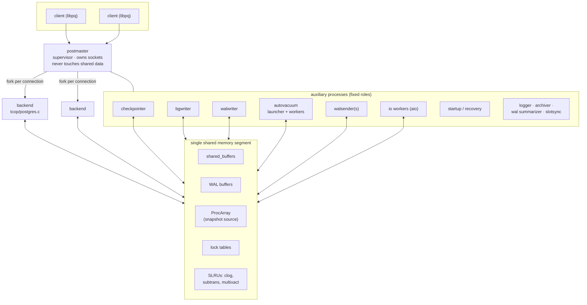
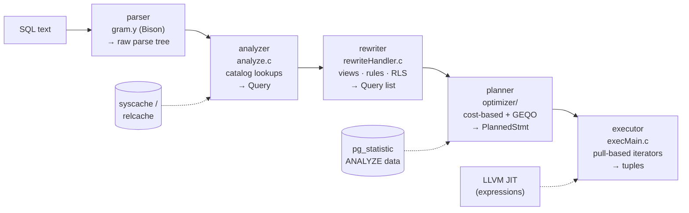
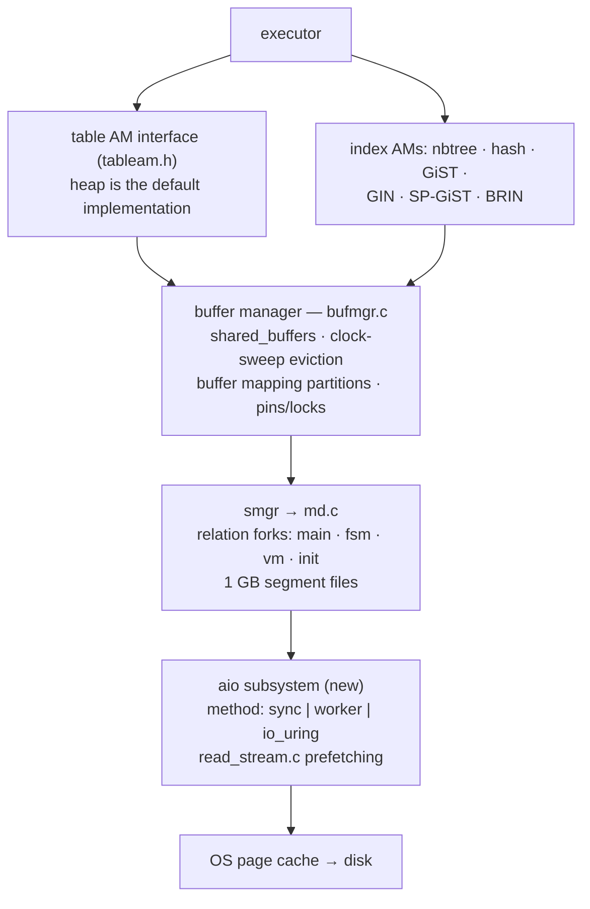
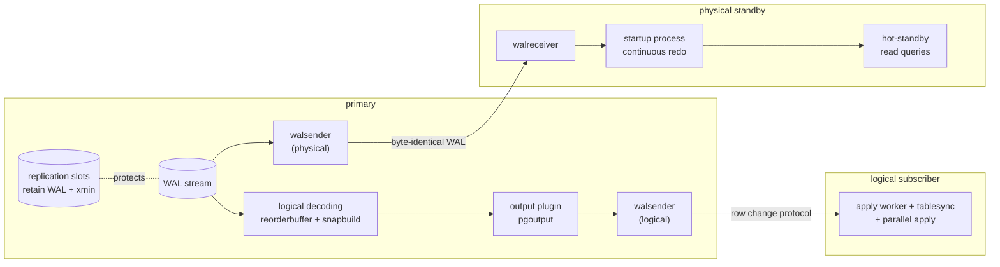

# PostgreSQL Internals: How Four Decades of Design Decisions Fit Together

> An architecture dossier — staff/principal-level analysis of the PostgreSQL server
> source tree: the process model, query pipeline, storage engine, MVCC machinery,
> WAL, and replication, with the trade-offs each layer accepted and the pressure
> points that shape current development.
>
> Prepared from direct analysis of this tree at commit `572c3b2ddf8`
> (master, version marker **20devel**).

| Metric | Value |
|---|---|
| Tree | 20devel (master) |
| Commits | 64,767 |
| Backend C/headers | ~1.39 M lines |
| System catalogs | 70 |
| WAL resource managers | 23 |
| contrib modules | 61 |
| In-tree README design docs | 102 |

## Contents

1. [The architectural thesis](#1-the-architectural-thesis)
2. [Codebase map](#2-codebase-map)
3. [Process architecture](#3-process-architecture)
4. [Life of a query](#4-life-of-a-query)
5. [Storage engine & buffer management](#5-storage-engine--buffer-management)
6. [MVCC and transactions](#6-mvcc-and-transactions)
7. [WAL, checkpoints, recovery](#7-wal-checkpoints-recovery)
8. [Replication: one log, two consumers](#8-replication-one-log-two-consumers)
9. [Concurrency primitives](#9-concurrency-primitives)
10. [Extensibility as architecture](#10-extensibility-as-architecture)
11. [Structural tensions — the staff-level scorecard](#11-structural-tensions--the-staff-level-scorecard)
12. [What this devel tree (20devel) adds](#12-what-this-devel-tree-20devel-adds)
13. [Implementation deep dive: the mechanisms under the architecture](#13-implementation-deep-dive-the-mechanisms-under-the-architecture)

## 1. The architectural thesis

PostgreSQL is best understood not as one design but as five long-lived bets that
everything else is arranged around:

1. **Process-per-connection, shared-memory-for-state.** Every client session is
   an OS process forked by a supervisor (`postmaster`). All coordination happens
   through a single shared memory segment. There is almost no in-process
   threading in the server.
2. **MVCC without an undo log.** Updates create new row versions in place in the
   heap; old versions stay until *vacuum* reclaims them. Rollback is free; the
   cost is deferred as garbage-collection debt.
3. **A single physical WAL as the source of truth.** One ordered, redo-only log
   drives crash recovery, physical replication, point-in-time recovery, and (via
   decoding) logical replication. There is no separate replication log.
4. **Cooperation with the OS rather than ownership of the machine.** A modest
   shared buffer pool sits atop the kernel page cache; the filesystem, scheduler,
   and (historically) synchronous `read()` do real work. This is the bet under
   the most active revision — the new asynchronous I/O layer in
   `src/backend/storage/aio/` is the first structural retreat from it.
5. **Extensibility as a first-class mechanism, not an add-on.** Types, operators,
   functions, index access methods, table access methods, foreign data wrappers,
   background workers, and dozens of planner/executor hooks are all
   runtime-pluggable through the same catalog machinery the core uses for itself.

Each bet buys simplicity somewhere and creates a pressure point somewhere else.
The rest of this document walks the layers top-down and calls out those pressure
points explicitly, because at staff level the interesting question is rarely
"how does it work" — it is "what does this design make cheap, what does it make
expensive, and where is the project spending effort to change the answer."

---

## 2. Codebase map

The server proper lives in `src/backend/`. Client libraries (`libpq`, ECPG) are
in `src/interfaces/`, the twenty-odd command-line tools in `src/bin/`, shared
headers in `src/include/` (mirroring the backend layout), procedural languages
in `src/pl/`, and 61 first-party extensions in `contrib/`. Two build systems
coexist — autoconf/make and Meson — producing identical binaries.

Line counts are a crude but honest signal of where complexity concentrates:

| Subsystem | Lines (C/H/Y/L) | What lives there | Landmark files |
|---|---:|---|---|
| `utils/` | 300,659 | Datatype implementations (`adt/`), caches, memory contexts, GUC, error handling, sorting | `ruleutils.c` (425 KB), `numeric.c`, `selfuncs.c`, `relcache.c` |
| `access/` | 164,208 | Heap + 6 index AMs, transaction machinery (`transam/`), TOAST | `xlog.c` (342 KB), `heapam.c` (307 KB) |
| `commands/` | 116,332 | DDL and utility statements | `tablecmds.c` — at 802 KB the largest file in the tree |
| `optimizer/` | 98,974 | Cost-based planner, GEQO | `planner.c`, `costsize.c`, `createplan.c` |
| `executor/` | 79,663 | Volcano-style plan-tree interpreter, ~45 node types | `execMain.c`, `nodeAgg.c`, `nodeHashjoin.c` |
| `storage/` | 67,346 | Buffer manager, smgr, locks, IPC, files, **new AIO layer** | `bufmgr.c` (276 KB), `aio/`, `lmgr/` |
| `parser/` | 63,159 | Bison grammar + semantic analysis | `gram.y`, `analyze.c` |
| `replication/` | 49,245 | WAL shipping, logical decoding, slots, sync rep | `walsender.c`, `logical/reorderbuffer.c` |
| `catalog/` | 46,535 | 70 system catalogs, dependency tracking, bootstrap data | `pg_class`/`pg_attribute`/`pg_proc` headers + `.dat` |
| `postmaster/` | 20,319 | Supervisor, launchers, checkpointer, bgwriter, autovacuum | `postmaster.c`, `launch_backend.c` |
| `tcop/` | 13,097 | "Traffic cop": the per-backend main loop and portal logic | `postgres.c` — `exec_simple_query()` |
| `rewrite/` | 10,910 | Rule/view expansion, row-level security | `rewriteHandler.c` |

Two navigational facts worth internalizing. First, the tree contains **102
README files** co-located with the code they describe —
`src/backend/access/heap/README.HOT`, `storage/buffer/README`,
`access/transam/README`, `replication/README` — and they are maintained as
rigorously as the code; they are the primary design documentation, better than
any external book. Second, node definitions in `src/include/nodes/*.h` are the
skeleton key: nearly every structure that flows through parser → planner →
executor is a tagged `Node`, with copy/equal/serialize functions *generated* at
build time by `gen_node_support.pl`.

---

## 3. Process architecture

The `postmaster` (`src/backend/postmaster/postmaster.c`) is a supervisor that
owns the listen sockets and the shared memory segment, forks one child per
connection, and never touches shared state itself beyond bookkeeping — a
deliberate blast-radius decision: if a backend crashes while holding
shared-memory locks, the postmaster detects it, kills all children, and
reinitializes shared memory, but the postmaster itself survives to accept
reconnections.



*Fig. 1 — Process model. Every box on the middle rows is an OS process; all
coordination flows through one shared memory segment. The full role taxonomy is
the `BackendType` enum in `src/include/miscadmin.h` (20 entries in this tree,
including the new `B_IO_WORKER` and `B_DATACHECKSUMSWORKER_*`).*

The auxiliary cast, each a single-purpose process: **checkpointer** (flushes all
dirty buffers at checkpoints), **bgwriter** (opportunistically cleans buffers
ahead of the clock sweep so foreground backends rarely write), **walwriter**
(background WAL flushing for async commits), **autovacuum launcher + workers**,
**walsenders/walreceiver** (replication), **startup** (runs redo; on a standby
it runs continuously), plus logger, archiver, WAL summarizer (incremental backup
support), slot-sync worker, and — new in this tree — a pool of **I/O workers**
and the **data-checksums workers** for online checksum enablement.

### Why processes, and what it costs

The 1980s-era choice of processes over threads bought three durable properties:
memory isolation (a wild pointer in one session cannot silently corrupt
another's private state — only the audited shared segment is at risk), simple
per-session lifecycle (exit = cleanup), and portability across every Unix of the
era. The costs have compounded with modern workload shapes:

- **Connections are expensive.** Each backend carries a full private relcache,
  catcache, plan cache and memory-context tree — commonly 5–10 MB idle, plus
  fork cost. This is why every serious deployment fronts PostgreSQL with a
  pooler (PgBouncer et al.), and why the pooler ecosystem effectively
  re-implements a session layer the server lacks.
- **Caches are duplicated per process**, so N connections re-parse and re-plan
  what a threaded server would share once. There is no shared plan cache.
- **Snapshot computation scales with process count** — building an MVCC snapshot
  historically meant scanning the `ProcArray`, and although
  commit-sequence-number caching and snapshot scalability work has softened
  this, high connection counts still pressure it.

> **Design tension** — The community has an accepted long-term goal of moving to
> a threaded model (the 2023 developer meeting outcome), and preparatory work is
> visible in this tree: global state has been systematically corralled,
> `launch_backend.c` abstracts process startup (also serving the
> `EXEC_BACKEND`/Windows path, which cannot fork-with-inheritance), and session
> state is increasingly explicit. But with ~1.4 M lines assuming process-private
> globals, this is a multi-year migration. Until then, "max_connections is not a
> sizing knob, the pooler is" remains an operational law.

---

## 4. Life of a query

Each backend runs the loop in `src/backend/tcop/postgres.c`: read a
frontend/backend-protocol message, dispatch, respond. A simple query traverses
five stages, each producing a well-defined tree type:



*Fig. 2 — The five-stage pipeline. Stage boundaries are real API boundaries:
extensions can intercept at `post_parse_analyze_hook`, `planner_hook`,
`ExecutorStart/Run/End_hook`, and others.*

### What deserves a staff engineer's attention per stage

**Parsing** is a single Bison grammar (`gram.y`) deliberately kept free of
catalog access, so a parse tree can be built without any locks — this separation
is what makes the extended-protocol prepare/bind flow and
`pg_stat_statements`-style query fingerprinting clean. **Analysis** resolves
names against the catalogs through the *syscache/relcache* layers — per-backend
hash caches over catalog tuples, kept coherent across processes by a
shared-memory invalidation-message queue (`sinvaladt.c`). Cache invalidation is
one of the genuinely hard invariants in the tree: DDL must broadcast
invalidations at exactly the right lock boundaries, and a whole class of
historical bugs lives there.

The **rewriter** is the survivor of the original Berkeley rules system. Its
modern jobs are view expansion (views *are* rules), `INSTEAD OF` rules, and
row-level-security policy injection. Staff-level footnote: user-defined rules
are effectively deprecated in practice (triggers won), but the rewriter remains
load-bearing because views and RLS route through it.

The **planner** is textbook System-R with forty years of refinement: bottom-up
dynamic programming over join orders (`joinrels.c`), switching to a genetic
algorithm (GEQO) beyond `geqo_threshold` relations; cost model in `costsize.c`
parameterized by page/CPU cost GUCs; selectivity estimation in `selfuncs.c`
against single-column histograms and MCV lists from `ANALYZE`, with *extended
statistics* (`src/backend/statistics/`: n-distinct, functional dependencies,
multi-column MCVs) as the opt-in answer to correlated columns. Notable
structural choices: planning is single-shot with no feedback loop (no adaptive
re-optimization mid-execution), and the project has a decades-old, deliberate
refusal to add optimizer hints — the position being that hints mask estimation
bugs that should be fixed. `pg_hint_plan` exists out-of-core precisely because
the hook interfaces make it possible.

The **executor** is a pull-based (Volcano) iterator tree with two significant
modernizations layered on: expression evaluation was compiled into a flat opcode
stream (`execExprInterp.c`) with optional LLVM JIT compilation
(`src/backend/jit/llvm/`), and **parallel query** runs plan subtrees in dynamic
background workers, exchanging tuples through shared-memory queues under a
`Gather` node. Parallelism is per-query fan-out of processes — consistent with
the process model, and with its cost: worker startup is milliseconds, so the
planner only bets on parallelism for large scans.

> **Design tension** — The planner's weakest flank is cardinality estimation
> through joins — errors compound multiplicatively, and there is no runtime
> correction. The mitigations are all static (extended statistics, better
> costing). Adaptive execution — switching join strategy mid-flight — has been
> prototyped in forks but resisted in core because it complicates the executor's
> invariants. Meanwhile the per-backend plan cache (`plancache.c`) makes
> prepared-statement plan quality dependent on the generic-vs-custom-plan
> heuristic, a recurring source of production surprises worth knowing cold.

---

## 5. Storage engine & buffer management

The storage stack is a strict layer cake, and since PostgreSQL 12 the top layer
is pluggable (the *table access method* API — `heap` is simply the default
implementation):



*Fig. 3 — The storage stack. Every table/index is a set of forks; each fork is
8 KB pages addressed by block number.*

### Pages, TOAST, and free space

Everything is 8 KB slotted pages (`bufpage.h`): a header with LSN, an array of
line pointers growing down, tuple data growing up. Oversized values are handled
by **TOAST** — attributes are compressed (pglz or lz4) and/or sliced into chunks
stored in a side table, transparently, above ~2 KB. Each relation carries two
auxiliary forks that make the system self-describing: the **free space map** (a
max-heap binary tree over per-page free space, enabling O(log n) "find a page
with room") and the **visibility map** — two bits per page recording
*all-visible* and *all-frozen*. The VM is load-bearing far beyond vacuum: it is
what makes index-only scans possible (skip heap visibility checks for
all-visible pages) and what lets anti-wraparound vacuums skip already-frozen
pages.

### Buffer manager mechanics

`bufmgr.c` maps (relation, fork, block) → buffer via a partitioned shared hash
table (128 partitions, each under its own lock — the classic fix for
mapping-lock contention). Eviction is **clock-sweep**, an LRU approximation with
a per-buffer usage count capped at 5; sequential scans and vacuum use small ring
buffers to avoid flushing the working set. Correctness invariants worth knowing:
a buffer must be *pinned* before use and *content-locked* for modification;
dirty buffers must not be written before their WAL is flushed (the
WAL-before-data rule is enforced here, via each page's LSN).

> **The bet under revision** — PostgreSQL historically read with synchronous
> `read()` and leaned on the OS for readahead and write scheduling — the "double
> buffering" architecture. The `src/backend/storage/aio/` subsystem in this tree
> replaces that at the structural level: I/O is issued as batched asynchronous
> operations through a pluggable method (`method_sync.c`, `method_worker.c` with
> the new `B_IO_WORKER` process pool, or `method_io_uring.c` on Linux), and
> `read_stream.c` gives scan-shaped code a declarative prefetching interface.
> This is the enabling layer for eventually running well with direct I/O
> (`debug_io_direct` exists today) — i.e., for finally owning the page cache
> instead of renting the kernel's. Expect years of follow-on work (async writes,
> checkpointer integration), but the beachhead is in-tree.

---

## 6. MVCC and transactions

PostgreSQL's concurrency story is version-based and append-biased. Every heap
tuple carries `xmin` (creating transaction) and `xmax` (deleting/locking
transaction). A snapshot is a set of transaction IDs considered in-progress at
snapshot time (built from the shared `ProcArray`); visibility is decided
per-tuple by comparing xmin/xmax against the snapshot and against the **commit
log** (`clog`, an SLRU with two bits per XID). An `UPDATE` is physically a
delete + insert of a new version chained via `ctid`.

The consequences fan out everywhere:

- **Rollback is O(1)** — mark the XID aborted in clog; dead versions are already
  in place and will be collected later. Contrast Oracle/InnoDB undo-based
  designs where rollback is proportional to work done but reads of hot rows pay
  version-reconstruction cost. PostgreSQL made writers cheap at abort and
  readers cheap at access, paying with background reclamation.
- **Vacuum is not optional hygiene; it is the other half of the storage
  engine.** It reclaims dead versions, updates the FSM/VM, and — critically —
  *freezes* old tuples. XIDs are 32-bit and compared circularly, so an XID older
  than ~2 billion transactions would wrap into the future; freezing rewrites
  tuple headers to a permanently-visible state before that horizon.
  Anti-wraparound autovacuum is the failure mode every operator of a high-churn
  PostgreSQL fleet eventually meets.
- **Hint bits** cache commit/abort verdicts in tuple headers on first access,
  which is why a large table's first read after bulk load produces surprising
  write I/O.
- **HOT (heap-only tuples)**, documented in `access/heap/README.HOT`, is the key
  write-amplification mitigation: if an update touches no indexed columns and
  the new version fits on the same page, no index entries are created — the old
  line pointer redirects. Fill-factor tuning and "don't index what you update"
  both derive from this mechanism.
- **Index bloat is coupled to heap bloat.** Indexes point at heap TIDs and have
  no version information of their own; every non-HOT update inserts into every
  index. B-tree bottom-up deletion and deduplication (PG 13/14 era) reduce the
  damage, but the architecture is why "update-heavy table with eight indexes" is
  a pathological shape.

Isolation levels: Read Committed takes a new snapshot per statement; Repeatable
Read holds one per transaction; Serializable is implemented as **SSI**
(Serializable Snapshot Isolation, `storage/lmgr/predicate.c`) — an optimistic,
research-derived design (Cahill 2008; the PostgreSQL implementation was the
first in a production DBMS) that tracks read/write dependencies with predicate
locks and aborts transactions when a dangerous structure appears, rather than
blocking.

> **Design tension** — Vacuum debt is the tax on the no-undo bet, and it is paid
> in operator attention: long-running transactions (or abandoned replication
> slots, or long-idle hot-standby queries) hold back the global `xmin` horizon
> and silently prevent all reclamation. The mitigation surface keeps growing —
> but the structural fact remains that *any* single old snapshot stalls cleanup
> globally per-database. The 64-bit XID patchset (which would eliminate
> wraparound, though not bloat) has been in discussion for years; this tree
> still carries 32-bit XIDs with the freezing machinery. Meanwhile the new
> in-core `pgrepack` (see §12) acknowledges that online table reorganization is
> a first-class operational need, not an afterthought for an external tool.

---

## 7. WAL, checkpoints, recovery

All durability reduces to one rule enforced in one place: *a data page may not
be written to disk before the WAL describing its change is flushed*. WAL
(`access/transam/xlog.c` — 342 KB of some of the most carefully reviewed C in
open source) is a single, totally-ordered, **redo-only** stream addressed by LSN
(byte offset). Records are typed by one of 23 *resource managers*
(`rmgrlist.h`) — heap, each index AM, transactions, storage ops — each owning
its redo logic; extensions can register custom rmgrs.

Because recovery is redo-only (no undo pass — aborted transactions' effects are
simply invisible under MVCC, which is a beautiful cross-subsystem economy),
crash recovery is: find the last checkpoint, replay forward to end of WAL, done.
Two subtleties matter at depth:

- **Full-page writes (FPW):** the first modification of a page after each
  checkpoint logs the entire page, defending against torn 8 KB writes on
  4 KB-sector storage. This makes WAL volume spike after checkpoints — the
  reason checkpoint spacing (`max_wal_size`, `checkpoint_timeout`) is a
  throughput knob, not just a recovery-time knob.
- **Group commit:** WAL insertion reserves space under a lightweight
  insert-position lock, copies into shared WAL buffers, and commits flush via
  `XLogFlush`, which batches concurrent committers into shared fsyncs.
  `synchronous_commit = off` trades a bounded window of recent transactions
  (never consistency) for latency.

Checkpoints are spread ("throttled") writes of all dirty buffers by the
checkpointer, paced by `checkpoint_completion_target`. The WAL stream is also
the substrate for **PITR** (base backup + archived WAL + a recovery target) and
for the WAL summarizer process that powers incremental backups.

---

## 8. Replication: one log, two consumers



*Fig. 4 — Both replication families are consumers of the same WAL. Slots pin WAL
retention and the xmin horizon for their consumer — powerful and dangerous in
equal measure.*

**Physical replication** ships raw WAL; the standby runs permanent redo and is
byte-identical — which is why it can serve reads (hot standby) but only of the
whole cluster, same major version, no writes. Synchronous replication
(`syncrep.c`) is configurable per-transaction from `remote_write` through
`remote_apply`, with quorum sets — the primitives for RPO-zero pairs, though
failover orchestration is explicitly left to external tooling (Patroni et al.);
core ships no consensus layer, a deliberate scope boundary.

**Logical replication** re-derives row-level changes from the same WAL:
`reorderbuffer.c` reassembles interleaved per-transaction change streams
(spilling large ones to disk, or streaming them before commit), `snapbuild.c`
constructs historic MVCC snapshots so decoded tuples can be interpreted with the
catalog as it looked *then*, and an output plugin (`pgoutput`) serializes for
the subscriber's apply workers. It enables selective, cross-version,
writable-target replication — the substrate for near-zero-downtime major
upgrades. Its structural limits are equally important: DDL is not replicated,
and sequences historically weren't (this tree adds `sequencesync.c` — see §12).
This tree also carries `slotsync.c` (synchronizing logical slots to physical
standbys so logical consumers survive failover) and per-conflict-type handling
(`conflict.c`) — both closing long-standing operational gaps.

---

## 9. Concurrency primitives

Four tiers, each built on the one below, each with a distinct contract:

| Tier | Where | Contract |
|---|---|---|
| **Spinlocks** | `s_lock.c` | Hold for a few instructions; no error paths, no sleeping. TAS + backoff. |
| **LWLocks** | `lwlock.c` | Shared/exclusive, atomic-based fast path, no deadlock detection — ordering is by convention. Protect shared-memory structures (buffer mapping, WAL insert, clog). |
| **Heavyweight locks** | `lock.c` | Eight modes, per-object (relation/tuple/xid/advisory), full deadlock detection (`deadlock.c` runs after `deadlock_timeout`), released at transaction end. The fast path avoids the shared table for weak relation locks — vital, since *every* query takes relation locks. |
| **Predicate locks (SSI)** | `predicate.c` | Non-blocking dependency tracking for Serializable; escalates page→relation granularity under memory pressure. |

Sleeping/wakeup is unified by the **latch** abstraction
(`storage/ipc/latch.c`) — a self-pipe/eventfd-based primitive that composes
"wake on socket data, shared-memory flag, postmaster death, or timeout" into one
wait, and its generalization `WaitEventSet`. Every idle loop in the server
bottoms out here, and postmaster-death detection via this path is what
guarantees orphaned children exit. Row-level locking, notably, is *not* in the
lock table (which would explode under `SELECT FOR UPDATE` of a million rows) —
it is written into tuple headers as `xmax` markings, with **MultiXacts** (an
SLRU of XID groups) handling multiple simultaneous lockers. MultiXacts have
their own wraparound and vacuum requirements — a corner of the system that has
produced some of the subtlest bugs in project history, and a good interview
question for anyone claiming deep PostgreSQL knowledge.

---

## 10. Extensibility as architecture

The original Berkeley POSTGRES thesis was "an extensible type system," and it
shows: extensibility is not an API bolted onto the side, it is the same catalog
machinery core features use. A type is a row in `pg_type`; an operator in
`pg_operator`; a function in `pg_proc` — whether shipped by core or loaded from
a `.so` at runtime. The extension points, in rough order of power:

- **Functions/types/operators/aggregates** via the version-1 C call convention
  (`fmgr`), plus operator classes that teach existing index AMs to index new
  types.
- **Procedural languages** (`src/pl/`: PL/pgSQL, PL/Python, PL/Perl, PL/Tcl) —
  themselves just extensions using the handler mechanism.
- **Index access methods** (pluggable since 9.6) and **table access methods**
  (since 12) — the interfaces GIN/GiST/BRIN themselves use; this is the door
  vector-search extensions and alternative storage engines walk through.
- **Foreign data wrappers** — the planner/executor call FDW routines for path
  generation, costing, and scan/modify, enabling pushdown-aware federation
  (`postgres_fdw` being the reference).
- **Hooks** — dozens of bare function pointers (`planner_hook`,
  `ExecutorRun_hook`, `ProcessUtility_hook`, ...) with no stability contract but
  enormous leverage; `pg_stat_statements`, TimescaleDB, and Citus are
  hook-built.
- **Background workers, custom WAL resource managers, logical decoding output
  plugins** — extensions can be processes, can write recoverable WAL, can speak
  their own replication protocol.

This is a strategic moat as much as a technical feature: the extension ecosystem
(PostGIS, pgvector, Timescale, Citus) does market expansion core never has to
merge, at the cost of core maintaining hook stability informally across
releases. The 61 `contrib/` modules double as the compatibility test suite for
these interfaces.

---

## 11. Structural tensions — the staff-level scorecard

Summarizing the pressure points, with their current trajectory in this tree:

| Tension | Root cause | Mitigations shipped | Trajectory |
|---|---|---|---|
| Connection cost / no shared caches | Process-per-connection | External poolers; snapshot scalability work | Accepted goal to move toward threads; multi-year horizon. Poolers remain mandatory. |
| Vacuum debt, wraparound, bloat | No-undo MVCC + 32-bit XIDs | HOT, VM/all-frozen, autovacuum tuning, index dedup, radix-tree TID storage | Incremental relief; 64-bit XIDs still pending; in-core `pgrepack` treats reorganization as first-class. |
| OS-mediated I/O | "Cooperate with the kernel" bet | Ring buffers, posix_fadvise prefetch | Actively reversing: AIO layer + io_uring + read streams in-tree; direct I/O on the horizon. |
| Cardinality misestimation | Static single-shot planning | Extended statistics, better join costing | No adaptive execution planned in core; hints remain out-of-core policy. |
| Single-writer WAL, scale-up ceiling | One ordered log, shared-everything node | WAL insert-lock partitioning, group commit | Scale-out delegated to the ecosystem (Citus, Aurora-style forks) — deliberate scope boundary. |
| Failover/HA not in core | No consensus layer by design | Sync rep primitives, slot sync for logical continuity | Stable position: core supplies mechanisms, Patroni-class tools supply policy. |

The meta-observation: PostgreSQL's governance model (no company owns it;
~64,800 commits of consensus) selects strongly for *reversible, incremental*
changes over rewrites. Every trajectory above is being executed as a sequence of
independently shippable steps — the AIO work being the current best example of
how the project lands an architectural reversal without a flag day.

---

## 12. What this devel tree (20devel) adds

Signals of active direction visible in this checkout, beyond released
PostgreSQL:

- **Asynchronous I/O matured:** `storage/aio/` with three pluggable methods
  (`sync`, `worker` — a pool of dedicated I/O processes, `io_uring`) and
  `read_stream.c` adopted by scan paths. The largest storage-layer shift since
  the buffer manager itself.
- **Online data checksums:** `B_DATACHECKSUMSWORKER_LAUNCHER/WORKER` process
  types — enabling/disabling page checksums on a running cluster, removing an
  initdb-time one-way door that has haunted operators for a decade.
- **In-core `pgrepack`** (`replication/pgrepack/`): logical-replication-based
  online table reorganization, promoting the most-used external bloat remedy
  into the server.
- **Logical replication completeness:** `sequencesync.c` (sequences finally
  replicate), `slotsync.c` (logical slots survive physical failover),
  `conflict.c` (typed conflict detection/handling), parallel apply —
  collectively pushing logical replication toward being a full HA/migration
  substrate rather than a data-movement tool.
- **WAL summarizer + incremental backup** continuing to mature, and ongoing
  pgstats file-format rework visible in recent commits
  (`pgstat_write_statsfile` refactoring).

Read together, the investment themes are unmistakable: *own the I/O path, make
vacuum's failure modes operationally survivable, and make logical replication
complete enough to be the upgrade and failover story.* Anyone planning
multi-year work on or around PostgreSQL should assume those three currents
continue.

---
## 13. Implementation deep dive: the mechanisms under the architecture

Everything above describes shapes; this section describes machinery — the
specific data structures, bit layouts, and algorithms, with the constants as
they stand in this tree. This is the level at which patches are reviewed.

### 13.1 Memory management: `palloc` and the context tree

The server never calls bare `malloc` in normal paths. All allocation goes
through `palloc()` into the **current memory context**, and contexts form a
tree (`TopMemoryContext` → per-connection → per-transaction →
per-query/`ExecutorState` → per-tuple `ExprContext`). The killer property is
*bulk free*: `MemoryContextReset/Delete` releases everything at once, so query
teardown and — crucially — **error recovery** never walk individual
allocations. `ereport(ERROR)` longjmps (via `sigsetjmp` in the backend main
loop / `PG_TRY` blocks) back to a safe point, and transaction abort simply
deletes the subtree of contexts. Leaks are structurally confined: forget to
`pfree` and the memory dies with its context anyway.

Four allocator implementations sit behind one API (`src/backend/utils/mmgr/`):

| Allocator | File | Strategy | Built for |
|---|---|---|---|
| AllocSet | `aset.c` | Power-of-2 chunk freelists; blocks start small and double up to 8 MB; chunks > 8 kB get dedicated blocks | The default; general query memory |
| Generation | `generation.c` | Append-only blocks, freed when every chunk in the block is freed; no per-chunk reuse | FIFO-ish lifetimes: `reorderbuffer.c` decoded changes |
| Slab | `slab.c` | Fixed-size chunks, per-block freelists | Many same-sized objects with churn (WAL-sender, radix tree nodes) |
| Bump | `bump.c` | Pointer-bump, **no chunk headers, no pfree at all** | Densest possible storage: tuplesort runs |

Each chunk carries an 8-byte header (except bump: zero) encoding its context
type in 3 spare bits, which is how `pfree(ptr)` finds its owner without any
lookup. `work_mem`-bounded operators account against
`MemoryContextMemAllocated()` on the context, not per-chunk — cheap because
block counts are small.

### 13.2 On-disk formats: tuple, page, varlena

A heap tuple header (`HeapTupleHeaderData`, `htup_details.h`) is **23 bytes**
before the null bitmap:

```
t_xmin      4B   inserting XID
t_xmax      4B   deleting/locking XID (or 0/invalid)
t_cid       4B   command id — inserting OR deleting; a "combo CID"
                 (HEAP_COMBOCID) multiplexes both when one xact does both,
                 via a backend-local combo-cid map — an on-disk space hack
t_ctid      6B   (block, offset) of this or the NEWER version → HOT chains
t_infomask2 2B   attribute count (11 bits) + HOT flags (HEAP_HOT_UPDATED,
                 HEAP_ONLY_TUPLE)
t_infomask  2B   null-bitmap-present, has-varwidth, XMIN/XMAX_COMMITTED|
                 INVALID hint bits, lock-mode bits, IS_MULTI, ...
t_hoff      1B   offset to user data (header + null bitmap + alignment)
```

The two *hint bits per XID* (`committed`/`invalid`) are the visibility fast
path: set opportunistically after a clog lookup, they let future scans skip
clog entirely. They are set without WAL (a page-LSN/checksum interaction:
with checksums on, hint-bit-only dirtying forces a full-page image via
`XLogSaveBufferForHint` — a real write-amplification line item).

Pages (`bufpage.h`): 24-byte `PageHeaderData` (first 8 bytes are `pd_lsn` —
the WAL-before-data enforcement point), then `pd_lower`/`pd_upper` delimiting
the hole between the line-pointer array (4-byte `ItemIdData`: 15-bit offset,
2 flag bits, 15-bit length) growing down and tuples growing up. Line pointers
are the indirection that makes HOT possible: `LP_REDIRECT` pointers let vacuum
collapse a HOT chain while index entries keep pointing at the original slot;
`LP_DEAD` marks slots reclaimable that index scans may also set (the
"kill_prior_tuple" optimization).

Variable-length datums (**varlena**): a 4-byte header (length + 2 flag bits)
normally, compressed to a **1-byte header** for values ≤ 126 bytes when
tuples are formed — misaligned by design, saving up to 3 padding bytes per
short string; every datatype function normalizes via `PG_DETOAST_DATUM`. An
out-of-line TOAST pointer is an 18-byte varlena carrying (value OID, toast
relation OID, raw/compressed sizes); chunks live in `pg_toast.pg_toast_<oid>`
sliced at ~2000 bytes, retrieved by index scan, with slicing support so
`substr()` on a huge text fetches only needed chunks.

### 13.3 The buffer descriptor: lock-free pinning in one atomic word

Each of the `shared_buffers` slots has a `BufferDesc` whose entire mutable
state packs into a **single `pg_atomic_uint32`** (`buf_internals.h`):

```
bits  0–17  refcount        (BUF_REFCOUNT_BITS 18)   — pin count
bits 18–21  usage_count     (BUF_USAGECOUNT_BITS 4)  — clock-sweep, max 5
bits 22–31  flags           (BUF_FLAG_BITS 12)       — BM_DIRTY, BM_VALID,
            BM_TAG_VALID, BM_IO_IN_PROGRESS, BM_LOCKED, BM_JUST_DIRTIED,
            BM_PIN_COUNT_WAITER, BM_CHECKPOINT_NEEDED, ...
```

Pinning is a compare-and-swap increment — no lock, no bus-locked RMW beyond
the CAS — and `BM_LOCKED` doubles as an embedded spinlock for the rare
multi-field transitions. Each backend additionally keeps a tiny private array
(8 entries, then a hash table) of its own pins (`PrivateRefCount`), so
re-pinning a buffer you already hold touches no shared memory at all. Page
content is protected by a separate per-buffer LWLock; the descriptor and
content lock live in different arrays for cache-line hygiene. Lookup goes
through a shared hash table striped across **128 partitions**
(`NUM_BUFFER_PARTITIONS`), so two backends faulting different pages almost
never contend.

### 13.4 Snapshots: the dense-array `GetSnapshotData`

Per-process state is a `PGPROC` in shared memory, but the hot fields are
*mirrored into dense parallel arrays* indexed by `pgxactoff`:
`ProcGlobal->xids[]`, `->subxidStates[]`, `->statusFlags[]` (the PG 14
snapshot-scalability rework). `GetSnapshotData()` therefore scans one
contiguous XID array — cache-line-friendly — instead of chasing hundreds of
`PGPROC` pointers. Two more layers of avoidance sit on top: an atomic
`xactCompletionCount` lets a backend *reuse its previous snapshot wholesale*
if no transaction has committed since; and per-tuple visibility checks use
`GlobalVisState` horizons (maintained lazily) rather than full snapshots
where possible. Subtransactions: each snapshot carries a `subxip` array, but
each PGPROC caches only 64 subxids; overflow flips a bit that forces
visibility checks through the `subtrans` SLRU — why "thousands of savepoints
in one transaction" is a known performance cliff.

### 13.5 WAL insertion: two-phase, eight-lane

`XLogInsertRecord` (in the 342 KB `xlog.c`) splits insertion into:

1. **Reserve** — a single spinlock (`insertpos_lck`) guards nothing but two
   integers (current byte position + previous record link). The critical
   section is a handful of arithmetic ops: this is the serialization point
   for all WAL and it is kept microscopic.
2. **Copy** — the record is CRC32C-summed and memcpy'd into the shared WAL
   buffer ring while holding one of **8 insertion LWLocks**
   (`NUM_XLOGINSERT_LOCKS`), so up to 8 backends copy concurrently. Each
   lock exposes an `insertingAt` progress LSN so a flusher only waits for
   copies that overlap its target (`WaitXLogInsertionsToFinish`).

Commit calls `XLogFlush(commit_lsn)`: whoever wins the flush lock writes and
fsyncs *everything accumulated*, satisfying all queued committers at once —
group commit with no explicit batching knob. Record integrity is CRC32C
(hardware-accelerated); torn-page defense is the FPW mechanism from §7, and
backup blocks are hole-compressed (optionally lz4/zstd via
`wal_compression`).

### 13.6 Lock manager: the fast path that saves every query

Every query takes an `AccessShareLock` on every relation it touches; pushing
those through the shared lock hash would be a global bottleneck. The fast
path (`storage/lmgr/lock.c`, `proc.h`): weak relation locks (≤
`RowExclusiveLock`) are recorded in a per-backend array in its own PGPROC —
**groups of 16 slots** (`FP_LOCK_SLOTS_PER_GROUP`), with the group count now
sized from `max_locks_per_transaction` up to 1024 groups (a recent change;
it used to be a hard 16 total). Taking a fast-path lock touches only your
own PGPROC under your own LWLock. The trick is the other direction: anyone
wanting a *strong* lock (e.g. `ALTER TABLE`) first bumps a counter in
`FastPathStrongRelationLocks` (1024 hash slots), which forces subsequent
weak lockers of that relation into the shared table, then scans every
backend's fast-path array to migrate existing entries. Cost lands on rare
DDL, not on every SELECT. The shared table itself is striped 16 ways
(`NUM_LOCK_PARTITIONS`); deadlock detection is lazy — sleep
`deadlock_timeout` (1s) first, then run the waits-for graph search, on the
bet that real deadlocks are rare and blocking is usually just contention.

### 13.7 Caches and invalidation: syscache → relcache → sinval

Catalog access never scans catalogs in hot paths. **Catcache**
(`catcache.c`): one hash per (catalog, index) pair defined in `syscache.c`,
caching individual tuples *and negative entries* (absence is cacheable —
vital for name lookups walking `search_path`). **Relcache** (`relcache.c`,
230 KB): assembled `RelationData` descriptors — tuple descriptor, AM
routine, index list, partition descriptor, RLS policies — the thing a
`Relation` handle points at. Coherence: any catalog change queues
invalidation messages that publish to a shared ring
(`sinvaladt.c`, 4096 entries); every backend drains at transaction
boundaries and at lock acquisition (the key handshake: you cannot observe a
stale relcache entry for a relation you just locked, because obtaining the
lock forces you to process the invalidation the DDL sent before it released
its conflicting lock). Ring overflow triggers a "catchup" interrupt cascade
where laggards rebuild caches wholesale. Plan cache (`plancache.c`) sits on
top with the visible-in-production heuristic: five custom plans, then switch
to the generic plan if its cost is not worse than the average custom cost.

### 13.8 B-tree internals: Lehman–Yao plus twenty years of tuning

`nbtree/` implements Lehman & Yao: every page has a **right-link** and a
**high key**, so a descending reader that lands on a just-split page detects
"my key exceeds the high key" and simply moves right — no lock coupling;
readers hold at most one page lock at a time, and never block on splits in
flight. Splits propagate up in a separate step; a crash between the two
leaves a "half-dead"/incomplete split repaired lazily. On top of the classic
algorithm: **suffix truncation** (pivot keys keep only distinguishing
prefix), **deduplication** (equal keys collapse into posting lists — halves
index size for low-cardinality columns), and **bottom-up deletion** (a
would-be page split first tries to evict entries whose heap tuples are dead,
targeting exactly the version-churn bloat from §6). Index-only scans consult
the visibility map per heap page; the planner costs this from the VM's
all-visible fraction in `pg_class.relallvisible`.

### 13.9 Executor mechanics: slots, opcodes, spilling

Tuples flow as `TupleTableSlot`s with four representations behind one vtable
(`TTSOpsVirtual` — just datum/isnull arrays, `TTSOpsHeapTuple`,
`TTSOpsMinimalTuple` — no visibility header, for hash tables and tuplestores,
`TTSOpsBufferHeapTuple` — points into a pinned buffer, zero-copy). Attribute
access is lazy: `slot_getattr(n)` deforms columns 1..n once and caches.

Expression evaluation compiles each expression tree into a **flat array of
opcode steps** (174 `EEOP_*` opcodes in `execExpr.h`), executed by
`execExprInterp.c` with **computed-goto dispatch** where the compiler
supports it (better branch prediction than a switch). The JIT
(`jit/llvm/`) is exactly this opcode stream lowered to LLVM IR — same
semantics, no separate codegen path — plus tuple-deforming compilation;
costing gates (`jit_above_cost`) decide per query.

Memory-bounded operators all have disk-spill strategies: `tuplesort.c` does
quicksort-in-memory with **abbreviated keys** (first 8 bytes of a
strxfrm'd/normalized key compared as a Datum before full comparison), falling
to polyphase-descended external merge with bounded merge fan-in;
`nodeHash.c` grows batches by doubling and spills partitions
(hybrid hash join), with skew-value handling; hash aggregation spills
partitions since PG 13 (before that it could simply blow past `work_mem` —
worth remembering when reading old incident reports). `hash_mem_multiplier`
exists because hashing suffers more from spilling than sorting does.

### 13.10 Shared memory and parallel infrastructure

The main segment is one anonymous `mmap` (plus a tiny SysV stub for
interlocking), sized once at postmaster start from `shared_buffers` et al. —
resizing requires restart. Optional huge pages (`huge_pages`) matter at
scale: hundreds of processes × page-table entries for 32 GB of
`shared_buffers` is real memory. On top, **DSM** (dynamic shared memory)
segments are created at need, **DSA** (`dsa.c`) provides a malloc-style
allocator over them using *relative pointers* (`dsa_pointer`, since
segments map at different addresses per process), and `shm_mq.c` provides
single-producer/single-consumer message queues. Parallel query is assembled
from exactly these parts: leader serializes snapshot + GUCs + plan into a
DSM "parallel context", workers attach, execute the same plan tree flagged
parallel-aware, and stream tuples back through per-worker shm_mqs into
`Gather`. Parallel scans coordinate via an atomic next-block counter in DSM
(with chunked allocation for sequential I/O locality); parallel hash join
builds one shared hash table in DSA with a barrier-synchronized build phase.

### 13.11 SLRUs: the metadata caches behind MVCC

Six "simple LRU" areas (`slru.c`) back the transaction metadata that is too
big for fixed shared memory but too hot for buffered relations: `clog`
(**2 bits per XID** → 32K transaction verdicts per 8 kB page), `subtrans`
(parent XID per subxact), `multixact` offsets + members (the §9 multi-locker
groups), `commit_ts`, `serializable` predicate-lock state, and notify. Each
is a small ring of pages over a directory of **32-page segment files**
(`pg_xact/`, `pg_multixact/`, ...). PG 17 made their buffer pools
configurable and **bank-partitioned** the locks (banks of 16 pages), after a
decade of clog-lock contention war stories at high transaction rates. Their
truncation is tied to vacuum's frozen horizons — another reason wraparound
stalls are systemic, not cosmetic.

### 13.12 Error handling and the elog discipline

`ereport()` is severity-routed: `ERROR` longjmps to the nearest
`PG_TRY`/sigsetjmp frame and aborts the transaction (memory contexts and
resource owners — `resowner.c`, which tracks buffer pins, file handles, and
locks — make this safe to do from almost anywhere); `FATAL` exits the
backend after cleanup; `PANIC` takes down the whole cluster into crash
recovery, reserved for shared-state corruption (e.g., failure inside a WAL
"critical section" — `START_CRIT_SECTION()` promotes any ERROR to PANIC,
because a half-applied shared-buffer change cannot be rolled back). This
promotion rule is why the buffer-modification protocol is rigidly: pin →
lock → `START_CRIT_SECTION` → mutate page + `XLogInsert` → set page LSN →
`END_CRIT_SECTION` → unlock. Every WAL-logged change in the tree follows
that exact shape, and reviewers reject patches that don't.

---

*Line counts computed over `.c/.h/.y/.l` files per subsystem. Primary sources
for going deeper, in recommended order: `src/backend/access/transam/README`,
`src/backend/storage/buffer/README`, `src/backend/access/heap/README.HOT`,
`src/backend/optimizer/README`, `src/backend/replication/README`, and the other
97 in-tree READMEs.*
