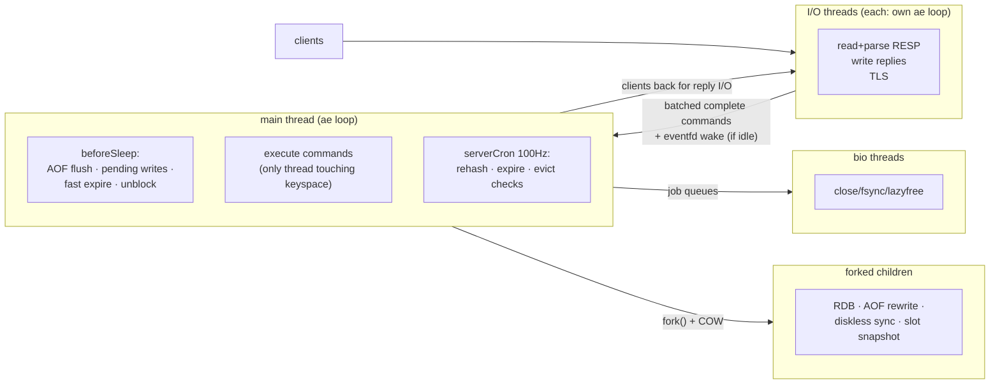
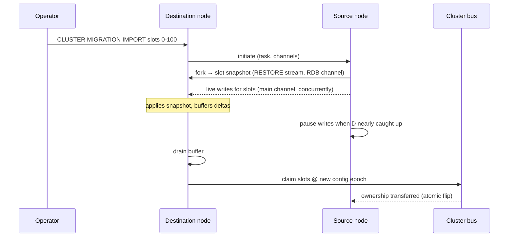

# Redis — Architecture & Implementation Deep Dive

> **Source tree:** `C:\workspace\opensource\redis` (branch `unstable`, commit `e5e1eaa97`, 2026-07-14 — post-8.2 development line; `version.h` carries the unstable placeholder `255.255.255`)
> **Audience:** Principal/Staff-level engineers who need to understand, extend, or operate the codebase.
> **Scope:** Core architecture, threading model, object/memory system, per-type data structures, keyspace machinery, persistence, replication, cluster, modules, and the engineering rationale behind them. File references are relative to `src/` unless noted.

| Metric | Value |
|---|---|
| Branch / commit | `unstable` @ `e5e1eaa97` (2026-07-14) |
| Core C source | ~201 K lines in `src/` (`.c` + `.h`) |
| Largest files | `module.c` (16.0 K), `server.c` (8.3 K), `cluster_legacy.c` (6.7 K), `t_stream.c` (6.3 K), `networking.c` (6.0 K) |
| Commands | 447 JSON definitions in `src/commands/` → generated `commands.def` |
| RDB format version | 14 |
| Cluster slots | 16,384 (`CLUSTER_SLOT_MASK_BITS` = 14) |
| Max I/O threads | 128 (`IO_THREADS_MAX_NUM`) |
| Bundled deps | jemalloc, lua 5.1, hiredis, fpconv, hdr_histogram, xxhash, tre (regex), linenoise |
| License | Tri-license: RSALv2 / SSPLv1 / **AGPLv3** (AGPL added in 8.0) |

## Contents

1. [The architectural thesis](#1-the-architectural-thesis)
2. [Codebase map](#2-codebase-map)
3. [Event loop & threading model](#3-event-loop--threading-model)
4. [Memory & object model: sds, robj, kvobj, keymeta](#4-memory--object-model)
5. [Data structures behind the types](#5-data-structures-behind-the-types)
6. [Keyspace: kvstore, expiration, eviction](#6-keyspace-kvstore-expiration-eviction)
7. [Life of a command](#7-life-of-a-command)
8. [Persistence: RDB and AOF](#8-persistence-rdb-and-aof)
9. [Replication](#9-replication)
10. [Cluster](#10-cluster)
11. [Sentinel](#11-sentinel)
12. [Scripting: EVAL, Functions](#12-scripting-eval-functions)
13. [Modules API & Vector Sets](#13-modules-api--vector-sets)
14. [Observability, security & operational machinery](#14-observability-security--operational-machinery)
15. [What this unstable tree adds](#15-what-this-unstable-tree-adds)
16. [Key invariants & design themes](#16-key-invariants--design-themes)

---

## 1. The architectural thesis

Redis is a single-process, in-memory data-structure server. Everything in the
codebase is arranged around five long-lived bets:

1. **One thread owns the data.** All command execution against the keyspace
   happens on the main thread inside one event loop (`ae.c`). There are no
   locks on data structures, no memory barriers in the data path, and command
   execution is trivially atomic. Concurrency exists only at the *edges*:
   I/O threads parse/write protocol bytes, `bio` threads do slow syscalls and
   deferred frees, forked children do persistence. The design goal is to keep
   the main thread doing nothing but O(small) memory operations.
2. **Polymorphic encodings under stable types.** Every value is a `robj` with
   a logical `type` (string, list, set, zset, hash, stream, array, module) and
   a physical `encoding` chosen adaptively — small collections live in
   cache-friendly flat buffers (listpack, intset), large ones convert to
   pointer-based structures (hashtable, skiplist, quicklist, rax). Memory
   efficiency is a first-order feature, not an optimization pass.
3. **Fork for consistency.** Point-in-time snapshots (RDB, AOF rewrite, full
   sync, slot migration) are produced by `fork()`ing and letting the kernel's
   copy-on-write provide an immutable view. The cost — COW memory spikes and
   fork latency proportional to page-table size — is accepted and managed
   (`childinfo.c` reports COW; `repl-diskless-*` options avoid disk).
4. **Asynchronous, offset-based replication.** Replicas receive the exact
   write stream identified by `(replication-id, offset)`; partial resync
   (PSYNC2) makes reconnects and failovers cheap. Consistency is eventual by
   design; `WAIT` gives opt-in synchronous acknowledgment, never quorum
   commit.
5. **Shared-nothing horizontal scaling.** Redis Cluster hashes keys into
   16,384 slots owned by masters; the client is part of the routing system
   (`-MOVED`/`-ASK` redirects, cluster-aware clients cache the slot map).
   No proxy, no distributed transactions, multi-key operations constrained to
   one slot (hash tags opt keys into co-location).

The recurring trade: **predictable low latency over everything else.** Any
operation that could take unbounded time on the main thread is either
incremental (rehashing, active expiry, defrag — all cursor-based with time
budgets), delegated (lazyfree, fsync), or forked. Reading the code, the
question to ask of every function is "how long can this hold the event loop."

---

## 2. Codebase map

```
redis/
├── src/                    The server, plus redis-cli, redis-benchmark, check tools
│   ├── server.c/.h         Boot, serverCron, call(), the god-header (structs for client,
│   │                       redisServer, redisDb, command table declarations)
│   ├── ae.c ae_epoll/kqueue/evport/select.c   Event loop abstraction
│   ├── networking.c        Client lifecycle, RESP output buffers, query buffer parsing
│   ├── iothread.c          I/O threads (each with its own event loop) + memory_prefetch.c
│   ├── connection.c/socket.c/tls.c/unix.c     Connection abstraction (plain/TLS/unix)
│   ├── db.c                Keyspace API: lookupKey*, dbAdd, dbDelete, notifications hooks
│   ├── kvstore.c           Array-of-dicts keyspace container (per-slot dicts in cluster)
│   ├── dict.c              Incremental-rehash hash table
│   ├── expire.c ebuckets.c estore.c fwtree.c  TTL machinery (see §6)
│   ├── evict.c             maxmemory policies: LRU/LFU/LRM/TTL/random, eviction pool
│   ├── lazyfree.c bio.c    Async free + background jobs (close/fsync/free workers)
│   ├── object.c object.h   robj/kvobj lifecycle, encodings, shared objects
│   ├── sds.c mstr.c        Dynamic strings (5 header widths); mstr = metadata-carrying string
│   ├── t_string/t_list/t_set/t_zset/t_hash/t_stream/t_array.c   Type command implementations
│   ├── listpack.c quicklist.c ziplist.c intset.c rax.c sparsearray.c   Underlying structures
│   ├── entry.c             Hash-entry layout (field+value+TTL embedded in one allocation)
│   ├── keymeta.c           Pluggable per-key metadata classes (8 slots; class 0 = expire)
│   ├── rdb.c rio.c         RDB serialization (format v14), diskless variants
│   ├── aof.c               Multi-part AOF with manifest
│   ├── replication.c       PSYNC2, replication buffer, rdb-channel replication
│   ├── cluster.c           Cluster API facade
│   ├── cluster_legacy.c    The actual gossip/bus/failover implementation
│   ├── cluster_asm.c       Atomic slot migration (new)
│   ├── sentinel.c          Sentinel mode (monitoring/failover for non-cluster)
│   ├── multi.c watch       MULTI/EXEC/WATCH
│   ├── eval.c script_lua.c functions.c function_lua.c   Lua scripting + Functions
│   ├── module.c            The Modules API (largest file in the tree)
│   ├── acl.c tracking.c pubsub.c notify.c latency.c slowlog.c defrag.c
│   ├── hotkeys.c chk.c     Hot-key tracking via Cuckoo Heavy Keeper top-K sketch (new)
│   ├── commands/           447 per-command JSON specs → commands.def (generated table)
│   └── zmalloc.c           Allocator wrapper (jemalloc default on Linux), used-memory accounting
├── modules/vector-sets/    Bundled VSET module: HNSW ANN index (hnsw.c), quantization, filters
├── deps/                   jemalloc, lua, hiredis, fpconv, hdr_histogram, xxhash, tre, linenoise
├── tests/                  Tcl integration suite (unit/, integration/, cluster/, sentinel/, modules/)
└── utils/                  create-cluster, lru simulators, etc.
```

Navigation hints: `server.h` is the skeleton key — nearly every struct that
matters (`client`, `redisServer`, `redisDb`, `redisCommand`, `IOThread`) is
defined there. Command metadata (arity, flags, key specs, ACL categories,
tips) lives in `src/commands/*.json` and is compiled into `commands.def` by
`utils/generate-command-code.py`; the JSON is the source of truth, and
`COMMAND DOCS`/`COMMAND INFO` are generated from it.

---

## 3. Event loop & threading model

### 3.1 The ae loop

`ae.c` is a ~500-line event loop with pluggable backends selected at compile
time (`ae_epoll.c` on Linux, `ae_kqueue.c` on BSD/macOS, `ae_evport.c` on
Solaris, `ae_select.c` fallback). One iteration: compute nearest timer →
poll → run **file events** (readable/writable callbacks) → run **time
events**. Two hooks matter architecturally:

- **`beforeSleep()`** (`server.c`) — runs before every poll, and is where an
  enormous amount of the server actually happens: flush the AOF buffer,
  handle clients with pending writes (direct `write(2)` first, only register
  a writable event if the socket buffer fills — saves one epoll round-trip
  per response in the common case), process clients handed back from I/O
  threads, run a fast expire cycle, unblock clients, send tracking
  invalidations, `clusterBeforeSleep` (flush cluster packets/failover state).
- **`serverCron()`** — the default-100 Hz (`hz` config) time event: incremental
  rehashing budget, slow active-expire cycle, memory/eviction checks, replica
  timeouts, BGSAVE/AOF-rewrite scheduling, cluster cron, dynamic-hz scaling
  with client count.

The rule the whole codebase obeys: **no unbounded work per callback.**
Anything O(N) over the keyspace is a cursor + time budget (`activeExpireCycle`
uses at most 25% of CPU time via `ACTIVE_EXPIRE_CYCLE_SLOW_TIME_PERC`;
incremental rehash runs 1 ms slices; active defrag has its own duty cycle).

### 3.2 I/O threads — the current design

This tree carries the *redesigned* I/O threading (`iothread.c`), a
significant departure from the 6.0 "fan-out/fan-in per event" model:

- Each of up to 128 I/O threads runs **its own `aeEventLoop`** and *owns* a
  set of clients (`IOThread.clients`); the main thread assigns new clients to
  the least-loaded thread (`server.io_threads_clients_num[]`).
- I/O threads do everything except execute commands: read sockets, parse
  RESP into `argv`, write replies, handle TLS. When a client has a complete
  command, the thread batches it onto a lock-protected list to the main
  thread (`mainThreadPendingClients`), waking it via an `eventNotifier`
  (eventfd/pipe) **only if it's idle** — batching (16-client chunks,
  `IO_THREAD_MAX_PENDING_CLIENTS`) and wake-suppression keep cross-thread
  synchronization off the per-command path.
- The main thread executes the commands, then hands clients back to their
  I/O thread for reply writing. `memory_prefetch.c` exploits the batch: a
  state machine issues `__builtin_prefetch` for the dict buckets, entries,
  and values of *all* queued commands before executing any
  (`prefetch-batch-max-size`, default 16) — hiding DRAM latency behind
  batch parallelism, which recovers much of the throughput a threaded core
  would get without giving up single-threaded semantics.
- `IOThread` is cache-line aligned; per-thread pending lists use one mutex +
  notifier pair each, and the structure deliberately avoids any shared
  queue across all threads.

The contract remains: **the main thread is the only thread that touches the
keyspace.** I/O threads see only the client's buffers. (Modules can acquire
the GIL from their own threads; `threads_mngr.c` exists to interrupt all
threads for crash-report stack collection.)

### 3.3 Background threads and forked children

- **`bio.c`** — three dedicated worker types with job queues:
  `BIO_WORKER_CLOSE_FILE`, `BIO_WORKER_AOF_FSYNC`, `BIO_WORKER_LAZY_FREE`
  (plus completion-callback jobs). This is where `unlink(2)` of closed RDB
  files, `fdatasync` for `appendfsync everysec`, and lazyfree land.
- **`lazyfree.c`** — `UNLINK`/`FLUSHALL ASYNC`/eviction/expiry can free values
  off-thread, but only when it pays: objects with free-effort ≤ 64
  (`LAZYFREE_THRESHOLD` — e.g. any string, small collections) are freed
  inline because queueing costs more than freeing. Effort is estimated per
  type (elements for collections, rax nodes for streams).
- **Forked children** — RDB save, AOF rewrite, diskless full sync, and (new)
  atomic slot migration snapshots. `childinfo.c` pipes COW stats back to the
  parent. Only one child at a time is allowed (dictates the
  BGSAVE-vs-rewrite scheduling dance in `serverCron`).



---

## 4. Memory & object model

### 4.1 sds — the string that carries its length before the pointer

`sds.c`: an `sds` is a `char*` pointing *after* a packed header; `s[-1]`
encodes the header type. Five header widths (`SDS_TYPE_5` through
`SDS_TYPE_64`) mean a 5-byte string pays 1 byte of overhead, not 17.
Binary-safe, O(1) length, amortized append with preallocation (doubling up
to 1 MB, then +1 MB). Nearly every string in the system — keys, values,
client buffers, protocol scratch — is an sds. This tree adds **aux bits** in
the sds flags byte (`sdsGetAuxBit`), used by `entry.c` to tag hash-field
strings with "has TTL" / "has value-pointer" without extra bytes, and
`mstr.c` ("meta-string") as a string type with optional attached metadata
blocks.

### 4.2 robj and the kvobj unification

`object.h` — the 16-byte `robj`:

```
struct redisObject {
    unsigned type:4;         /* OBJ_STRING..OBJ_ARRAY, OBJ_GCRA */
    unsigned encoding:4;     /* physical representation, see §5 */
    unsigned refcount:23;    /* OBJ_SHARED_REFCOUNT = never-freed (shared ints) */
    unsigned iskvobj:1;      /* this robj embeds its key */
    unsigned metabits:8;     /* bitmap of attached metadata classes (kvobj) */
    unsigned lru:24;         /* LRU clock or LFU (16b decay time + 8b log counter) */
    void *ptr;
};
```

The big recent structural change is **kvobj**: the object stored in the
keyspace dict *is* the key. The key sds is embedded inline after the struct,
small string values are embedded after the key, and per-key metadata (most
importantly the expire time) is stored in 8-byte blocks *before* the struct,
addressed via `metabits`. One allocation now holds
`[expiry][robj][key][value]` where the old design needed a dictEntry + key
sds + robj + value sds and a separate expires-dict entry. Fewer allocations,
fewer pointer hops on the hottest path in the server (lookup), and ~20–30
bytes saved per key.

**keymeta** (`keymeta.c/.h`) generalizes the metadata mechanism: up to 8
globally registered metadata *classes* (class 0 reserved for expiration),
each with lifecycle callbacks (copy, rename, unlink, free, RDB/AOF
persistence, defrag). Modules can register classes — per-key metadata
becomes a first-class extension point rather than a hack over dict
metadata.

### 4.3 Allocation accounting

`zmalloc.c` wraps the allocator (jemalloc bundled and default on Linux —
chosen for low fragmentation and because active defrag depends on jemalloc
internals), keeps a thread-safe `used_memory` counter, and exposes
`zmalloc_usable_size`. `maxmemory` enforcement, `INFO memory`, eviction and
the fragmentation ratio all hang off this counter. Shared integer objects
(0–9999) short-circuit allocation entirely — but are disabled under
LRU/LFU/LRM policies since shared objects can't carry per-key access data.

---

## 5. Data structures behind the types

The encoding lattice — each logical type silently converts from a compact
encoding to a scalable one when config thresholds are crossed (conversion is
one-way):

| Type | Small encoding | Large encoding | Conversion trigger (defaults) |
|---|---|---|---|
| string | `INT` / `EMBSTR` (≤44 B, single alloc) | `RAW` | length |
| list | `LISTPACK` | `QUICKLIST` (doubly-linked list of listpacks, middle nodes LZF-compressible) | 128 entries / 64 B values |
| set | `INTSET` (sorted ints) / `LISTPACK` | `HT` | 512 ints / 128 entries / 64 B |
| hash | `LISTPACK` / `LISTPACK_EX` (with per-field TTL metadata) | `HT` of `entry.c` entries | 128 fields / 64 B |
| zset | `LISTPACK` | `SKIPLIST` + dict (score lookup O(1), range O(log N)) | 128 entries / 64 B |
| stream | — | rax of listpack "macro nodes" | always |
| array (new) | — | `SLICED_ARRAY` (sparse array) | always |

The load-bearing pieces:

- **`dict.c`** — chained hash table with **incremental rehash**: two tables,
  `rehashidx` walks buckets, every read/write moves a bucket, `serverCron`
  adds 1 ms budgeted slices. Growth at load factor 1 (forced at 4 when
  resize is being avoided during fork — COW-friendliness); shrink below
  1/8 fill. SipHash-1-2 keyed hashing (HashDoS defense). `pauserehash`
  supports safe iterators. Table sizes are powers of two stored as
  exponents (`ht_size_exp`), and the struct is squeezed for padding — this
  table is per-slot × per-db, so its size matters.
- **`listpack.c`** — successor of ziplist (ziplist.c retained only for RDB
  upcompat): a single buffer of variable-width-encoded entries with
  *backwards-parseable* length encoding instead of ziplist's prevlen field —
  eliminating the cascading-update pathology ziplist had. 11 integer
  sub-encodings down to 7-bit immediates.
- **`quicklist.c`** — listpack nodes in a doubly-linked list; interior nodes
  optionally LZF-compressed (`list-compress-depth`), plain nodes for
  oversized elements.
- **`t_zset.c` skiplist** — classic Pugh skiplist (p=0.25, max 32 levels)
  with backward pointers and a companion dict member→score; rank queries
  supported via per-link span counters.
- **`rax.c`** — radix tree, used for streams (entry storage keyed by
  128-bit IDs, consumer-group PELs), the replication-backlog index, cluster
  slot→key tracking, and client tracking tables.
- **`t_stream.c`** — append-log-over-rax; entries delta-compressed against a
  per-listpack master entry. Consumer groups: `last_delivered_id` + PEL
  (pending entries rax) per group and per consumer. This tree adds **IDMP**
  (idempotent producer IDs for `XADD` — producer id + idempotency id
  deduplicate retried appends, tracked per stream in
  `db->stream_idmp_keys`).
- **`ebuckets.c`** — expiration-ordered bucket structure (rax of time
  buckets, each holding items in segments) giving O(1)-amortized "next to
  expire" — built for **hash-field TTL** (HFE) and now generalized (§6).
- **`sparsearray.c`** (new, by antirez) — the ARRAY type's engine: 64-bit
  index space, two-level directory→slice layout (three-level "superdir"
  with 2048-pointer blocks for huge indices), each slice (default 4096
  logical elements) either *sparse* (sorted offset/value pairs) or *dense*
  (sliding window array), with **tagged pointer-size values** (2-bit tag:
  heap string / 62-bit int / immediate double / ≤7-byte inline string).
  O(1) get/set, memory proportional to population not index span. The
  command surface (`ARSET`, `ARGET`, `ARINSERT`, `ARGREP` — regex via the
  bundled `tre` dep, `AROP`, `ARRING`, …) is in `t_array.c`.
- **`hyperloglog.c`** — 16384 6-bit registers, sparse→dense encoding,
  ~0.81% standard error, stored as a plain string value (so HLLs replicate
  and persist as strings).

---

## 6. Keyspace: kvstore, expiration, eviction

### 6.1 kvstore — the keyspace container

`kvstore.c` wraps an **array of dicts**: 1 dict in standalone mode, 16,384
(one per slot) in cluster mode. This made slot-scoped operations (count keys
in slot, iterate a slot for migration/rebalance, per-slot stats in
`cluster_slot_stats.c`) O(slot) instead of O(keyspace), and it lets resize
happen per-slot. `redisDb` holds three of them / related stores:

```c
typedef struct redisDb {
    kvstore *keys;       /* keyspace; carries key-size & alloc-size histograms as metadata */
    kvstore *expires;    /* keys with TTL (points into same kvobjs) */
    estore  *subexpires; /* sub-key TTLs (hash-field expiration), per-slot ebuckets */
    dict *blocking_keys, *ready_keys, *watched_keys; ...
} redisDb;
```

The kvstore keeps per-dict metadata and a **Fenwick tree** (`fwtree.c`)
over dict sizes so "pick a random key across all slots, weighted by size"
and cursor-style iteration over 16K dicts stay O(log slots).

### 6.2 Expiration

Two complementary mechanisms, both now more structured than the classic
"random sampling" story:

- **Lazy**: every `lookupKey*` checks expiry and deletes on touch (replicas
  don't delete — they answer as-if-expired and wait for the master's `DEL`;
  the master is the single source of truth for expiry effects).
- **Active**: `activeExpireCycle` (`expire.c`) — fast cycles (≤1 ms) in
  `beforeSleep`, slow cycles (time-budgeted to 25% CPU) in `serverCron`,
  sampling 20 keys per loop per db and repeating while >10% of sampled keys
  were expired (config `active-expire-effort` scales these).
- **Sub-key expiration**: hash-field TTLs (`HEXPIRE` family) are indexed in
  `estore` — per-slot `ebuckets` keyed by expire time, with a Fenwick tree
  over bucket populations. Small hashes keep TTLs inline in the listpack
  (`OBJ_ENCODING_LISTPACK_EX`); large hashes store per-field TTL in the
  `entry.c` field-value entry itself (TTL metadata embedded in the same
  allocation as field+value, flagged via sds aux bits). This is the template
  for generalizing sub-key TTL beyond hashes.

Expired keys propagate as explicit `DEL`/`UNLINK` to AOF and replicas —
expiry is an *effect*, replicas never expire independently (except logically
for reads). This is one instance of the general propagation rule (§7).

### 6.3 Eviction

`evict.c` under `maxmemory`: policies combine scope (`allkeys` vs
`volatile`) with ranking — LRU (24-bit approximate clock, 1s resolution),
LFU (8-bit log-scaled counter with configurable decay + 16-bit last-decay
time, packed in the same 24 `lru` bits), TTL, random, and — new in this
tree — **LRM ("least recently modified")** variants (`allkeys-lrm`,
`volatile-lrm`), ranking by write recency rather than access recency
(useful when reads shouldn't protect keys, e.g. cache-aside patterns with
scans). Ranking is approximate: sample `maxmemory-samples` keys into a
16-slot **eviction pool** (`EVPOOL_SIZE`), evict the best candidate, repeat
until under limit. Eviction runs synchronously at command-processing
boundaries (`performEvictions`), can lazyfree, and fires keyspace
notifications + propagates `DEL`s.

---

## 7. Life of a command

```
socket bytes → (I/O thread) readQueryFromClient → RESP parse → argv
  → (main thread) processCommand:
      lookupCommand (commands.def table)
      → auth/ACL check → cluster redirect check → OOM/eviction check
      → disk-persistence-error / replica-readonly / pubsub-context checks
      → call(c, CMD_CALL_FULL)
          → cmd->proc(c)            — the actual t_*.c implementation
          → dirty counter → propagate to AOF buffer + replica buffers
          → slowlog / latency / commandstats / hotkeys sampling
  → addReply* into client output buffer (16 KB static, then reply list)
  → (I/O thread) write to socket
```

Points that carry architectural weight:

- **The command table is data.** `commands/*.json` defines arity, flags
  (`write`, `denyoom`, `no-script`, …), **key specs** (how to locate keys in
  argv — enabling generic cluster routing and ACL key checking even for
  commands with exotic shapes), ACL categories, and hints for clients.
- **Propagation is effect-based.** Commands don't replicate verbatim by
  default; they replicate their *effects* deterministically:
  `SPOP` → `SREM` of the chosen members, expired key → `DEL`, `INCRBYFLOAT`
  → `SET` of the result. `alsoPropagate()` accumulates the rewritten
  commands; everything a command emits is wrapped in `MULTI/EXEC` so
  AOF/replicas apply it atomically. Since 7.0, replicas apply the stream
  verbatim — all nondeterminism must be resolved on the master. **Never call
  `rand()`, the clock, or iteration-order-dependent logic in a write path
  without canonicalizing the propagated form.**
- **Blocking commands don't block.** `BLPOP`/`XREAD BLOCK`/`WAIT` park the
  client on `db->blocking_keys` (`blocked.c`); writes to those keys mark
  them ready (`signalKeyAsReady`), and `beforeSleep` serves the blocked
  clients. Timeouts via a rax sorted by deadline (`timeout.c`). The client
  is the continuation.
- **MULTI/EXEC** queues commands client-side in the server (`multi.c`) and
  replays them inside one `call()`; `WATCH` implements optimistic CAS by
  dirtying watchers on key modification. No rollback — errors inside EXEC
  don't undo prior commands. Scripts and Functions get the same atomicity by
  simply running on the main thread.
- **RESP3** (`resp_parser.c`, negotiated via `HELLO`) adds typed replies,
  out-of-band push (used by client tracking §14), and big-number/double
  types; `addReply*` paths are dual-protocol throughout.

---

## 8. Persistence: RDB and AOF

### 8.1 RDB

`rdb.c` — format version **14**. A compact binary snapshot: per-db, per-key
`[expire?][type][key][value]` with type-specific serializers, integer/LZF
string compression, opcodes for aux fields, function code, slot info (in
cluster mode), module aux data. Produced by:

- `BGSAVE`: fork; child iterates the (COW-frozen) keyspace and writes a temp
  file, atomic `rename(2)`. Parent throttles dict resizes during the child's
  lifetime (`dict_can_resize = AVOID`) to limit COW.
- **Diskless**: child writes RDB directly to replica sockets
  (`repl-diskless-sync`, with a wait-window to batch multiple replicas onto
  one fork), and replicas can load diskless too (`swapdb` mode keeps the old
  dataset until the new one parses).

RDB doubles as the **replication and migration wire format** — full sync
payloads, `DUMP`/`RESTORE` blobs (used by legacy `MIGRATE` and the new
atomic slot migration), and module type serialization all reuse it.

### 8.2 AOF — multi-part with manifest

`aof.c` implements MP-AOF (7.0+): the append-only "file" is a directory of
**BASE** (an RDB or AOF-format snapshot from the last rewrite) + one or more
**INCR** files + a **manifest** describing the live set. A rewrite forks a
child to produce a new BASE while the parent simply switches to a fresh INCR
file — eliminating the old design's rewrite buffer (the parent no longer
double-buffers the delta and there is no "replay diff through a pipe"
choreography; history files are garbage-collected on completion).

Write path: `call()` appends the propagated form to `server.aof_buf`;
`beforeSleep` flushes it with `write(2)`; fsync policy is `always`
(fsync in the write path — group-committed by the event loop batching),
`everysec` (fsync handed to the bio thread; a 2-second-behind check can
*block writes* if the fsync thread stalls — the documented data-loss window),
or `no`. `aof_timestamp` annotations enable PITR-style truncation with
`redis-check-aof --truncate-to-timestamp`.

Loading prefers AOF (if enabled) since it's the more complete history; the
manifest orchestrates BASE-then-INCRs replay through a fake client.

---

## 9. Replication

`replication.c` — asynchronous, single-master, chainable (replicas can have
sub-replicas), position-identified by `(replid, offset)`.

- **Full sync**: replica sends `PSYNC replid offset`; master forks an RDB
  (disk or diskless) and streams it, then the accumulated delta. **RDB-channel
  replication** (`repl-rdb-channel`, capability `rdb-channel-repl`, new
  generation of the dual-channel idea): the replica opens a *second*
  connection dedicated to the RDB transfer while the main channel
  concurrently streams the live delta into a local accumulation buffer
  (`replDataBuf`) — removing the master-side output-buffer bulge for large
  syncs and overlapping snapshot transfer with delta accumulation.
- **Partial resync (PSYNC2)**: the master keeps a **replication backlog** —
  logically a ring, physically the tail of the shared **replication buffer**:
  a refcounted list of `replBufBlock`s shared by *all* replicas and the
  backlog (one copy of the stream regardless of fan-out — the 7.0 fix for
  N-replica memory blowup), with a **rax index** over blocks for O(log N)
  offset seek on PSYNC. Two replids (`replid`/`replid2`) let a promoted
  replica serve partial resyncs for offsets from the old master's era —
  failover without full-sync storms.
- **Consistency knobs**: `min-replicas-to-write/max-lag` (write refusal on
  insufficient healthy replicas — a liveness guard, not a consistency
  guarantee), `WAIT numreplicas timeout` (synchronous ack via `REPLCONF ACK`
  offsets), `FAILOVER` command for coordinated planned handoff.
- Replicas are read-only by default, apply the master stream verbatim, don't
  expire keys autonomously, and propagate nothing themselves (sub-replicas
  receive the same stream relayed).

---

## 10. Cluster

`cluster.c` is a facade; `cluster_legacy.c` holds the implementation
(the split was made to allow alternative cluster backends; "legacy" is the
only one in-tree).

- **Data placement**: `slot = CRC16(key) & 16383`, hash tags (`{...}`)
  override the hashed substring for co-location. Each master owns a slot
  set; the kvstore's per-slot dicts (§6.1) make slot enumeration native.
- **Cluster bus**: every node connects to every other on port+10000 with a
  binary gossip protocol: PING/PONG carry the sender's view (config epoch,
  slot bitmap, flags) plus a random gossip section; failure detection is
  PFAIL (one node's suspicion) promoted to FAIL when a majority of masters
  agree within a window. `clusterBeforeSleep` batches config/state
  broadcast.
- **Config epochs** provide last-writer-wins conflict resolution for slot
  ownership claims; **failover** is Raft-flavored leader election: replicas
  of a failed master request votes (`FAILOVER_AUTH_REQUEST`) with a rank
  delay favoring the most caught-up replica; a majority of masters grants a
  new epoch; the winner claims the slots and broadcasts.
- **Client routing**: `-MOVED slot host:port` (permanent, refresh slot map)
  vs `-ASK` (one-shot redirect during migration). Multi-key ops must be
  single-slot (`-CROSSSLOT` otherwise).
- **Atomic slot migration** (`cluster_asm.c`, new — 3.9 K lines): replaces
  the operator-driven key-by-key `MIGRATE` dance. The *destination* runs
  `CLUSTER MIGRATION IMPORT <slots>`; the source forks a slot snapshot
  (RESTORE stream over a dedicated RDB channel) while forwarding live
  writes for those slots over the main channel; the destination buffers,
  drains, then ownership flips **atomically via a cluster-bus config
  update** once caught up (with a brief source-side write pause bounding
  divergence). No `-ASK` window per key, no partially-migrated limbo on
  crash — migration became replication-shaped rather than command-shaped.



Per-slot observability (`cluster_slot_stats.c`: key count, CPU, network
in/out per slot) exists precisely to feed rebalancing decisions.

---

## 11. Sentinel

`sentinel.c` (5.5 K lines) — the same binary in a monitoring mode for
non-cluster deployments: sentinels gossip about a monitored master via its
Pub/Sub (`__sentinel__:hello`), declare SDOWN (subjective) then ODOWN
(objective, quorum) failure, elect a leader sentinel by epoch-based voting,
and orchestrate replica promotion + `REPLICAOF` rewiring, publishing config
updates to clients via Pub/Sub. It's operationally the HA answer where
cluster's sharding (and its multi-key constraints) isn't wanted. Notable:
sentinel state persists by rewriting its own config file in place.

---

## 12. Scripting: EVAL, Functions

- **EVAL** (`eval.c`, `script_lua.c`): Lua 5.1 interpreter embedded on the
  main thread; scripts are atomic by construction. Post-7.0 semantics:
  scripts declare keys via `KEYS[]` (enforced-ish; cluster requires it),
  effects-based replication is mandatory (the script's *writes* propagate,
  not the script), and long-running scripts can be killed only before their
  first write (`SCRIPT KILL` vs `SHUTDOWN NOSAVE`). The script cache is
  SHA1-addressed (`EVALSHA`); replicas/AOF receive effects so cache misses
  there don't matter.
- **Functions** (`functions.c`, `function_lua.c`): the durability answer to
  "scripts are client-managed state" — libraries are *loaded into the server*
  (`FUNCTION LOAD`), persisted in RDB/AOF, replicated to replicas, and
  callable by name (`FCALL`). Engine-pluggable by design (Lua is the in-tree
  engine; the engine API is module-extensible). Deliberate scope: Functions
  are named, versioned server-side APIs; EVAL remains for ad-hoc logic.

Both run on the main thread — the atomicity guarantee *is* the
single-threadedness, and the cost model ("your script blocks everyone") is
the same as any command.

---

## 13. Modules API & Vector Sets

`module.c` — at 16 K lines the largest file in the tree — exposes a stable C
ABI (`redismodule.h`, versioned `RM_*` function table resolved at load):
commands with full flag/keyspec metadata, native data types (with RDB/AOF
callbacks, and now keymeta metadata classes §4.2), blocking clients with
background threads + GIL (`RM_ThreadSafeContext`), keyspace notifications,
server events, cluster message bus access, timers, ACL integration, defrag
callbacks. Modules are first-class enough that Redis 8 ships core features
as bundled modules.

**Vector Sets** (`modules/vector-sets/`, GA'd during 8.x, by antirez) is the
flagship example: a new type (`VADD`/`VSIM`/…) implementing ANN search over
**HNSW** (`hnsw.c` — default M=16, layered navigable small-world graph)
with int8 quantization by default (`Q8`, plus `BIN` binary and `NOQUANT`
fp32), optional random-projection dimensionality reduction (`REDUCE`),
threaded candidate collection (`CAS`), and filtered search — per-element
JSON attributes (`fastjson.c`) evaluated against a small expression language
(`expr.c`, e.g. `.year > 1950`) during graph traversal. Architecturally
notable: it's the first bundled type whose reads can be meaningfully
threaded (VSIM can run in a background thread with the graph under
reader-writer discipline), previewing how CPU-heavy types coexist with the
single-threaded core.

---

## 14. Observability, security & operational machinery

- **Metrics**: `INFO` sections; `LATENCY` subsystem (`latency.c` — event
  spike tracking with per-event time series, `latency-monitor-threshold`);
  `SLOWLOG` (in-memory ring of slow command executions);
  `COMMANDSTATS`/`LATENCYSTATS` (per-command call/usec histograms via
  hdr_histogram); `MEMORY DOCTOR`/`MEMORY USAGE` (per-key deep sizing);
  key-size and allocation-size histograms carried as kvstore metadata.
- **Hot keys** (`hotkeys.c` + `chk.c`, new): on-demand tracking of top-K
  keys by CPU time and/or network bytes using a **Cuckoo Heavy Keeper**
  sketch (bounded memory, per-slot filtering support, sampling ratio) — the
  built-in answer to "which key is melting this shard," previously the
  domain of `MONITOR`-based guesswork.
- **Active defrag** (`defrag.c`): jemalloc-specific — `je_get_defrag_hint()`
  identifies pointers in mostly-empty runs; values are *reallocated and
  relocated* incrementally (cursor + duty-cycle budget, `defrag_later` for
  huge multi-part values), trading CPU for RSS without restart.
- **Client-side caching** (`tracking.c`): RESP3 push-based invalidation.
  Default mode tracks touched keys per client in a rax (invalidation table);
  broadcast mode subscribes clients to key prefixes; `OPTIN`/`OPTOUT` and
  `NOLOSS` variants. Invalidations flush in `beforeSleep`.
- **ACL** (`acl.c`): users with command category/individual permissions
  (`+@read -@dangerous`), key patterns (with R/W split), pub/sub channel
  patterns, and selectors (multiple permission sets per user). SHA256
  password hashes. External file or `CONFIG`-managed.
- **TLS** (`tls.c` behind the `connection.c` vtable): compile-time opt-in,
  covers client, replication, and cluster-bus links.
- **Keyspace notifications** (`notify.c`): per-event-class Pub/Sub
  (`__keyspace@N__`/`__keyevent@N__`) — best-effort, fire-and-forget, off by
  default (costs).
- **`logreqres.c`**: full request/response logging for protocol-level
  debugging/fuzzing corpora.
- **Crash handling** (`debug.c`, `threads_mngr.c`): SIGSEGV handler prints
  registers, stack traces for *all* threads (via signal-coordinated
  collection), the current client/command, and a fast memtest — the crash
  report is a deliberately maintained operational artifact.

---

## 15. What this unstable tree adds

Direction signals visible in this checkout, beyond released 8.2:

- **kvobj everywhere** — key, value, expire and metadata unified into one
  allocation (§4.2); `dictEntry`-less keyspace in the common case, keymeta
  as a pluggable metadata framework with class 0 = TTL.
- **ARRAY: a new core type** (`t_array.c`, `sparsearray.c`) — 64-bit-indexed
  sparse arrays with tagged-value slices, a full command family (including
  regex search via the `tre` dep, ring-buffer mode, multi-get/set), authored
  by Salvatore Sanfilippo — the first genuinely new core sequence type since
  streams (5.0).
- **Atomic slot migration** (`cluster_asm.c`) — replication-shaped,
  crash-safe slot movement with an atomic ownership flip (§10), replacing
  the fragile `MIGRATE`+`SETSLOT` choreography.
- **Expiration store generalization** (`estore.c`, `fwtree.c`, `ebuckets.c`)
  — per-slot, time-bucketed sub-key expiration indexing (currently hashes),
  positioned to replace sampling-based expiry with structure-guided expiry.
- **Hot-key tracking** (`hotkeys.c`/`chk.c`) and **per-slot stats** — the
  observability groundwork for automated rebalancing.
- **LRM eviction policies** — write-recency-based eviction alongside
  LRU/LFU.
- **Stream idempotent producers (IDMP)** — dedup for `XADD` retries, closing
  a long-standing exactly-once-ingestion gap.
- **GCRA rate limiter as an experimental core type** (`gcra.c`,
  compile-time `-DENABLE_GCRA`, modeled on redis-cell) — cell-rate limiting
  without Lua.
- **I/O thread model maturation** — per-thread event loops with client
  ownership + batched command prefetching (§3.2), converging with the
  design Valkey pursued after the fork.
- The licensing/community context worth knowing: the 2024 RSAL/SSPL
  relicense triggered the Valkey fork (Linux Foundation); Redis 8 added
  AGPLv3 as a third option and merged formerly-proprietary capabilities
  (Vector Sets bundled in-tree). Several of the above (kvobj, per-slot
  machinery, io-threads) are competitive responses — expect continued rapid
  structural change on this branch.

---

## 16. Key invariants & design themes

Rules a change must not break:

1. **Only the main thread touches the keyspace.** I/O threads see client
   buffers; bio threads see orphaned pointers; children see a COW snapshot.
   Any new parallelism must preserve this or take the module GIL.
2. **Nothing unbounded on the event loop.** Long work must be incremental
   (cursor + budget), delegated, or forked. "How long can this hold the
   loop" is the first review question.
3. **Propagation must be deterministic and effect-based.** Whatever a write
   command does, its AOF/replica form must replay to the identical state on
   a verbatim-applying replica: canonicalize randomness, clocks, and
   iteration order; wrap multi-effect commands in MULTI/EXEC via
   `alsoPropagate`.
4. **Replicas never originate effects.** No autonomous expiry, no writes
   (modulo explicitly-volatile replica-side state); the master's stream is
   the single history.
5. **Encodings must be transparent.** Every type operation must behave
   identically across all encodings of that type; conversions are one-way
   and must preserve exact semantics (ordering, duplicates, TTLs).
6. **Every allocation is accounted.** Data-path memory goes through
   zmalloc so `maxmemory`, eviction, and INFO stay truthful; per-type
   `MEMORY USAGE` estimators and defrag callbacks must be maintained with
   new structures.
7. **Fork-friendliness**: avoid gratuitous writes to shared pages while a
   child is alive (dict resizes are suppressed; large transient buffers are
   suspect — COW cost is real money at scale).
8. **RDB/AOF forward compatibility is sacred** — new on-disk constructs get
   new opcodes/versions (`RDB_VERSION` bump), old files must load; the wire
   `DUMP` format follows RDB versioning with its own CRC+version footer.
9. **Keyspace events, dirty counting, WATCH, and tracking invalidation**
   must fire for *every* mutation path — a write that skips
   `signalModifiedKey`/`notifyKeyspaceEvent` breaks MULTI/WATCH, client
   caches, and blocked clients in ways tests catch late.

### Suggested code-reading paths

- **Command, end to end**: `iothread.c` (read/parse) →
  `networking.c:processCommandAndResetClient` → `server.c:processCommand` →
  `server.c:call` → `t_string.c:setCommand` → `db.c:setKey` →
  `server.c:propagateNow` → reply via `networking.c:addReply` → I/O thread
  write path.
- **A key's life**: `db.c:dbAdd` → `kvstore.c:kvstoreDictAdd` →
  `object.h` kvobj layout → `expire.c` + `estore.c` (TTL) →
  `evict.c:performEvictions` → `lazyfree.c:freeObjAsync`.
- **Full sync**: `replication.c:syncCommand` →
  `startBgsaveForReplication` → `rdb.c:rdbSaveToSlavesSockets` →
  `replication.c:sendBulkToSlave` / rdb-channel path → replica side
  `syncWithMaster` state machine → `readSyncBulkPayload`.
- **Cluster failover**: `cluster_legacy.c:clusterCron` (PFAIL/FAIL) →
  `clusterHandleSlaveFailover` → `clusterRequestFailoverAuth` →
  `clusterSendFailoverAuthIfNeeded` (voting) → `clusterFailoverReplaceYourMaster`.
- **Slot migration (new)**: `cluster_asm.c` top-of-file design comment, then
  the task state machine and the source-side fork/stream path.

---

*Generated 2026-07-15 from source analysis of the `unstable` branch @ `e5e1eaa97`. Companion in-tree reading: top-of-file design comments in `cluster_asm.c`, `sparsearray.h`, `keymeta.h`, `object.h`, `kvstore.h`, `aof.c` (manifest format), and `modules/vector-sets/README.md` — this codebase documents itself in file headers rather than separate design docs.*
